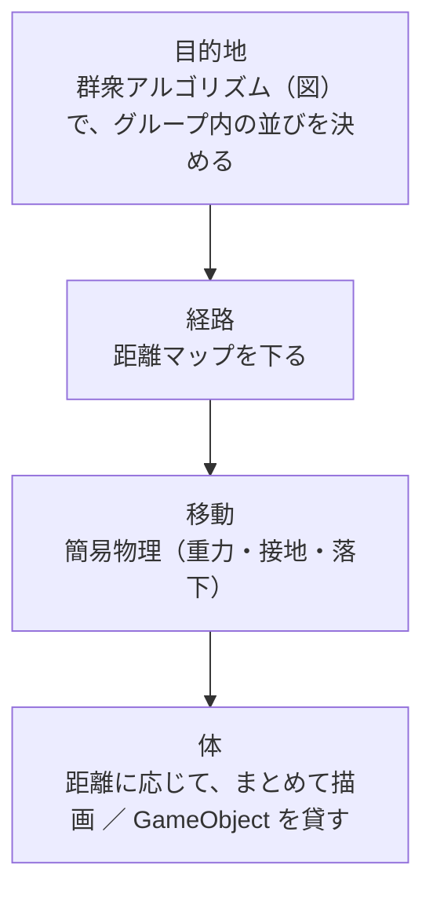

# 敵の大群の AI・崩落による撃破・エネルギーの議論メモ

- 日付：2026-10-05
- 状態：議論中（方式は未決定。下の「おすすめ」は議論の時点での案）
- 関係する計画書：[区間4 雑魚敵と出現](Sections/Section04_Enemy.md)、[区間5 破壊対象](Sections/Section05_DestructionTarget.md)、[区間3 チャージ](Sections/Section03_Charge.md)

## 1. 前提と目標

### 規模
- 同時に動く敵は約 1000 体を目指す。比較の基準は 1 年次の DataCenterOutbreak（敵の総数は最大 330 体、マップはおおむね 1000 m 四方）
- マップは広くなる予定
- パフォーマンスの調整は全力でやる

### 地形
- マップの一部の物はボクセルで、壊せる。橋のような足場も壊れる可能性がある

### 敵の動きの目標
| 目標 | 内容 |
|---|---|
| 重なりすぎない | 多少の重なりは許す |
| 近傍を調べずに動かす | メッシュ切断とボクセルで、すでに負荷が高いため |
| 地形の変化に追従する | ボクセルが壊れて変わる地形に、その場で対応する |
| 軍隊らしい規律 | 敵は機械なので、整列していても違和感はない |
| 避けたい見た目 | プレイヤーを中心にした塊に見えること。全員が見えない台座に乗ってスライドしているように見えること |

### 遊びの方針
- 切断は「スキルを使うまでのつなぎ」で、切る範囲は広げない
- 大量撃破は、マップのボクセルを壊し、崩落に敵を巻き込んで行う。巻き込まれた敵は撃破扱いで、メッシュ切断もかけらも出さない
- 撃破された敵はエネルギーを出す。**エネルギー＝チャージ**。基本は自動で吸い込まれるだけで、見た目を華やかにするためのもの（スキルによっては、別の役割を付ける可能性がある）
- 「大量の敵がステージクリアに有利につながる」「ステージの破壊が大量撃破につながる」といった、選択肢を増やす方向の遊びにする

## 2. 構成：4 つの層

| 層 | 決めること |
|---|---|
| 目的地 | どこへ行くか。グループごとの図で並びを決める（4 章） |
| 経路 | 目的地までどう進むか（3 章） |
| 移動 | 体をどう動かすか。Rigidbody は使わない可能性が高い（5 章） |
| 体 | どう描画し、どう切断を受けるか（6 章） |

## 3. 経路の方式の比較

| 案 | 内容 | 判断 |
|---|---|---|
| 案1 NavMesh | `NavMeshBuilder.UpdateNavMeshDataAsync` で、変わった範囲を作り直す。NavMesh は経路を調べるだけにして、移動は自前で行う | 不採用寄り。`NavMeshAgent` に移動を任せると、足場が壊れたときに宙に浮く。NavMesh の外にいるとエラーになる。新しくできた道を通れるかも分からない。敵ごとに目的地が違うので、敵の数だけ経路を調べることになる |
| 案2 真上からの深度バッファ | 正射影のカメラで深度を描いてハイトマップにし、横向きのレイで障害物を確かめる | 不採用寄り。真上から見て被さった物（屋根、出入口の上の梁、橋）の下が扱えない。読み戻しが 1〜3 フレーム遅れる |
| 派生案 下向きのレイを何度も当てる | `RaycastCommand` で、マスごとに複数の層を記録する | 予備案。実行中にレイを撃つ負荷が気になる |
| 案3 距離マップ | 格子に物があるかと、立てるかをマークし、プレイヤーからの距離を格子に持つ。ボクセルが削られたら SDF で調べ直す | **最有力** |

### 案3を、広いマップ向けに変える点
| 項目 | 内容 |
|---|---|
| 格子の持ち方 | 密な立体格子は成り立たない（1000 m × 1000 m × 50 m を 0.5 m で切ると約 4 億マス）。**縦の列ごとに「立てる層」の一覧**を持つ |
| 立てるマス | 下のマスに物があり、上に敵の背丈の分だけ空きがあるマス。登れるのは登れる高さまでの段差だけ。降りるのは一方通行 |
| 作り方 | 壊れない部分は、エディタで事前に焼く。実行中は、`VoxelShapeChange.LocalBounds` に重なるマスだけ、SDF で調べ直す |
| 更新の向き | 壁が削られると通れるマスが増え、床が削られると立てるマスが減る。両方とも更新する |
| 距離マップ | 2 段にする。プレイヤーの周り（半径 100〜150 m）は細かいマス、遠くは区画（例：16 m 四方）のつながり。参考：Supreme Commander 2 の Flow Field Tiles（Game AI Pro 第 1 巻） |
| 計算するとき | プレイヤーのいるマスが変わったとき。Burst の Job で、数フレームおきに計算する |
| 数え方 | 斜めを約 1.41 として数える（ダイクストラ法） |
| プレイヤーが立てるマスにいないとき | 壁走り、空中、ワープ中は、真下か近くの立てるマスから数え始める |
| 切り離された塊 | 落ちている間は格子に入れない。止まったら、足場や障害物としてマークする |

## 4. 目的地：群衆アルゴリズムの改良

### 元のアルゴリズム（UnlimitedKnight、Notion「群衆風アルゴリズムについて」）
- プレイヤーを中心にしたアルキメデスの螺旋の上に、(ID ＋ 全体で共有するインデックス) × 一定の角度で、敵ごとの目的地を割り当てる
- 近傍を調べずに、ある程度重ならない群衆を作れる
- 倒されたらインデックスをずらすので、穴は密度が下がったようにしか見えない
- 欠点：動きの規則性が分かりやすい。壁に触れると重なる。地形に応じて密度を変えるのが苦手。塊のまま動いているように見える

### ユーザーの改善案
1. 移動の向きなどに応じて、図（螺旋など、規則的に並びつつ重ならない線や格子）をゆがめて引き延ばす
2. 敵全体を 1 つの図で動かさず、グループごとに図で並びを決め、グループ自体は経路探索や別の図で動かす
3. プレイヤーに一定以上近い敵は、図から外して経路探索で動かす（離れたときにどう図へ戻すかが課題）

### 議論の結果（案）
| 項目 | 内容 |
|---|---|
| 台座に見える原因 | 目的地がプレイヤーにくっついた図の上にあるので、全員が同じ向き・同じ速さで動く |
| グループ | 改善案 2 を中心にする。1000 体なら、1 グループ 10〜15 体で約 70〜100 グループ |
| アンカー | グループの先頭（仮想的な隊長）は、距離マップを下る。反応の遅れ、加速の上限、エージェントより少し遅い速度を持たせる |
| 道筋の上の図 | 改善案 1 の発展。アンカーが通った道筋を記録し、目的地を「道筋に沿って先頭から s メートル後ろ、横に d メートル」で決める。d は壁からの距離で制限する。通路では細い縦隊、広場では横に広がった隊形になる。1 列に並べる数を超えたら、後ろの列に回す |
| 隊形 | 行軍中は縦隊、交戦は横隊やくさび形。包囲は、グループの配置で作る |
| 交互に進む | あるグループが進む間、別のグループは止まって待つ。全体が 1 つの塊として動いて見えないようにする |
| 交戦 | 改善案 3。近づいて交戦に入る距離と、離れて交戦をやめる距離を変える（例：4 m で入り、7 m で抜ける） |
| 合流 | 図から外れた敵は距離マップを下る。アンカーが通った通路に合流したら、図に戻る |
| 並べ替え | グループの中の目的地の割り当てを、ときどき距離マップの値の順に並べ替える（UnlimitedKnight の対策にあった「ID の入れ替え」に当たる） |
| 戻れない敵 | 距離マップの値がない敵は、一定時間たったら、見えない所で湧き場所へ戻す |
| 撃破 | インデックスを詰めて、穴を隊列の後ろへずらす。人数が少なくなったグループは、別のグループと合流させる |

## 5. 移動：簡易物理
- Rigidbody は使わない可能性が高い。重力、接地、落下、着地を自前で持つ
- 接地は、距離マップの格子（立てる層の高さ）を使い、敵ごとのレイを減らす
- 足場が消えたら落下し、着地したら目的地の計算からやり直す
- 移動部位を失って止まった敵の目的地をどうするかは、未決

## 6. 体と実装方式

### 1000 体での量（区間4の仮モデルは 1 体 7 パーツ）
| 項目 | 量 |
|---|---|
| 描画 | 7000 個のレンダラー |
| Transform | 毎フレーム 7000 個 |
| FK / IK | 1000 体分 |
| 切断できる対象の登録 | 全員を `MeshDataCache` に入れる前提は、見直しが要る |

### 距離による体の表現の分け方
| 距離 | 体の表現 |
|---|---|
| 近い（切れる範囲） | プールから取り出した、本物のパーツの GameObject。切断でき、IK も解く。数十〜百体 |
| 中くらい | GameObject を持たず、Job で計算した行列で、まとめて描画する（BatchRendererGroup ／ GPU Resident Drawer ／ `Graphics.RenderMeshInstanced`） |
| 遠い | まとめて描画するだけ。VAT も候補 |

### 実装方式の比較
| 観点 | 案A：Jobs ＋ 体を貸す | 案B：全面 ECS | 案C：敵だけ ECS |
|---|---|---|---|
| AI と移動 | Burst | Burst | Burst |
| 描画 | BRG を自前で使う | Entities Graphics（中身は BRG） | Entities Graphics |
| 物理 | PhysX のまま | Unity Physics と PhysX は互いに当たらないので、プレイヤー、ボクセル、かけら、ステージまで移すか、二重に置く必要がある | PhysX のまま |
| 書き直す範囲 | 敵だけ | 切断の入口と出口、プレイヤー、ボクセル、かけら、オーブ、ステージ | 敵と、体を貸す部分 |
| UsefulToolkit との接続 | 今のまま | 橋渡しの層が大きい | 敵の部分だけ |

メッシュ切断（`com.rei.usefultoolkit.meshcut`）は、計算の中心がすでに Burst の Job とネイティブのデータで動いている。Unity のオブジェクトに依存するのは、入口（`Physics.OverlapBox`、`CuttableObject`）と出口（かけらのコライダー、速度、MeshFilter）だけ。

**おすすめ：案A**。1000 体では、AI と描画の速さは ECS とほぼ同じになる見込み。敵の状態は構造体の NativeArray で持ち、後から ECS のコンポーネントへ移せる形にしておく。

### スマホについて
- PC のレンダラーは Forward+、スマホのレンダラーは Forward
- GPU Resident Drawer は Forward+ が必要
- BRG、Entities Graphics、VFX Graph がスマホで動く条件は、確認が要る

## 7. 崩落による大量撃破

| 種類 | 判定 |
|---|---|
| 落ちてくる塊に潰された | 切り離された塊（Rigidbody 付きの `VoxelPiece`）のうち、下向きの速度が一定以上のものについて、`WorldBounds` に入るマスにいる敵を拾う。その敵の位置が塊の内側か、`SampleDistance`（SDF）で確かめる |
| 足場ごと落ちた | 簡易物理で、落ちた高さが一定以上なら撃破する |

- 敵には PhysX のコライダーを付けない
- マスからそこにいる敵を引ける索引を、毎フレーム 1 回作る。敵どうしは比べない
- 区間5の「判定の窓口」（5-2）に、ダメージの種類として「崩落」を足す形になる見込み
- 確認が要ること：ボクセルの SDF を Burst の Job から読めるか
- 遊びとのつながり：距離マップで動く敵は、通れる狭い場所（橋、建物の間）に集まる。隊列を組んだ縦隊が崩落に巻き込まれやすくなる

## 8. エネルギー（チャージ）

### 流れ
- 切断のかけらからのチャージ（区間3の `FragmentOrbAdapter`）と、崩落で撃破した敵からのエネルギーが、両方 `ChargeService` に入る
- 獲得量は、フレームごとに合計して 1 回だけ `ChargeService` に渡す（State を書くのは 1 か所）

### 実装方式の論点
| 案 | 判断 |
|---|---|
| エネルギーだけ ECS | 境界ははっきりしていて、物理も要らないので、ECS を入れるなら一番安全な入口。ただ、自動で吸い込まれるだけなら ECS の価値は出ない |
| 敵と同じ NativeArray 方式 | 1 粒ずつに遊びの意味がある場合に合う |
| **VFX Graph** | 演出だけなら、これで足りる。Unity 公式の GPU パーティクルで、最適化もされている。**最有力** |

### VFX Graph にする場合に決めること
| 項目 | 内容 |
|---|---|
| 獲得量の数え方 | VFX Graph は、粒が届いたことを CPU に返しにくい。獲得量は CPU 側で決める。撃破したときにすぐ足すか、飛ぶ時間の分だけ遅らせて足すかを決める。今の `FragmentOrbAdapter` は「届いたら足す」 |
| 大量撃破の瞬間 | 撃破ごとに `SendEvent` を呼ばず、撃破位置を GraphicsBuffer にまとめて、毎フレーム 1 回渡す |
| 吸い込む先 | カメラの位置を、毎フレーム VFX Graph のプロパティに渡す |
| スローモード | VFX Graph の時間が `Time.timeScale` に従うか確認する |
| スマホと VR | VFX Graph は compute shader が必要。動かない機種では Particle System で代わりにする |
| 切断のかけら | かけら（GameObject）がオーブに変わるときに、位置を渡すだけで同じ VFX Graph にまとめられる。区間3で作ったオーブのプールを置き換えることになる |
| 別の役割を持つスキル | 演出のオーブと、遊びに関わる物（飛んでいって当たる物など）を分ける。遊びに関わる物だけ、CPU 側（NativeArray か ECS）で作る |

## 9. 未決事項と確認が要ること
- 同時に動かす数（約 1000 体）は「同時にアクティブな数」で確定か
- 格子のマスの大きさ（敵の大きさ、登れる高さとの関係）
- 移動部位を失って止まった敵の目的地の扱い
- ボクセルの SDF を Burst の Job から読めるか。`SampleDistance` が `ApplyEdit` の直後に新しい値を返すか
- BRG、GPU Resident Drawer、VFX Graph がスマホと VR で動く条件
- エネルギーの獲得量を足すタイミング（撃破時か、届いたときか）
- 崩落で倒すことと、エネルギーの扱いを、Notion の仕様書に反映するか（ユーザーが判断する）

## 10. 次の作業の候補
1. 計測用の試作：敵 1000 体（状態は NativeArray、BRG でまとめて描画、直進で移動）、体の貸し出しと今の `MultiCutBlade` での切断、崩落に巻き込んで撃破する判定、VFX Graph によるエネルギーの大量発生。描画、AI、体の受け渡し、崩落の判定にかかる時間を計測する
2. 区間4の計画書の書き直し：4-5（`NavMeshAgent` でプレイヤーに近づく）と、決めること #5、`EnemyUnit` を MonoBehaviour で 1 体ずつ持つ前提
