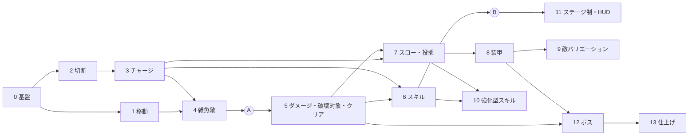

# インゲーム 全体実装計画書

インゲーム開発期間の全体実装計画。
開発は「全体実装計画 → 区間実装計画 → 詳細仕様確定と実装」の 3 段階で進める。
この文書は全体実装計画で、区間ごとの計画は [Sections/](Sections/) にある。

| 資料 | 場所 |
|---|---|
| ゲーム仕様の正本 | Notion「刻断 / 仕様書」（https://app.notion.com/p/49c1ea2aa7fa83aca214017b9e856040） |
| スケジュール | Notion「仕様書 / スケジュール」のマイルストーン（https://app.notion.com/p/3131ea2aa7fa8339acaa01d55399b74a） |
| 時間制御の設計 | Notion「システムリスト / 時間制御（スローモード）」（https://app.notion.com/p/3ea1ea2aa7fa8183bbfac10bfafd4d70） |

作成日：2026-09-29 ／ 更新日：2026-10-04

## 0. 作業者向けの前提

この計画書を受け取って実装する人（AI を含む）は、着手前にここを読む。

### 最初に読むもの

| 対象 | 内容 |
|---|---|
| スキル `state-centrism-architecture` | 5 層の役割、State の Single Writer、Getter インターフェース、参照ルール |
| スキル `usefultoolkit` | BlackBoard・State・Initializer・Compositor・SceneGroup・入力の書き方と、エディタのメニュー |
| [VoxelOverview.md](../Voxel/VoxelOverview.md) | ボクセルを扱う区間（5, 6, 10, 12）で読む |
| UsefulToolkit.MeshCut の README | `Library/PackageCache/com.rei.usefultoolkit.meshcut@*/README.md`。切断を扱う区間（2, 3, 4）で読む |

### 手本にする既存コード

| 役割 | 手本 | 要点 |
|---|---|---|
| State | [PlayerMovementState](../../Code/Scripts/BlackBoardLayer/Player/Runtime/PlayerMovementState.cs)、[BuildModeState](../../Code/Scripts/BlackBoardLayer/CoreSystem/ApplicationManagement/BuildModeState.cs) | シーンごとの値は `SceneStateBase`、常駐の値は `GameStateBase`。読み取り用に `IStateGetter` を継承したインターフェースを用意し、`[RegisterBoard(typeof(〜Board))]` を付ける |
| Service（Application） | [PlayerMovementService](../../Code/Scripts/Application/Player/PlayerMovementService.cs) | 具象の State を持つのはこのクラスだけ（Single Writer）。Board へはインターフェースで登録する。入力は `IInputState.RegisterInput` で購読する |
| Adapter（EngineAdapter） | [PlayerMovementAdapterBase](../../Code/Scripts/EngineAdapterLayer/Player/PlayerMovementAdapterBase.cs) | `InitializableMonoBehaviour` を継承し、`SubscribeStateRegister` で State の登録を待ち受けて読む |
| Initializer | [PlayerInitializer](../../Code/Scripts/Initialization/Player/PlayerInitializer.cs)、[ApplicationManagementInitializer](../../Code/Scripts/Initialization/ApplicationManagement/ApplicationManagementInitializer.cs) | Service と Adapter を生成して配線するだけで、ロジックは持たない |
| DI で操作面を渡す | [GameSceneInitializer](../../Code/Scripts/Initialization/Scene/GameSceneInitializer.cs)、[PlayerInputRouteInitializerBase](../../Code/Scripts/Initialization/Input/PlayerInputRouteInitializerBase.cs) | 渡す側は `TryRegisterContent`、受け取る側は `IInjectable<T>` |
| Application と EngineAdapter の直接配線 | [PlayerInitializer](../../Code/Scripts/Initialization/Player/PlayerInitializer.cs) が `PlayerMovementService.Step` を `PlayerMovementAdapterBase.Initialize` に渡す | 毎ステップ変わる値（視線の向き、経過時間）は引数で渡し、結果（打ち出し速度）は戻り値で返す。続く状態は State で渡す |
| EngineAdapter が持つ State | [PlayerContactState](../../Code/Scripts/BlackBoardLayer/Player/Runtime/PlayerContactState.cs) | 物理の判定の結果を、物理ステップの後に Adapter が書く。チラつきは Adapter 側で抑える |

### 守ること

- `// 自動生成ファイル` と書かれたファイル（Compositor、`BuildScenes`、入力の enum など）は手で編集しない。次のメニューで作り直す
  - Initializer を置いた・外した、ChildBoard を足した：`UsefulToolkit/Generate/Scene Compositor`
  - Build Settings のシーンを変えた：`UsefulToolkit/Generate/Scene Enum`
  - 入力アクションを変えた：`UsefulToolkit/Input/Generate Action Enums`
- 新しい asmdef の参照（NavMesh、UsefulToolkit.Debugging など）が必要なら、その層の asmdef に足す。層の参照ルール（スキル `state-centrism-architecture`）を破らない
- コメントには処理の内容を書き、設計意図は書かない（ユーザーの CLAUDE.md のルール）
- `Assets/Code/Editor/Legacy/` は旧コード。参考にしてよいが、使わない・直さない

### 区間の進め方

1. 区間計画書を読み、今のコードと食い違う箇所があれば先に報告する
2. 「詳細仕様で決めること」の各項目について、案を出してユーザーに確認する。決まったことは区間計画書に書き込む
3. 作業計画（詳細仕様、新しく作る型、コミットの分け方）を立てる。提示する前に `~/.claude/skills/planning-criteria/SKILL.md` を読み、その基準を当てはめる
4. 実装する。確認には uloop のスキル（`uloop-compile`、`uloop-control-play-mode`、`uloop-get-logs` など）を使い、プレイモードで動かして完了条件を確かめる
5. 区間計画書の「状態」を更新し、変更したファイルの一覧と確認の結果を報告して止まる。コミットとプッシュはユーザーが行う

## 1. 技術前提

| 項目 | 内容 |
|---|---|
| 敵のメッシュ切断 | UsefulToolkit.MeshCut を使う。マルチスレッド、Burst、Job で並列化と非同期化が済んでいる |
| 敵の構成 | SkinnedMeshRenderer は使わない。パーツごとに分かれた軽量なメッシュ（全パーツを合わせて 2000 ポリゴン未満）を、パーツ単位で FK / IK で動かす |
| ボスの構成 | 敵と同じく、パーツ単位で FK / IK で動かす。ボクセルのスキニングは使わない |
| ボクセル | ボクセルでできた物はメッシュ切断できない。切断攻撃に破壊属性を付けたときは、切断方向と同じ向きに、厚みゼロの平面でボクセルを分ける（`VoxelPiece.Slice` で実装済み） |
| スローモード | `Time.timeScale` を下げて世界全体を遅くする。プレイヤーのアニメーション、視点操作、UI は等速。倍率の正本は TimeScale State で、`Time.timeScale` と `Time.fixedDeltaTime` に反映するのは EngineAdapterLayer の 1 か所だけ。詳細は Notion「時間制御（スローモード）」 |
| アーキテクチャ | State-Centrism Architecture（Initialization / Application / BlackBoardLayer / ExternalLayer / EngineAdapterLayer）と UsefulToolkit |
| シーン構成 | 常駐シーン（`UsefulToolkitPersistent`）＋ 場面シーン（アウトゲーム / インゲーム。3 ビルド共通）＋ 操作シーン（プレイヤー一式と入力の配線。ビルドモードごと）。場面と操作シーンの組を SceneGroup で持ち、`GameSceneController` が場面の単位で切り替える。操作シーンは場面をまたいで残る |

## 2. プラットフォームの方針

- 先に PC（マウスとキーボード）で作り、スマホと VR にも随時対応させる
- 各区間の完了条件は PC で判定する
- プラットフォームごとの違いは、EngineAdapterLayer の Adapter（`Standard〜` / `Vr〜`）と入力の層に閉じ込める。Application と BlackBoardLayer はプラットフォームに依存させない
- スマホと VR の既存コード（ビルドモード、Adapter、入力マップ）は壊さずに保つ
- 他プラットフォームへの対応は番号付きの区間とは別に、随時行う。各区間計画書の「他プラットフォームへの対応」に、その区間で気をつけることを書く

## 3. 現状（2026-10-04 時点。区間1の完了後）

| 分野 | 状態 |
|---|---|
| 基盤（5 層の asmdef、UsefulToolkit、常駐シーン、入力の経路、ビルドモード） | あり |
| TimeScale（State、Service、Adapter、デバッグの操作と表示） | あり（区間0）。インゲームから出るときの倍率のリセットは未実装 |
| シーン遷移（`GameSceneController` / `GameSceneInitializer`） | 配線済み（区間0）。常駐シーンから再生すると、アウトゲーム → インゲームの順に入れる。場面シーン（`OutGame` / `InGame`）と操作シーン（`StandardPlayerControl`）は `Assets/Level/Scenes/Master/`、SceneGroup アセットは `Assets/Level/Data/SceneGroup/`。アウトゲームからインゲームへは、仮のボタン（`OutGameStartInitializer`）で入る |
| プレイヤーの移動（歩行、ダッシュ、ジャンプ、壁走り、短距離ワープ）と視点操作（Cinemachine） | あり（区間1）。PC とスマホが共用する操作系は `StandardPlayerControl` シーンにある。遊びのルールに関わる値は `PlayerParameterData`、ダッシュの操作方式は `AccessibilitySettingState`。開発用の `PlayerMoveTest` は区間1で削除した |
| プレイヤーの HP と被ダメージ | あり（区間1）。`PlayerHealthService.ApplyDamage`（ワープ中は軽減率を適用）と `IPlayerHealthState`。今呼んでいるのはデバッグ操作（`PlayerDebugInitializer`）だけ |
| 入力（PC の Player マップ） | 区間0で、切断面の回転、ワープ、スローモード、投擲、ランチャー、スキル 1〜3 のアクションを追加済み。Smartphone と VRControllers のマップは未対応 |
| VR の操作系 | `VrPlayerMovementAdapter` / `VrPlayerInputRouteInitializer` はあるが、どのシーンにも置かれていない |
| ボクセル（ベイク、削る・盛る、塊の分離、平面での切り分け、融解） | あり。ゲームのルールとはまだつながっていない |
| メッシュ切断 | パッケージは導入済み。ゲーム側からはまだ使っていない |
| 敵、チャージ、スキル、スローモード、装甲、クリア判定、HUD | なし |
| 旧構成 | `Test/InGame.unity` と `Test/OutGame.unity`、`Assets/Level/Prefabs/` の既存プレハブは旧構成のもの。`Test/InGame.unity` は Build Settings から外してあり、`BuildScenes.InGame` は新しい `Master/InGame` を指す |

## 4. 進め方

- 先に「刻む → 溜まる → スキルで壊す → クリア」のコアループを、仮の見た目で一周させる。そのあとで、スロー、装甲、敵の種類、強化型スキルを足していく
- ダメージタイプは「攻撃が持つデータ」として持ち、攻撃と対象ごとの判定を 1 か所の窓口にまとめる（区間5）
- 各区間は 0 章の「区間の進め方」の順で進める
- 区間計画書は、着手する直前にその時点の実装に合わせて見直す

## 5. 区間一覧

| # | 区間 | 主な内容 | 前提 | 目安の時期 | 状態 | 計画書 |
|---|---|---|---|---|---|---|
| 0 | 基盤整備 | TimeScale State と Adapter、シーン遷移の配線とインゲームのシーン、PC 用入力マップ、デバッグ手段 | ― | 2026/09/29〜10/05 | 完了（10/04） | [Section00](Sections/Section00_Foundation.md) |
| 1 | プレイヤー移動の完成 | ダッシュ、ジャンプ、壁走り、短距離ワープ、HP と被ダメージの窓口 | 0 | 10/06〜10/12 | 完了（10/04） | [Section01](Sections/Section01_PlayerMovement.md) |
| 2 | 近接切断 | MeshCut による剣の切断、ホイールで切断面を回転、切断面のプレビュー、かけらの通知 | 0 | 10/13〜10/19 | 未着手 | [Section02](Sections/Section02_MeleeCut.md) |
| 3 | かけら・オーブ・チャージ | かけらのオーブ化と自動吸収、チャージの State、ステージ外周コライダー、オーブのプール | 2 | 10/20〜10/26 | 未着手 | [Section03](Sections/Section03_Charge.md) |
| 4 | 雑魚敵と出現 | パーツ分割メッシュと FK / IK の敵、湧き場所、同時存在数の上限、簡単な AI、HP 0 で失敗 | 1, 3 | 10/27〜11/08 | 未着手 | [Section04](Sections/Section04_Enemy.md) |
| A | マイルストーンA | 「切って溜める」までがつながる | | 11/08 | | |
| 5 | ダメージ基盤・破壊対象・クリア判定 | ダメージタイプと対象ごとの判定、ボクセルの破壊対象、重要パーツの体積割合、マップオブジェクト、クリア判定 | 4 | 11/09〜11/22 | 未着手 | [Section05](Sections/Section05_DestructionTarget.md) |
| 6 | スキル基盤・攻撃型スキル | スキルの定義データ、装備枠 3、チャージ消費、攻撃型スキル 2 種 | 3, 5 | 11/23〜11/29 | 未着手 | [Section06](Sections/Section06_Skill.md) |
| B | マイルストーンB | 1 ステージが最初から最後まで遊べる | | 11/29 | | |
| 7 | スローモード・つかみ・投擲・ランチャー | TimeScale の倍率操作、ゲージ消費、切断回数の上限、かけらのつかみ・投擲・ランチャー、粉砕ダメージ | 3, 5 | 11/30〜12/13 | 未着手 | [Section07](Sections/Section07_SlowMode.md) |
| 8 | 装甲 | 耐久値、粉砕タイプで一撃破壊、破壊ダメージの遮断、破壊対象の防御パーツ | 5, 7 | 12/14〜12/20 | 未着手 | [Section08](Sections/Section08_Armor.md) |
| 9 | 敵のバリエーション | シールドを持つ敵、吸収型の敵 | 4, 8 | 12/21〜2027/01/03 | 未着手 | [Section09](Sections/Section09_EnemyVariation.md) |
| 10 | 強化型スキル | ダメージタイプの付与などの強化型スキル、破壊属性の切断でボクセルを平面で切り分ける | 6, 7 | 2027/01/04〜01/17 | 未着手 | [Section10](Sections/Section10_EnhanceSkill.md) |
| 11 | ステージ制・インゲームの流れ・HUD | ステージデータ、HUD、リザルト、アウトゲームとの受け渡し、ポーズ | B | 01/18〜01/31 | 未着手 | [Section11](Sections/Section11_StageFlow.md) |
| 12 | ボス | ボクセルのパーツを FK / IK で動かすボス、最終ステージ | 5, 8 | 02/01〜02/21 | 未着手 | [Section12](Sections/Section12_Boss.md) |
| 13 | 仕上げ | 負荷調整、エフェクト、SE、パラメータ調整 | 全部 | 02/22〜03/07 | 未着手 | [Section13](Sections/Section13_Polish.md) |

- 目安の時期は、期限を決める前に、区間0の開始日から区間ごとの作業量で割り当てたもの
- 8〜10 と 11 は順番を入れ替えられる

依存関係

## 6. 使う既存機能

| 用途 | 使うもの |
|---|---|
| 敵の切断 | UsefulToolkit.MeshCut（`MultiCutBlade` / `MultiMeshCut` / `CuttableObject` / `MeshDataCache` / `MeshCutObjectPool`）。シーン上では `MeshCut System` の下に `MeshDataCache` / `FragmentPool` / `CutBlade` という名前で置かれる |
| かけらの上限 | `MeshCutObjectPool` は固定長のリングバッファで、空きがなくなると最も古いかけらを回収して使い回す |
| 敵の移動 | `com.unity.ai.navigation`（NavMesh。導入済みだが asmdef の参照はまだない） |
| 敵・オーブの再利用 | `UnityEngine.Pool.ObjectPool<T>` |
| シーン遷移 | `GameSceneController` / `GameSceneInitializer`、SceneGroup アセット（`GameSceneGroupData`） |
| デバッグ表示 | UsefulToolkit.Debugging の `DebugGUI`（`ObserveVariable` で値を画面に出す。シーンへの配置は `UsefulToolkit/ProgramTools/DebugGUI Setup`）、State の `GetLog()` |
| ポーズ | 常駐の `PauseBoard` と `IPausable`（UsefulToolkit.ProgramTools。中身はまだほぼない） |
| プレイヤーの物理 | Rigidbody（補間、ContinuousDynamic）、摩擦ゼロの PhysicsMaterial、`Physics.SphereCast`（接地）、`Physics.OverlapCapsuleNonAlloc` と `Collider.ClosestPoint`（壁） |
| カメラ | Cinemachine |
| エフェクト | VFX Graph |
| 破壊対象・マップ | 既存のボクセル（`VoxelModelLoader` / `VoxelPiece` / `IVoxelShape`） |
| 破壊属性の切断 | `VoxelPiece.Slice`（厚みゼロの平面で切り分ける） |
| 破壊スキルの演出 | 既存のボクセルの融解（Thermal / Melt） |

## 7. 未確定の仕様と、決める区間

| 区間 | 決めること |
|---|---|
| 0 | TimeScale State の置き場所、シーンの作り方と置き場所、アウトゲームからインゲームへの仮の入り方、入力の割り当て |
| 1 | ワープ中のダメージ軽減率、各移動パラメータ、壁走りに入る条件 |
| 2 | 切断判定の方式、攻撃の範囲と間隔、生まれたかけらを受け取る方法 |
| 3 | かけらを再度切ったときのチャージの数え方、ゲージの上限、かけらが強制回収されたときの扱い |
| 4 | 雑魚敵がプレイヤーを攻撃する方法、敵を倒す条件、プレイヤーの HP と回復の有無、敵を MeshCut に登録して使い回す方法 |
| 5 | 重要パーツの指定方法、本体から分離した塊を破壊済みに数えるか、クリアに必要な割合をどの単位で持つか |
| 6 | 最初に作る攻撃型スキル、消費量 |
| 7 | スローの倍率、初回消費と継続消費、切断回数の上限、サウンドのスロー表現 |
| 8 | 装甲の作り方（メッシュかボクセルか）、耐久値、遮断の判定方法 |
| 9 | 各敵のパラメータと攻撃パターン |
| 10 | 強化型スキルの一覧、平面で切り分ける範囲、切り分けた側の扱い |
| 11 | ステージ数、ステージごとの失敗条件、ポーズを `timeScale = 0` で実装するか |
| 12 | ボスの形、行動、重要パーツ |
| 13 | 目標のフレームレートと、対象の PC スペック |

## 8. 仮定として置いている事項（未確認）

- 区間の順番は 5 章のとおり
- `Assets/Docs/Voxel/Skinning/SkinningPlan.md` には手を付けない
