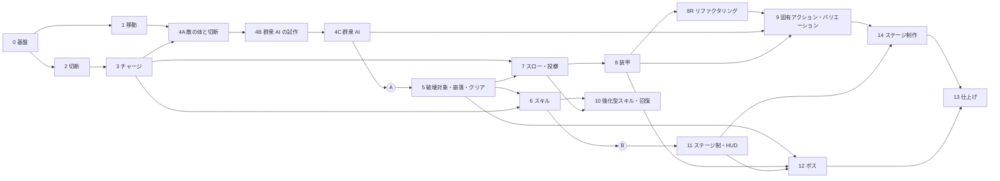

# インゲーム 全体実装計画書

インゲーム開発期間の全体実装計画。
開発は「全体実装計画 → 区間実装計画 → 詳細仕様確定と実装」の 3 段階で進める。
この文書は全体実装計画で、区間ごとの計画は [Sections/](Sections/) にある。

| 資料 | 場所 |
|---|---|
| ゲーム仕様の正本 | Notion「刻断 / 仕様書」（https://app.notion.com/p/49c1ea2aa7fa83aca214017b9e856040） |
| スケジュール | Notion「仕様書 / スケジュール」のマイルストーン（https://app.notion.com/p/3131ea2aa7fa8339acaa01d55399b74a） |
| 時間制御の設計 | Notion「システムリスト / 時間制御（スローモード）」（https://app.notion.com/p/3ea1ea2aa7fa8183bbfac10bfafd4d70） |

作成日：2026-09-29 ／ 更新日：2026-10-08

## 0. 作業者向けの前提

この計画書を受け取って実装する人（AI を含む）は、着手前にここを読む。

### 最初に読むもの

| 対象 | 内容 |
|---|---|
| スキル `state-centrism-architecture` | 5 層の役割、State の Single Writer、Getter インターフェース、参照ルール |
| スキル `usefultoolkit` | BlackBoard・State・Initializer・Compositor・SceneGroup・入力の書き方と、エディタのメニュー |
| [VoxelOverview.md](../Voxel/VoxelOverview.md) | ボクセルを扱う区間（5, 6, 10, 12, 14）で読む |
| [EnemyCrowdDiscussion.md](EnemyCrowdDiscussion.md) | 敵の群衆 AI・崩落による撃破・エネルギーの議論の記録。敵を扱う区間（4A〜4C、5、9）で読む |
| UsefulToolkit.MeshCut の README | `Library/PackageCache/com.rei.usefultoolkit.meshcut@*/README.md`。切断を扱う区間（2, 3, 4）で読む |
| スキル `code-refactoring`・`comment-refactoring` | リファクタリングの区間（8R）で読む。ソースコードの整備、コメントの整備の順で使う |

### 手本にする既存コード

| 役割 | 手本 | 要点 |
|---|---|---|
| State | [PlayerMovementState](../../Code/Scripts/BlackBoardLayer/Player/Runtime/PlayerMovementState.cs)、[BuildModeState](../../Code/Scripts/BlackBoardLayer/CoreSystem/ApplicationManagement/BuildModeState.cs) | シーンごとの値は `SceneStateBase`、常駐の値は `GameStateBase`。読み取り用に `IStateGetter` を継承したインターフェースを用意し、`[RegisterBoard(typeof(〜Board))]` を付ける |
| Service（Application） | [PlayerMovementService](../../Code/Scripts/Application/Player/PlayerMovementService.cs) | 具象の State を持つのはこのクラスだけ（Single Writer）。Board へはインターフェースで登録する。`IBlackBoard` をコンストラクタ（DI で先に生成するものは `Initialize`）で受け取り、必要な Board と State は自分で取り出す（[BlackBoardExtensions](../../Code/Scripts/BlackBoardLayer/BlackBoardExtensions.cs)）。入力は `IInputState.RegisterInput` で購読する |
| Adapter（EngineAdapter） | [PlayerMovementAdapterBase](../../Code/Scripts/EngineAdapterLayer/Player/PlayerMovementAdapterBase.cs) | `InitializableMonoBehaviour` を継承し、`Initialize(IBlackBoard ...)` で受け取った BlackBoard から State を取り出して読む。読む State を登録する Service より後に初期化する。取り出せなかったときは基底の `Initialize()` を呼ばず、Update を止めたままにする |
| Initializer | [PlayerInitializer](../../Code/Scripts/Initialization/Player/PlayerInitializer.cs)、[ApplicationManagementInitializer](../../Code/Scripts/Initialization/ApplicationManagement/ApplicationManagementInitializer.cs) | Service と Adapter を生成して配線するだけで、ロジックは持たない。State を集めて渡すことはせず、`IBlackBoard` をそのまま渡す。Inspector で受け取る必須の参照は、最初にまとめて確かめ（[InitializerExtensions](../../Code/Scripts/Initialization/InitializerExtensions.cs) の `IsAssigned`）、足りなければ全部をエラーログに出して止める |
| DI で操作面を渡す | [GameSceneInitializer](../../Code/Scripts/Initialization/Scene/GameSceneInitializer.cs)、[PlayerInputRouteInitializerBase](../../Code/Scripts/Initialization/Input/PlayerInputRouteInitializerBase.cs) | 渡す側は `TryRegisterContent`、受け取る側は `IInjectable<T>` |
| Application と EngineAdapter の直接配線 | [PlayerInitializer](../../Code/Scripts/Initialization/Player/PlayerInitializer.cs) が `PlayerMovementService.Step` を `PlayerMovementAdapterBase.Initialize` に渡す | 毎ステップ変わる値（視線の向き、経過時間）は引数で渡し、結果（打ち出し速度）は戻り値で返す。続く状態は State で渡す |
| EngineAdapter が持つ State | [PlayerContactState](../../Code/Scripts/BlackBoardLayer/Player/Runtime/PlayerContactState.cs) | 物理の判定の結果を、物理ステップの後に Adapter が書く。チラつきは Adapter 側で抑える |

### 守ること

- `// 自動生成ファイル` と書かれたファイル（Compositor、`BuildScenes`、入力の enum など）は手で編集しない。次のメニューで作り直す
  - Initializer を置いた・外した、ChildBoard を足した：`UsefulToolkit/Generate/Scene Compositor`
  - Build Settings のシーンを変えた：`UsefulToolkit/Generate/Scene Enum`
  - 入力アクションを変えた：`UsefulToolkit/Input/Generate Action Enums`
- 新しい asmdef の参照（NavMesh、UsefulToolkit.Debugging など）が必要なら、その層の asmdef に足す。層の参照ルール（スキル `state-centrism-architecture`）を破らない
- コメントとサマリーは、スキル `comment-refactoring` の基準で書く（ユーザーの CLAUDE.md のルール）。変更の経緯は書かず、今の設計判断・仕様判断を書く。装飾を付けない。変数のサマリーは一行。コードから読み取れる否定形を避ける。今後の課題は `// TODO:` にとどめる
- `Assets/Code/Editor/Legacy/` は旧コード。参考にしてよいが、使わない・直さない
- 切断対象にするモデルの FBX は、取り込み設定で Read/Write を有効にする（MeshCut が頂点を読む為。無効だと `MeshDataCache.Register` が登録しない）

### 区間の進め方

1. 区間計画書を読み、今のコードと食い違う箇所があれば先に報告する
2. 「詳細仕様で決めること」の各項目について、案を出してユーザーに確認する。決まったことは区間計画書に書き込む
3. 作業計画（詳細仕様、新しく作る型、コミットの分け方）を立てる。提示する前に `~/.claude/skills/planning-criteria/SKILL.md` を読み、その基準を当てはめる
4. 実装する。確認には uloop のスキル（`uloop-compile`、`uloop-control-play-mode`、`uloop-get-logs` など）を使い、プレイモードで動かして完了条件を確かめる
5. 区間計画書の「状態」を更新し、変更したファイルの一覧と確認の結果を報告して止まる。コミットとプッシュはユーザーが行う

## 1. 技術前提

| 項目 | 内容 |
|---|---|
| 敵のメッシュ切断 | UsefulToolkit.MeshCut を使う。マルチスレッド、Burst、Job で並列化と非同期化が済んでいる |
| 敵の構成 | SkinnedMeshRenderer は使わない。パーツごとに分かれた軽量なメッシュを、パーツ単位で FK / IK で動かす。仮モデルは四足歩行の攻撃する敵（`Assets/Art/Models/EnemyModels/MachineEnemy_Attacker.fbx`。区間8の途中でユーザーが入れ替えた。部位の位置・向き・大きさは区間4A の旧 `AttackerEnemy.fbx` と同じで、三角形は合計 4310、実測。体のプレハブは `Assets/Level/Prefabs/Enemy/AttackerEnemy.prefab`）。同じフォルダに、シールドを持つ敵（`MachineEnemy_Defender`）、吸収型の敵（`MachineEnemy_Finisher`）、ボス（`MachineEnemy_Boss`）のモデルがある。敵のモデルは部位ごとの回転を 0 にして書き出す（脚の IK の `EnemyLegs` が、休みの姿勢の回転を 0 とする為）。取り込み設定は Read/Write を有効にする。1000 体をまとめて描画すると、通常の描画と影で約 862 万の三角形になる（区間4B で計測） |
| 敵の群衆（2026-10-05 決定、2026-10-06 区間4B で確定） | 同時に約 1000 体。敵の状態は構造体の NativeArray（`EnemyAgent`）に持って Burst の Job で更新し、`Graphics.RenderMeshInstanced` でまとめて描画する。切断できる GameObject の体は、近くの敵にだけプールから貸す。経路は縦の列ごとに立てる層を持つ格子と、プレイヤーからの距離マップ。移動は簡易物理で、NavMesh は使わない。詳細は Notion「敵の群衆 AI」「敵の大量描画と体の貸し出し」と、区間4B・4C の計画書の「計測の結果」。区間4C の本実装で、1000 体・32 体に体を貸して敵の処理は平均 1.33ms（エディタ、安全チェックなし） |
| 敵の体のプール（2026-10-05 決定） | 敵の体は最初にすべてプールに用意し、実行中は Instantiate しない |
| ボスの構成 | 敵と同じく、パーツ単位で FK / IK で動かす。ボクセルのスキニングは使わない |
| ボクセル | ボクセルでできた物はメッシュ切断できない。切断攻撃に破壊属性を付けたときは、切断方向と同じ向きに、厚みゼロの平面でボクセルを分ける（`VoxelPiece.Slice` で実装済み） |
| スローモード | `Time.timeScale` を下げて世界全体を遅くする。プレイヤーのアニメーション、視点操作、UI は等速。倍率の正本は TimeScale State で、`Time.timeScale` と `Time.fixedDeltaTime` に反映するのは EngineAdapterLayer の 1 か所だけ。詳細は Notion「時間制御（スローモード）」 |
| アーキテクチャ | State-Centrism Architecture（Initialization / Application / BlackBoardLayer / ExternalLayer / EngineAdapterLayer）と UsefulToolkit |
| シーン構成（2026-10-05 変更） | 常駐シーン（`UsefulToolkitPersistent`）＋ 場面シーン（アウトゲーム / インゲーム。3 ビルド共通）。場面ごとに 1 つの SceneGroup を持ち、`GameSceneController` が場面の単位で切り替える。プレイヤー一式（リグ、入力の配線、プレイヤーの Initializer）は `InGame` に置き、インゲームの機能を 1 つの DI のスコープにまとめる。プラットフォームごとのリグは `InGame` に置いてビルドモードで選ぶ（選ぶ仕組みは VR のリグを置くときに作る）。リグは実行時に Instantiate しない（Compositor はシーンに置いた Initializer しか初期化しない為）。アウトゲームにはプレイヤーを置かない。以前の「操作シーン（StandardPlayerControl）」は区間3のコミット0で廃止した |
| インゲームのシーン（2026-10-04 決定） | インゲームの場面シーン（`InGame`）には、ステージによらず使うシステム（MeshCut System、敵の生成の仕組み、プレイヤー一式 など）を置く。ライティング、敵の生成位置、置くオブジェクトは、ステージごとのステージシーンに置く。敵などの切断対象は `MeshDataCache` の子に置く必要があるので、`InGame` に置く。ステージシーンを分ける作業は区間4の最初に行う。複数のシーンを読み込んだときは、アクティブなシーンのライティングの設定（環境光、スカイボックス）だけが効くので、ステージシーンをアクティブにする |

## 2. プラットフォームの方針

- 先に PC（マウスとキーボード）で作り、スマホと VR にも随時対応させる
- 各区間の完了条件は PC で判定する
- プラットフォームごとの違いは、EngineAdapterLayer の Adapter（`Standard〜` / `Vr〜`）と入力の層に閉じ込める。Application と BlackBoardLayer はプラットフォームに依存させない
- スマホと VR の既存コード（ビルドモード、Adapter、入力マップ）は壊さずに保つ
- 他プラットフォームへの対応は番号付きの区間とは別に、随時行う。各区間計画書の「他プラットフォームへの対応」に、その区間で気をつけることを書く

## 3. 現状（2026-10-08 時点。区間8R の完了まで）

| 分野 | 状態 |
|---|---|
| 基盤（5 層の asmdef、UsefulToolkit、常駐シーン、入力の経路、ビルドモード） | あり |
| TimeScale（State、Service、Adapter、デバッグの操作と表示） | あり（区間0）。スローモード（区間7）は、インゲームを出るときに自分がかけたスローを解く。デバッグの操作で変えた倍率は、インゲームを出ても戻らない |
| シーン遷移（`GameSceneController` / `GameSceneInitializer`） | 配線済み（区間0）。常駐シーンから再生すると、アウトゲーム → インゲームの順に入れる。場面シーン（`OutGame` / `InGame`）は `Assets/Level/Scenes/Master/`、SceneGroup アセット（`OutGameGroup` / `InGameGroup`。場面ごとに 1 つ）は `Assets/Level/Data/SceneGroup/`。アウトゲームからインゲームへは、仮のボタン（`OutGameStartInitializer`）で入る |
| プレイヤーの移動（歩行、ダッシュ、ジャンプ、壁走り、短距離ワープ）と視点操作（Cinemachine） | あり（区間1）。PC とスマホが共用するリグ（`PlayerRoot`、`CameraPivot`、`Main Camera`）は `InGame` にある。遊びのルールに関わる値は `PlayerParameterData`、操作の設定（ダッシュの操作方式、切断面の回転角度、視点の感度）は `OperationSettingState`（`AppBoard`、常駐）。開発用の `PlayerMoveTest` は区間1で削除した |
| プレイヤーの HP と被ダメージ | あり（区間1）。`PlayerHealthService.ApplyDamage`（ワープ中は軽減率を適用）と `IPlayerHealthState`。今呼んでいるのはデバッグ操作（`PlayerDebugInitializer`）だけ |
| 入力（PC の Player マップ） | 区間0で、切断面の回転、ワープ、スローモード、投擲、ランチャー、スキル 1〜3 のアクションを追加済み。Smartphone と VRControllers のマップは未対応 |
| スマホの視点操作 | `TouchLookInputSource` は、タッチ領域の UI に付けて EventSystem のドラッグ通知で動く形になっている。どのシーンにも置かれておらず、InGame には EventSystem もない |
| VR の操作系 | `VrPlayerMovementAdapter` / `VrPlayerInputRouteInitializer` はあるが、どのシーンにも置かれていない。スティックのデッドゾーンは InputActionAsset の `StickDeadzone` が受け持つ。外部入力スロット `VrMove` / `VrLook` は、Player マップのどの Action にもバインドされていない |
| ボクセル（ベイク、削る・盛る、塊の分離、平面での切り分け、融解） | あり。敵の距離マップが形状の変化に追従する（区間4C）。プレイ中は、デバッグの破壊攻撃（G キー、`VoxelDestructionAdapter`）で壊せる（区間5）。ベイクは、大きな三角形のメッシュだと中身が空になるので、面を 0.25m 程度に分けたメッシュで、最大距離 0.6m・余白 6 にする（区間5の「見つけた問題」）。支えの判定はなく、分かれたら最も大きい塊が残り、ほかが Rigidbody で落ちる |
| 近接切断（メッシュ切断） | あり（区間2）。左クリックで、ホイールで回した角度の刃（カメラの位置を通る）で範囲内を切る。InGame に `MeshCut System` と、切断を実行する `MeleeCutAdapter`、切れるダミーの敵がある。攻撃は `PlayerInitializer` が `MeleeCutService` から `MeleeCutAdapter.Swing` へ直接配線している（区間2の `PlayerEventBoard` / `MeleeCutEvents` は区間3で廃止）。切断の結果（元の対象とかけら）と切断面は、`PlayerInitializer.DistributeCutResults` が、敵の `EnemySpawnAdapter`、`FragmentOrbAdapter` の順に直接渡している（区間4A）。ダミーの敵は区間4A で削除した |
| かけら・オーブ・チャージ | あり（区間3）。InGame の `FragmentOrbAdapter` が、かけらを管理し、寿命（3 秒）が来たらオーブにして、`Camera.main` へ引き寄せて吸収する。吸収した数は `ChargeService.AddFragments` で `IChargeState`（`PlayerBoard`、InGame の SceneState）に加える。スキルの発動で `ChargeService.TryConsume` が消費する（区間6）。かけらは Shard レイヤーで、Shard 同士とプレイヤーとは衝突しない。切ったかけらはぶつかってもオーブにならない（区間7。地面の近くで切ったかけらがすぐオーブになり、スロー中につかめなかった為）。テスト用のステージは `TestWalls/StageBounds` で囲ってある |
| 画面空間の擬似破壊シェーダー（`Shader/Boolean`、`Shader/Embedded`） | コードは残してあるが、Renderer Feature は Renderer から外してある。ボクセルとメッシュ切断で足りているため使っていない |
| ステージシーン | あり（区間4A）。`Assets/Level/Scenes/Stage/TestStage/TestStage.unity` にライト・地面・`TestWalls`（`StageBounds`）・`EnemySpawnSystem` を置き、`InGameGroup` は `[TestStage（アクティブ）, InGame]`。TestStage は 200m 四方で、段差・壁・橋（`CrowdTerrain`）と、ボクセルの壁とスロープ付きの橋（`CrowdVoxelTerrain`）を置き、東西南北の 4 か所から 250 体ずつ出す（区間4B・4C）。敵の出し方は 2 つあり、有効な方が使われる：`EnemySpawnSystem_Few`（10 体、北と南に 5 体ずつ。テストプレイ用で既定）と `EnemySpawnSystem_Crowd`（1000 体。群衆の挙動や負荷を見るとき）（区間6） |
| 敵の体と切断 | あり（区間4A・4B）。InGame の `Enemy`（`EnemyInitializer`、`EnemySpawnAdapter`）が、敵の状態（`EnemyAgent` の NativeArray。ステージシーンの `EnemySpawnSystem` の上限の数）と生成を持つ。体のプール（Inspector の数、既定 32）、近くの敵への体の貸し出しと返却、切断の受け取りは `EnemyBodyLender`、見た目用の部位（`EnemyDebris`、ディゾルブ `Kizami/EnemyDissolve`）は `EnemyDebrisSpawner` が受け持ち、どちらも `EnemySpawnAdapter` が持つ（区間8R）。`EnemyBody` は、接続部側を残す、子の部位を失う、役割（核で倒れる・移動部位 4 つで止まる）、倒れたら切断済みはオーブ・切っていない部位は見た目用の物、を行う。部位の状態は体を返しても `EnemyAgent` に持ち続け、短くなった部位の形は `EnemyShapeKeeper` が預かる。攻撃はない |
| 敵の群衆 | あり（区間4B・4C）。1000 体を `EnemyCrowdRenderer`（`RenderMeshInstanced`）でまとめて描画する。経路は格子と距離マップ（`EnemyDistanceField`。初期化のときに物理のクエリで作り、ボクセルの形が変わったら作り直しのあとで変わった列だけ調べ直す。距離は Dial 法の Job）。敵は 12 体のグループ（`EnemyGroups`、`EnemyGroupJob`）で、アンカーの道筋に沿って 1〜4 列の隊列を組み、交互に進み、プレイヤーを螺旋の置き場で囲む。近づいた敵は交戦の螺旋の置き場へ向かい、離れると隊列に戻る（`EnemyMoveJob`）。撃破の穴詰めと合流、動けない敵、戻れない敵の扱いもある。体を貸した敵は `EnemyLegs`（脚の IK）で歩く。体を貸していない敵は休みの姿勢のまま描く。設定は `EnemySpawnAdapter` の Inspector の「Formation」 |
| 破壊対象とクリア | あり（区間5）。ステージシーンの `DestructionTarget`（`VoxelModelLoader` と同じ GameObject）が、重要パーツ（`PartPath`）が 1 つずつ必要な割合まで削れたら破壊済みにする。InGame の `Stage`（`StageInitializer`、`StageClearAdapter`）が、すべて破壊済みになったらクリアにして、仮の「STAGE CLEAR」を出す。クリアの State はまだない（区間11）。TestStage に門の形の破壊対象を 2 つ置いた |
| 崩落による撃破とエネルギー | あり（区間5）。足場ごと 3m 以上落ちた敵（`EnemyMoveJob`）と、落ちてくるボクセルの塊に潰された敵（`EnemyCollapseDetector`）を倒す。かけらは出さない。倒した敵の位置は `EnemyEnergyAdapter`（InGame の `EnemyEnergy`）が GraphicsBuffer で VFX Graph（`EnemyEnergy.vfx`）へ渡し、粒をカメラへ吸い込ませる。チャージは倒したときに `ChargeService.AddCollapsedEnemies` で足す。Enemy と Default のレイヤーは衝突しない（落ちてくる塊が体をすり抜ける為）。TestStage に崩す張り出し（`CrowdVoxelTerrain/Overhang`）を置いた |
| スローモード | あり（区間7）。F で切り替え、`SlowModeService` がチャージを消費して `ITimeScaleController`（常駐の DI）で倍率を 0.25 にする。状態は `ISlowModeState`（`PlayerBoard`）。1 回のスローで振れる回数は 5 回（`SlowModeService.TryUseCut` を `MeleeCutService` へ直接渡す） |
| つかむ・投げる・ランチャー | あり（区間7）。`FragmentThrowService` が右クリック・R・中クリックを受け、InGame の `FragmentThrowAdapter`（`FragmentThrow`）が、かけらを `FragmentOrbAdapter.TryTake` で管理から外してカメラの前に運び、投げる・装填する・撃つ。飛ばしたかけらは最初にぶつかった時点でプールへ返り、チャージにならない |
| 装甲 | あり（区間8）。メッシュのパネル（`ArmorPanel`、Armor レイヤー、1.3m 角）がパネルごとに耐久値 10 を持つ。剣・スキル・G キーは 1 回当たるごとに 1 減らし、投げた・撃ったかけらは当たったパネルを一撃で壊す。ビームは装甲で止まり、爆発と G キーは装甲の奥を削らない。パネルはプレイヤーを通さない。TestStage の門 A の核 2 つを殻（`ArmorCoreShell.prefab`、24 枚）で囲み、剣の確認用の壁 `ArmorTestWall` を開始位置の近くに置いた |
| ダメージタイプと判定の窓口 | なし（区間10。区間8の決定 6。区間8では攻撃ごとに種類が 1 つに決まり、装甲への効き方も 2 通りしかない為。各攻撃の Adapter が `ArmorPanel.ApplyHit` / `Shatter` を直接呼ぶ） |
| スキル | あり（区間6）。1 キーで前方ビーム（消費 30。カメラから視線の向きへ半径 1m・長さ 30m のカプセルで削り、壁を貫通する）、2 キーで自分中心の爆発（消費 50。カメラの位置を中心に半径 4m の球で削る）。`SkillData`（External）を `PlayerInitializer` の Inspector の 3 枠に装備し、`SkillService` が入力を受けてチャージを消費し、`VoxelDestructionAdapter` の `CarveBeam` / `CarveExplosion` を呼ぶ。チャージが足りなければ発動も消費もしない。クールタイムと見た目の演出はない。スキルは敵に当たらない（Enemy のレイヤーを除いて削る） |
| 旧構成 | `Test/InGame.unity` と `Test/OutGame.unity`、`Assets/Level/Prefabs/` の既存プレハブ（`Enemy/AttakkerEnemy.prefab` など。区間4A で作った `Enemy/AttackerEnemy.prefab` は除く）は旧構成のもの。旧 FBX `AttakkerEnemy.fbx` と区間4A の `AttackerEnemy.fbx` は、区間8の途中でユーザーが消した。旧構成の `AttakkerEnemy.prefab` と開発用のシーン（`ShaderTest`、`VoxelModelTest`）は、参照が切れたまま。`Assets/Art/` は区間4A から git の対象。`Test/InGame.unity` は Build Settings から外してあり、`BuildScenes.InGame` は新しい `Master/InGame` を指す |

## 4. 進め方

- 先に「刻む → 溜まる → スキルで壊す → クリア」のコアループを、仮の見た目で一周させる。そのあとで、スロー、装甲、敵の種類、強化型スキルを足していく
- ダメージタイプは「攻撃が持つデータ」として持つ。攻撃と対象ごとの判定をどこに置くかは、区間5の着手時に決める（2026-10-05 変更）。計画当初は Application の 1 か所の窓口にまとめる予定だったが、区間2〜4では、切断・オーブ化・敵のルールを、利用者が 1 つであることから EngineAdapter に置いている。また、切断は EngineAdapter の `MeleeCutAdapter` が MeshCut を直接呼んでおり、Application の asmdef は MeshCut を参照していない。区間5・6では、ダメージを受けるのがボクセルだけだった為に窓口を作らず、区間7（粉砕のダメージ）へ持ち越した（区間6の決定 7）。区間7・8でも作らず、区間8では装甲の受け手（`ArmorPanel`）を各攻撃の Adapter から直接呼ぶ形にした。1 つの攻撃が複数の種類を持つようになる区間10で作る（区間8の決定 6）
- 各区間は 0 章の「区間の進め方」の順で進める
- 区間計画書は、着手する直前にその時点の実装に合わせて見直す

## 5. 区間一覧

表は実施する順に並べている。区間の番号は識別用。2026-10-05 に、区間4を 4A・4B・4C に分け、区間14を追加し、区間9を区間11のあとへ移した。2026-10-08 に、区間8のあとへリファクタリングの区間8R を足し、区間9を区間10・11の前へ戻した。

| # | 区間 | 主な内容 | 前提 | 目安の時期 | 最速の推定 | 状態 | 計画書 |
|---|---|---|---|---|---|---|---|
| 0 | 基盤整備 | TimeScale State と Adapter、シーン遷移の配線とインゲームのシーン、PC 用入力マップ、デバッグ手段 | ― | 2026/09/29〜10/05 | ― | 完了（10/04） | [Section00](Sections/Section00_Foundation.md) |
| 1 | プレイヤー移動の完成 | ダッシュ、ジャンプ、壁走り、短距離ワープ、HP と被ダメージの窓口 | 0 | 10/06〜10/12 | ― | 完了（10/04） | [Section01](Sections/Section01_PlayerMovement.md) |
| 2 | 近接切断 | MeshCut による剣の切断、ホイールで切断面を回転、切断面のプレビュー、切断の結果（かけらと元の対象）の取得 | 0 | 10/13〜10/19 | ― | 完了（10/05） | [Section02](Sections/Section02_MeleeCut.md) |
| 3 | かけら・オーブ・チャージ | かけらの通知、かけらのオーブ化と自動吸収、チャージの State、ステージ外周コライダー、オーブのプール | 2 | 10/20〜10/26 | ― | 完了（10/05） | [Section03](Sections/Section03_Charge.md) |
| 4A | 敵の体と切断 | ステージシーンの分離、生成システム、敵の体のプール、部位の役割（核・攻撃・移動）、接続部側が残る切断、部位ごとの切断回数の上限、核でだけ倒れる、ディゾルブ、仮の移動 | 1, 3 | 2026/10/06〜10/19 | 10/06〜10/09 | 完了（10/06） | [Section04](Sections/Section04_Enemy.md) |
| 4B | 群衆 AI の試作と計測 | 敵の状態（NativeArray）、まとめて描画、距離マップの試作、体の貸し出しと返却、貸した体の切断、計測と方式の決定 | 4A | 10/20〜11/02 | 10/10〜10/13 | 完了（2026-10-06） | [Section04B](Sections/Section04B_CrowdPrototype.md) |
| 4C | 群衆 AI の本実装 | 距離マップ（速くする、ボクセルへの追従）、グループとアンカー、隊列、交戦と合流、簡易物理、戻れない敵、脚の IK | 4B | 11/03〜11/16 | 10/14〜10/17 | 完了（2026-10-07） | [Section04C](Sections/Section04C_CrowdAI.md) |
| A | マイルストーンA | 群れで迫る敵を切って溜める | | 11/16 | 10/17 | | |
| 5 | 破壊対象・崩落・クリア判定 | ボクセルの破壊対象、重要パーツの体積割合、マップオブジェクト、崩落による撃破、エネルギーの演出（VFX Graph）、クリア判定。ダメージタイプと対象ごとの判定は区間6へ持ち越す（区間5の決定 1） | 4C | 11/17〜12/07 | 10/18〜10/23 | 完了（2026-10-07） | [Section05](Sections/Section05_DestructionTarget.md) |
| 6 | スキル基盤・攻撃型スキル | スキルの定義データ、装備枠 3、チャージ消費、攻撃型スキル 2 種、仮の HUD | 3, 5 | 12/08〜12/14 | 10/24〜10/25 | 完了（2026-10-08） | [Section06](Sections/Section06_Skill.md) |
| B | マイルストーンB | 1 ステージが最初から最後まで遊べる | | 12/14 | 10/25 | 達成（2026-10-08） | |
| 7 | スローモード・つかみ・投擲・ランチャー | TimeScale の倍率操作、ゲージ消費、スロー中の切断回数の上限、かけらのつかみ・投擲・ランチャー、粉砕ダメージ | 3, 5 | 12/15〜12/28 | 10/26〜10/29 | 完了（2026-10-08） | [Section07](Sections/Section07_SlowMode.md) |
| 8 | 装甲 | 耐久値、粉砕タイプで一撃破壊、破壊ダメージの遮断、破壊対象の防御パーツ | 5, 7 | 12/29〜2027/01/04 | 10/30〜10/31 | 完了（2026-10-08） | [Section08](Sections/Section08_Armor.md) |
| 8R | リファクタリング | ソースコードの整備（スキル `code-refactoring`）のあと、コメントの整備（スキル `comment-refactoring`）。挙動は変えない | 8 | 01/05〜01/11 | 10/09〜10/10 | 完了（2026-10-08） | [Section08R](Sections/Section08R_Refactoring.md) |
| 9 | 敵の固有アクション・バリエーション | 敵の種類と編成、雑魚 3 種の固有のアクション（攻撃する敵の攻撃、シールドを持つ敵、吸収型の敵）、特殊部位（敵を生み出す部位など） | 4C, 8, 8R | 01/12〜01/25 | 10/11〜10/14 | 未着手 | [Section09](Sections/Section09_EnemyVariation.md) |
| 10 | 強化型スキル・回復 | ダメージタイプのデータと判定の窓口（区間8から持ち越し）、ダメージタイプの付与などの強化型スキル、破壊属性の切断でボクセルを平面で切り分ける、HP を回復するスキル | 6, 7 | 01/26〜02/08 | 10/15〜10/18 | 未着手 | [Section10](Sections/Section10_EnhanceSkill.md) |
| 11 | ステージ制・インゲームの流れ・HUD | ステージデータ、HUD、失敗（HP 0）、リザルトとスコア、リトライ、アウトゲームとの受け渡し、ポーズ | B | 02/09〜02/22 | 10/19〜10/22 | 未着手 | [Section11](Sections/Section11_StageFlow.md) |
| 14 | ステージ制作 | チュートリアル、一般戦闘、ギミック戦闘の 3 ステージ（破壊対象、マップ、生成システム、ギミック、チュートリアルの案内）、2 段の距離マップと格子の事前の焼き付け（区間4C から持ち越し） | 9, 11 | 02/23〜03/08 | 10/23〜10/26 | 未着手 | [Section14](Sections/Section14_StageContent.md) |
| 12 | ボス | ボクセルのパーツをパーツ単位で動かすボス、ボス戦のステージ | 5, 8, 11 | 03/09〜03/29 | 10/27〜11/01 | 未着手 | [Section12](Sections/Section12_Boss.md) |
| 13 | 仕上げ | 負荷調整、エフェクト、SE、パラメータ調整 | 全部 | 03/30〜04/12 | 11/02〜11/05 | 未着手 | [Section13](Sections/Section13_Polish.md) |

- 目安の時期（2026-10-05 見直し）は、区間0〜3が予定より約 3 週間早く終わったので、区間4以降を前に詰めたもの。区間4（当初 13 日）は 4A・4B・4C の各 2 週間に分け、区間5は崩落とエネルギーの演出を足したので 3 週間にした。区間14は 2 週間。それ以外の区間の長さは、計画当初の見積もりのまま。この結果、完了の目安は当初の 2027/03/07 より遅い 2027/04/05 になった。2026-10-08 に区間8R（1 週間）を足し、以降を 1 週間ずつ後ろへずらしたので、完了の目安は 2027/04/12 になった
- 最速の推定は、区間0〜3の進み方が続いた場合の値。区間0〜3は、計画では 4 週間（28 日）の作業を、2026/09/29〜10/05 の 7 日で終えた（約 4 倍の速さ）。そこで、区間4以降の各区間の長さを 4 で割り、日単位で切り上げた。この進み方が続くとは限らない（8 章の仮定）
- 区間4A〜8 は、最速の推定よりさらに早く、2026-10-08 までに終わった。そこで区間8R 以降の最速の推定を、2026-10-09 を起点に同じ割り方（長さを 4 で割り、日単位で切り上げる）で引き直した
- 区間8R は、区間9で敵の仕組み（`EnemySpawnAdapter` など）に種類と攻撃を足す前に、コード全体を整えるために置いた。今の仕様に対する整理だけを行い、区間9で要る変更は先取りしない
- 区間9（固有のアクション）は、2026-10-05 に「最後の方に作る」方針で区間11のあとに置いたが、2026-10-08 に区間10・11の前へ戻した。区間11（失敗の流れ）がなくても、区間9の完了条件は確かめられる為。敵の攻撃で HP が 0 になっても、区間11までは何も起きない
- 10 と 11 は順番を入れ替えられる

依存関係

## 6. 使う既存機能

| 用途 | 使うもの |
|---|---|
| 敵の切断 | UsefulToolkit.MeshCut（`MultiCutBlade` / `MultiMeshCut` / `CuttableObject` / `MeshDataCache` / `MeshCutObjectPool`）。シーン上では `MeshCut System` の下に `MeshDataCache` / `FragmentPool` / `CutBlade` という名前で置かれる。`MultiCutBlade.ExecuteCut` は切断した対象ごとに `MultiCutResult`（`Original` / `Front` / `Back`）を返す（区間2で拡張）。区間4A で、`MeshDataCache.Register`（実行中に 1 つ登録）、`CuttableObject` の切断回数の上限（`MaxCutCount` / `CutCount`。かけらへ引き継ぐ）、`AdoptCutShape`（かけらの形を移す。`AdoptColliderMode.FitOwnColliders` で元のコライダーを残った形に合わせる）、`RestoreInitialShape`（切断前の形に戻す）を拡張した。拡大率は `localScale` で扱うので、切断対象の親に拡大率を持たせない |
| かけらの上限 | `MeshCutObjectPool` は固定長のリングバッファで、空きがなくなると最も古いかけらを回収して使い回す |
| 敵の移動 | 自作の距離マップと簡易物理（Burst の Job）。格子は `RaycastCommand` と `OverlapBoxCommand`（物理のバッチのクエリ）で作り、ボクセルの形状変化は `VoxelModelLoader` の通知と `VoxelPiece.PendingChunkCount`（作り直しが済んだか）で追う（区間4C）。`com.unity.ai.navigation`（NavMesh）は導入済みだが、使わない（Notion「敵の群衆 AI」） |
| 敵の大量描画 | `Graphics.RenderMeshInstanced`（区間4B で採用。1 回に 511 体まで描けるので、それを超える分は分けて描く）。マテリアルは GPU インスタンシングを有効にしたアセットにする（プロジェクトはインスタンシングのバリアントを使われていなければ削る設定の為）。BatchRendererGroup と GPU Resident Drawer は使わない |
| 敵の脚 | 2 本の骨の IK を自前で解く（区間4C の `EnemyLegs`）。Animation Rigging（TwoBoneIK）は、体ごとに Animator と RigBuilder が要り、足を置く位置の決め方は結局自前で作るので使わない |
| 計測 | Unity の `ProfilerMarker` と `ProfilerRecorder`（Burst の Job の中の時間も、ワーカースレッドの分まで取れる） |
| オーブの再利用 | `UnityEngine.Pool.ObjectPool<T>`（区間3の `FragmentOrbAdapter` が使っている） |
| 散らばる部位の再利用 | UsefulToolkit.framework の `RecycleBuffer<T>`（固定長のリングバッファ）。区間4A の `EnemyDebris`（区間8R から `EnemyDebrisSpawner` が持つ）。敵の体のプールは、空きがなければ出さない規則なので、`List` で持つ |
| 部位の役割の選択 | UsefulToolkit.framework の `SubclassSelectorAttribute`（`[SerializeReference]` のフィールドにサブクラスを選ぶ表示を付ける） |
| かけらの接触 | かけらのプレハブに付けた `FragmentContactReporter`（`OnCollisionEnter`）。接触のコールバックは Rigidbody と同じ GameObject のコンポーネントにしか届かない為。ぶつかったかけらと相手のコライダーを渡す（区間7） |
| かけらを持つ間に切らせない | UsefulToolkit.MeshCut の `CuttableObject.DisableCutting`（プールへ返すと `OnRecycle` で切れる状態に戻る）（区間7） |
| 装甲 | 区間8の `ArmorPanel`（パネルごとの耐久値）。遮断は Armor レイヤーへの `Physics.Raycast` で判定し、爆発で当てるパネルは `Physics.OverlapSphereNonAlloc` で集める。破壊対象とのひも付けは持たない |
| 速く飛ぶかけらの当たり | 投げた・撃ったかけらは、飛んでいる間だけ `CollisionDetectionMode.ContinuousDynamic` にする。Discrete だと薄い装甲のパネルを 1 ステップで越え、奥の物への接触が先に届く（区間8） |
| カメラに合わせて物を置く | CinemachineBrain は実行順の指定なしに `LateUpdate` でカメラを動かすので、カメラに合わせる側に `[DefaultExecutionOrder]` で後ろの実行順を付ける（区間7の `FragmentThrowAdapter`） |
| シーン遷移 | `GameSceneController` / `GameSceneInitializer`、SceneGroup アセット（`GameSceneGroupData`） |
| ログ | UsefulToolkit の `UsefulLogger`（`LogError` はエディタと Development Build、それ以外はエディタだけで出る）。Voxel の実行時コードも区間8R で揃えた。UsefulToolkit を参照しないエディタ専用の asmdef（ベイク、デバッグツール）は `Debug.Log` |
| デバッグ表示 | UsefulToolkit.Debugging の `DebugGUI`（`ObserveVariable` で値を画面に出す。シーンへの配置は `UsefulToolkit/ProgramTools/DebugGUI Setup`）、State の `GetLog()` |
| ポーズ | 常駐の `PauseBoard` と `IPausable`（UsefulToolkit.ProgramTools。中身はまだほぼない） |
| プレイヤーの物理 | Rigidbody（補間、ContinuousDynamic）、摩擦ゼロの PhysicsMaterial、`Physics.SphereCast`（接地）、`Physics.OverlapCapsuleNonAlloc` と `Collider.ClosestPoint`（壁） |
| カメラ | Cinemachine |
| エフェクト | VFX Graph。崩落で倒した敵のエネルギーは、位置を GraphicsBuffer で渡し、イベントを 1 フレームに 1 回送る（区間5の `EnemyEnergyAdapter`）。グラフはエディタで手で組む（スクリプトから組む公開の方法がない為。組み方は `Sections/Section05_EnergyVfxGraph.md`） |
| 破壊対象・マップ | 既存のボクセル（`VoxelModelLoader` / `VoxelPiece` / `IVoxelShape`）。重要パーツの削れた割合は、パーツの `RelativeVolume`（切り離した塊を含まない）から求める（区間5） |
| Unity CLI Loop（uloop） | `Packages/manifest.json` で v3.13.0 のタグに固定した（区間5）。タグなしだと main の最新を取り、未公開の project runner を指すことがある為。上げるときはタグを書き換える |
| 破壊属性の切断 | `VoxelPiece.Slice`（厚みゼロの平面で切り分ける） |
| 破壊スキルの演出 | 既存のボクセルの融解（Thermal / Melt）が候補。区間6では使わず、区間13（または区間10）で決める。`VoxelMeltSystem` は InGame にも TestStage にも置かれていない |

## 7. 未確定の仕様と、決める区間

| 区間 | 決めること |
|---|---|
| 0 | TimeScale State の置き場所、シーンの作り方と置き場所、アウトゲームからインゲームへの仮の入り方、入力の割り当て |
| 1 | ワープ中のダメージ軽減率、各移動パラメータ、壁走りに入る条件 |
| 2 | 切断判定の方式、攻撃の範囲と間隔、生まれたかけらを受け取る方法 |
| 3 | かけらの通知の経路、かけらを再度切ったときのチャージの数え方、ゲージの上限、かけらが強制回収されたときの扱い |
| 4A | 散らばる部位の見た目（GameObject か VFX Graph か）、接続部の近くとみなす距離、動けなくなる移動部位の数 N、部位の系統ごとの切断回数の上限値、生成情報の中身、仮モデルの FBX の扱い |
| 4B | 体を貸す距離・返す距離と数、短くなった部位を貸し直すときの戻し方、まとめて描画する方法、格子のマスの大きさ、敵の状態とルールを置く層 |
| 4C | 1 グループの人数と隊形、交戦に入る・抜ける距離、動けない敵の隊列での扱い、距離マップの半径と頻度、歩き方 |
| 5 | 重要パーツの指定方法、本体から分離した塊を破壊済みに数えるか、クリアに必要な割合をどの単位で持つか、ダメージの判定を置く層、崩落で撃破になる条件、崩落で撃破した敵 1 体あたりのチャージ量と足すタイミング |
| 6 | 最初に作る攻撃型スキル、消費量、ダメージのデータと判定の窓口を置く層、破壊ダメージの量と削る形状の大きさの対応（区間5から持ち越し） |
| 7 | ダメージのデータと判定の窓口を置く層（区間6から持ち越し。区間7で作らず区間8へ持ち越すと決めた）、スローの倍率、初回消費と継続消費、スロー中の切断回数の上限と、部位ごとの切断回数の上限との関係、サウンドのスロー表現 |
| 8 | 装甲の作り方（メッシュかボクセルか）、耐久値、遮断の判定方法、ダメージ量と耐久値の対応（区間6から持ち越し）、ダメージのデータと判定の窓口を置く層（区間7から持ち越し。区間8で作らず区間10へ持ち越すと決めた） |
| 8R | 確認項目（過剰な分割、重複、既存機能の再実装、仕様との一致、命名、メンバー順、参照の渡し方）ごとの、直すか残すか |
| 9 | 敵の種類の持ち方と編成、雑魚 3 種のパラメータと固有のアクション、シールドの当たり判定とかくまい方、特殊部位の種類（着手前の調査の案は区間9の計画書にある） |
| 10 | ダメージのデータと判定の窓口（区間8から持ち越し）、強化型スキルの一覧、平面で切り分ける範囲、切り分けた側の扱い、回復スキルの中身と分類 |
| 11 | ステージごとの失敗条件、失敗したあとの表示、スコアの計算式と表示項目、リトライの方法（UsefulToolkit にシーンを読み直す経路を足す）、ポーズを `timeScale = 0` で実装するか、クリアを Application の Service と State に移す（区間5から持ち越し） |
| 14 | ギミック戦闘ステージのギミック、チュートリアルの進め方、各ステージの破壊対象・マップ・敵の配置、ボクセルの支えの判定、崩落で倒す値の調整（区間5から持ち越し） |
| 12 | ボスの形、行動、重要パーツ |
| 13 | 目標のフレームレートと、対象の PC スペック |

2026-10-05 に、次の仕様を決めて Notion に反映した（仕様検討リスト「区間4開始時の仕様確定」「区間4の詳細仕様の確定」）。

| 仕様 | 内容 |
|---|---|
| 敵の部位 | 部位に役割を持たせる。攻撃部位（壊すと攻撃できない）、移動部位（N 個壊すと移動できない）、核（壊すと一撃で倒せる）、特殊部位（例：敵を生み出す部位。種類を足せるようにしておく） |
| 部位ごとの切断回数の上限 | 部位の系統（その部位と、そこから生まれたかけら）ごとに、切断できる回数に上限を設ける。敵ごとに数えると、脚だけを切って上限に達し、倒せない敵ができる為（2026-10-05 に「1 体あたり」から変更） |
| 切られた部位 | 接続部に近い側が体に残り、遠い側がかけらになる。接続部の近くを切ると部位全体が落ちる |
| 倒れる条件と倒れたとき | 切断では核を壊すまで倒れない（崩落では倒れる）。倒れたとき、切断済みの部分はチャージになり、切っていない部位はディゾルブで消える |
| 雑魚敵 | 3 種類（攻撃する敵、シールドを持つ敵、吸収型の敵）。固有のアクションは最後の方（区間9）で作る |
| 敵の出現 | ステージシーンの生成システム（実行中の生成位置、初期生成情報、生成情報）から出す。「基本的に無限に出現する」はやめた |
| プレイヤーの HP | 回復は基本的にスキルで行い、自然回復はない。ステージは HP 満タンで始まる |
| スコア | 倒した敵の数、クリアタイム、合計被ダメージなどから計算して表示する。報酬には関わらない |
| ステージ構成 | 4 ステージ（チュートリアル、一般戦闘、ギミック戦闘、ボス戦） |

## 8. 仮定として置いている事項（未確認）

- 区間の順番は 5 章のとおり
- `Assets/Docs/Voxel/Skinning/SkinningPlan.md` には手を付けない
- 最速の推定は、区間0〜3の速さ（計画の約 4 倍）が続くことを前提にしている。区間0〜3はコードの作業が中心だった。区間12・13・14は、モデル（ボクセルの破壊対象、ボス）とステージの制作、調整の割合が大きいので、同じ速さで進まない可能性がある。区間4B は計測の結果で方式が変わる可能性がある
- 区間4A・4B・4C、区間5の長さ（2 週間・2 週間・2 週間・3 週間）は、区間を分けたときに仮に置いた値。区間8R の長さ（1 週間）も、足したときに仮に置いた値で、調べた結果の提案の量で変わる
- アウトゲーム（スキルの購入、装備、通貨、セーブ）を作る作業は、この計画に含めていない。区間11の受け渡しの相手として扱う
