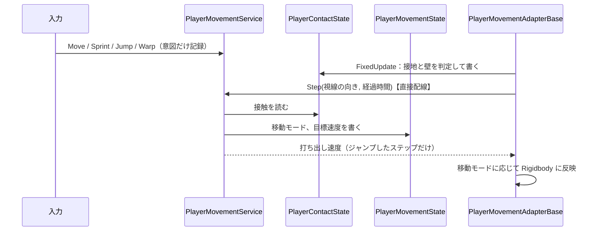

# 区間1：プレイヤー移動の完成

| 項目 | 内容 |
|---|---|
| 状態 | 着手（2026-10-04） |
| 目安の時期 | 2026/10/06〜10/12 |
| 前提となる区間 | 0 |
| 全体計画 | [InGameOverallPlan.md](../InGameOverallPlan.md) |

## 目的

仕様「プレイヤー移動」の移動アクションをすべて揃える。敵からの攻撃を受けるための、HP と被ダメージの窓口を用意する。

## 関連する仕様

- プレイヤー移動：https://app.notion.com/p/3e91ea2aa7fa818bbc3fe53a151e424f
- 失敗条件：https://app.notion.com/p/3e91ea2aa7fa813fb405e07c700a75b4

## 計画書と今のコードの食い違い（着手時に確認）

| # | 内容 | 対応 |
|---|---|---|
| 1 | 骨子の「決めること」にあった「HP の値と回復の有無」は、全体計画の 7 章では区間4に割り当てられている | 区間1では最大 HP の仮の値だけを決める。回復は区間4のまま |
| 2 | 骨子の「エンジン側の情報を Application へ渡す経路」は、2026-10-04 の設計の更新（Application と EngineAdapterLayer の直接配線、EngineAdapterLayer による State の所有）で答えが出ている | 接触は Adapter が持つ State にし、視線の向きと経過時間は直接配線で渡す（下の「設計」） |
| 3 | InGame シーンには地面しかなく、壁走りを試す壁がない | 作業に「テスト用の壁」を足す |

## 既存コードの確認結果

| 対象 | 状態 |
|---|---|
| [PlayerMovementService](../../../Code/Scripts/Application/Player/PlayerMovementService.cs) | Move 入力からカメラ相対の方向と速度を State に書くだけ。時間の経過を扱う処理はない |
| [PlayerMovementState](../../../Code/Scripts/BlackBoardLayer/Player/Runtime/PlayerMovementState.cs) | カメラ相対の `MovementDirection` と `MovementSpeed`。読むのは Adapter だけ |
| [PlayerMovementAdapterBase](../../../Code/Scripts/EngineAdapterLayer/Player/PlayerMovementAdapterBase.cs) | FixedUpdate で水平速度を目標へ加速・減速レート（40 / 60 m/s²）で近づける。Y 方向の速度は触らない。カメラ相対からワールドへの変換は `StandardPlayerMovementAdapter.ResolveWorldDirection` |
| [PlayerInitializer](../../../Code/Scripts/Initialization/Player/PlayerInitializer.cs) | 歩行速度 `_moveSpeed`（5 m/s）を Inspector に持ち、Service に渡す |
| PlayerRoot（`StandardPlayerControl.unity`） | レイヤーは Default。Collider の物理マテリアルはなく、プロジェクト既定のマテリアルもない（既定の摩擦が効く）。衝突判定は Discrete。補間は有効 |
| 入力 | Jump（Space）、Sprint（左 Shift）、Warp（左 Ctrl）はどれも Button 型 |
| レイヤー | `Player` と `Wall` は定義済み |
| 設定の State | 視点の感度は `PlayerOperationConfigState`（PlayerBoard の GameState）にある。アクセシビリティの設定を置く State はない |

## 作業一覧

| # | 作業 | 層 | 内容 |
|---|---|---|---|
| 1-1 | ダッシュ | BlackBoard / Application | Sprint 入力で目標速度を切り替える。押している間か、トグルかを `AccessibilitySettingState` で選ぶ |
| 1-2 | ジャンプ | Application / EngineAdapter | 接触の State、接地の判定、上向きの速度を与える処理 |
| 1-3 | 壁走り | Application / EngineAdapter | 壁との接触の判定、壁走り（ラッチを含む）に入る条件と抜ける条件、壁ジャンプ |
| 1-4 | 短距離ワープ | Application / EngineAdapter | 視線の向きに入力の向きを少し混ぜた方向への高速移動、クールタイム、エフェクトの差し込み口（移動モードの変化の通知） |
| 1-5 | ワープ中の軽減 | Application | 軽減率（0〜100）の適用 |
| 1-6 | HP と被ダメージの窓口 | BlackBoard / Application | HP の State、ダメージを受け付ける操作（軽減率を適用する）、HP が 0 になったことの通知 |
| 1-7 | 移動パラメータのデータ化 | ExternalLayer | 遊びのルールに関わる値を ScriptableObject にまとめる |
| 1-8 | 物理の下準備 | Level | 摩擦ゼロの物理マテリアル、PlayerRoot を Player レイヤーへ、衝突判定を ContinuousDynamic へ、InGame にテスト用の壁（Wall レイヤー） |

## 完了条件

- 歩行、ダッシュ、ジャンプ、壁走り、短距離ワープがすべて操作できる
- 各パラメータを Inspector から調整できる
- デバッグ操作でダメージを与えると HP が減り、ワープ中は軽減率が適用され、HP が 0 になると通知が出る

## 詳細仕様で決めること（2026-10-04 決定）

| # | 項目 | 決定 |
|---|---|---|
| 1 | ダッシュの操作 | `AccessibilitySettingState`（AppBoard の GameState）の `SprintInputMode` で、Hold（押している間）と Toggle を選ぶ。既定は Hold。Toggle は、もう一度押したときと、移動入力が 0 になったときに解除する。空中でも有効。歩行 5 m/s、ダッシュ 9 m/s |
| 2 | 空中での操作 | 空中でも水平移動を操作できる。加速・減速レートは地上と分ける（仮に 10 / 10 m/s²。壁ジャンプの横の勢いが、地上の減速 60 m/s² だと約 0.1 秒で消える為） |
| 3 | ジャンプ | 地上でだけ跳べる。二段ジャンプはなし。高さで指定する（仮に 1.5m。初速は重力から求める） |
| 4 | 壁走りに入る条件 | 空中（地面に触れていない）で Wall レイヤーの面に触れていて、前向きの移動入力があり、壁走りの持ち時間が残っているとき。ただし、入力が壁から離れる向き（下の 7 の角度以内）の間と、壁ジャンプのあと壁との接触が一度切れるまでは入らない（実装時に追加。斜めの入力での「入る→離れる」の繰り返しと、壁ジャンプ直後の入り直しを防ぐ為） |
| 5 | 壁走り中の動き | 重力を切る。入力を壁の面に投影した水平方向へ、壁走り速度（仮に 9 m/s）で進む。入力がなければその場にとどまる（ラッチ） |
| 6 | 壁走りの持ち時間 | 走っている間もラッチしている間も減る（仮に 1.5 秒）。着地でだけ回復し、壁ジャンプでは回復しない。抜けたあとも、持ち時間が残っていれば再び壁走りに入れる（同じ壁でもよい） |
| 7 | 壁走りを抜ける条件 | ① 持ち時間が尽きる ② 壁から離れる ③ 壁ジャンプをする。② は、入力の向きと壁の法線（壁から離れる向き）のなす角が閾値（仮に 45°）以下の状態が一定時間（仮に 0.2 秒）続いたとき、または何かの干渉で壁との接触が切れたとき。入力がないときは、どこを向いていてもラッチを続ける。壁へ押し込む向きの入力では離れない |
| 8 | 壁ジャンプ | 水平方向は、入力から壁へ押し込む成分を取り除いたものと、壁の法線とを、割合（仮に 0.5）で混ぜる。入力がなければ法線の向き。横の速さは仮に 6 m/s、上向きの速度はジャンプと同じ |
| 9 | ワープ | 方向は「視線の向き ＋ ワールドの入力の向き × 割合（仮に 0.2）」を正規化したもの（仕様変更。2026-10-04）。距離 8m、所要 0.15 秒、クールタイムはワープ終了から 0.5 秒。空中や壁走り中でも使え、壁走り中なら壁走りを抜ける。ワープ中は重力を切る。終わったら、水平速度はワープ前の速度に戻し、垂直速度は 0 にする |
| 10 | ワープ中の軽減率 | 100（無敵）。0〜100 で調整できる |
| 11 | HP | 最大 100 の整数。HP が 0 になったあとのダメージは無視する。回復は区間4、ステージ開始時のリセットは区間11で決める |
| 12 | パラメータの置き場所 | 遊びのルールに関わる値は ScriptableObject（`PlayerParameterData`）にまとめる。物理の反映の調整値（加速・減速レート、接触判定の距離）は Adapter の Inspector に置く（Adapter は ExternalLayer を参照できない為） |
| 13 | 時間の数え方 | ワープの所要時間、クールタイム、壁走りの持ち時間は FixedUpdate の経過時間で数える。スローモード中は一緒に遅くなる |
| 14 | エンジン側の情報を渡す経路 | 接触（地面・壁・壁の法線）は、Adapter が所有して書き込む `PlayerContactState` で渡す（設計「EngineAdapterLayer による State の所有」）。視線の向きと経過時間は毎ステップ変わる値なので、直接配線で Adapter の FixedUpdate から `PlayerMovementService.Step` に渡す |
| 15 | ジャンプを Adapter に伝える経路 | `Step` の戻り値で、そのステップで与える打ち出し速度（なければ null）を返す。続く動き（移動モード、目標速度）は State で渡す |
| 16 | PlayerMoveTest | 新しい参照を設定し、引き続き動くようにする |

## 設計

### State

| State | Board / 寿命 | 持つもの | 書くクラス |
|---|---|---|---|
| `PlayerContactState` | PlayerBoard / SceneState | 接触（`[Flags] PlayerContact { None, Ground, Wall }`）、壁の法線、接触の変化の通知（変化前と変化後） | `PlayerMovementAdapterBase`（EngineAdapterLayer） |
| `PlayerMovementState` | PlayerBoard / SceneState | 移動モード（`PlayerMoveMode { Normal, WallRunning, Warping }`）、ワールド空間の目標速度、移動モードの変化の通知 | `PlayerMovementService` |
| `AccessibilitySettingState` | AppBoard / GameState | `SprintInputMode { Hold, Toggle }` | `ApplicationManagementInitializer`（初期値を書くだけ） |
| `PlayerHealthState` | PlayerBoard / SceneState | 現在の HP、最大 HP、HP の変化の通知 | `PlayerHealthService` |

- `PlayerContactState` は、Adapter が物理ステップの結果から書く。接地の境目などでのチラつきは、Adapter 側で一度だけ安定させる
- 地面と壁の両方に触れているときは地面を優先し、壁走りには入らない
- 接触が None に変わった瞬間が、空中に出た瞬間
- ラッチは「WallRunning で入力がない」状態で、別の値は持たない

### 処理の流れ

- 入力をワールドの向きに直す処理と、壁走り・壁ジャンプ・ワープの判定は、すべて `PlayerMovementService` が行う
- Adapter は、接触の判定と `PlayerContactState` への書き込み、視線の向きの取得、Rigidbody への反映だけを行う

### 新しく作る型と、区間1での利用者

| 型 | 層 | 利用者 |
|---|---|---|
| `PlayerContact`、`PlayerContactState` / `IPlayerContactState` | BlackBoard | Adapter（書く）、`PlayerMovementService`（読む）、デバッグ表示 |
| `PlayerMoveMode` | BlackBoard | `PlayerMovementService`、Adapter、`PlayerHealthService` |
| `SprintInputMode`、`AccessibilitySettingState` / `IAccessibilitySettingState` | BlackBoard | `PlayerMovementService` |
| `PlayerHealthState` / `IPlayerHealthState` | BlackBoard | `PlayerHealthService`（書く）、デバッグ表示 |
| `PlayerHealthService` | Application | `PlayerDebugInitializer`（DI で具象型のまま渡す） |
| `PlayerParameterData` | External | `PlayerInitializer` |
| `PlayerDebugInitializer` | Initialization | 完了条件3の確認（ダメージのボタン、ワープ中にダメージを与えるトグル、HP の表示、HP 0 のログ） |

作らないもの：ダメージ受付のインターフェース、プレイヤーの EventBoard とジャンプのイベント、接触情報を運ぶ struct、エフェクトの差し込み口専用の型

### コミットの分け方

| # | 内容 | 確かめ方 |
|---|---|---|
| 1 | `PlayerParameterData`、`AccessibilitySettingState`、ダッシュ（Hold / Toggle）、目標速度をワールド空間にする変更と `Step` の直接配線 | 歩行とダッシュの速度が切り替わる。Hold と Toggle の両方 |
| 2 | 接触の State、接触の判定、ジャンプ、物理マテリアル、Player レイヤー | Space で跳び、接触が Ground → None → Ground と変わる。壁に押し付けても張り付かない |
| 3 | 壁走り、ラッチ、抜ける条件、壁ジャンプ、空中の加減速、テスト用の壁 | 上の 4〜8 の挙動 |
| 4 | ワープ、クールタイム、移動モードの変化の通知、ContinuousDynamic | 方向、距離、クールタイム、壁をすり抜けない |
| 5 | HP と被ダメージ、ワープ中の軽減、`PlayerDebugInitializer`、Compositor の作り直し、PlayerMoveTest への追従 | 完了条件3 |
| 6 | 区間計画書の「実装結果」と全体計画書の更新 | ― |

## 見つけた問題（今回は扱わない）

- 壁の判定は `Collider.ClosestPoint` で壁の面上の点を求める為、凸でない MeshCollider の壁は判定できない（ボクセルの壁を壁走りの対象にするとき、区間5以降で見直す）
- 古い名前「PlayerMovementAbstractor」が `PlayerInitializer.cs` の XML コメントとエラーメッセージに残っている（`PlayerMovementService.cs` の分は、コミット1で XML コメントを書き直した際に消えた）

## 他プラットフォームへの対応

- 移動の判断は Application に置き、Rigidbody への反映は `Standard〜` / `Vr〜` の Adapter に置く
- 視線の向きは Adapter が渡す。VR の Adapter は、HMD の向きを渡すように対応時に直す（区間1では体の向きを渡す）
- VR では、ダッシュとワープによる酔いへの対策（暗転や視野を狭めるなど）が別に必要になる
