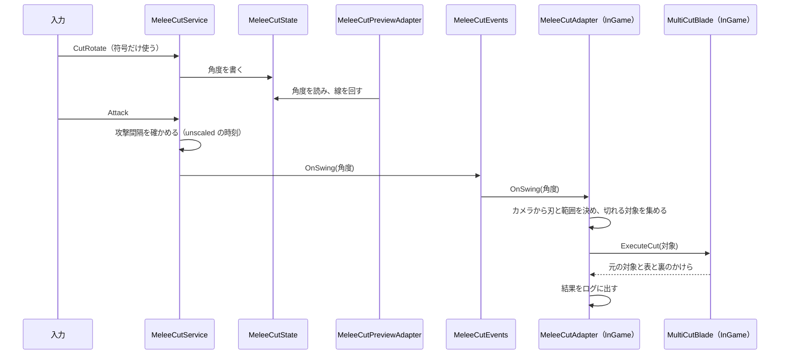

# 区間2：近接切断

| 項目 | 内容 |
|---|---|
| 状態 | 完了（2026-10-05） |
| ブランチ | `feature/alpha/cut-attack`（UsefulToolkit 側は `feature/meshcut/execute-cut`） |
| 目安の時期 | 2026/10/13〜10/19 |
| 前提となる区間 | 0 |
| 全体計画 | [InGameOverallPlan.md](../InGameOverallPlan.md) |

## 目的

剣による近接切断（通常攻撃）を作る。切断面の角度はマウスホイールで回す。
切断で生まれたかけらと元の対象を、切断の結果として受け取れるようにする（通知の仕組みは、受け取り手のできる区間3で作る）。

## 関連する仕様

- 近接切断（通常攻撃）：https://app.notion.com/p/3e91ea2aa7fa8139b59ffc7be6c0e090
- ダメージタイプ：https://app.notion.com/p/3e91ea2aa7fa81c49ddbf615308a48f8
- 時間制御（スローモード）：https://app.notion.com/p/3ea1ea2aa7fa8183bbfac10bfafd4d70

## 計画書と今のコードの食い違い（着手時に確認）

| # | 内容 | 対応 |
|---|---|---|
| 1 | 骨子の 2-6「かけらの通知」は、区間2では受け取り手がデバッグのログしかない | 区間2では、切断の結果を受け取ってログに出すところまでにする。通知の Event は区間3で作る（決定 2） |
| 2 | InGame シーンには Compositor と Initializer が 1 つもない（区間0の決定どおり。Initializer がないので、なくても動く） | 切断の Adapter を InGame に置くので、その Initializer と InGame の Compositor を作る（決定 3） |
| 3 | シーンの構成を変えた（2026-10-04）。InGame はインゲーム共通のシステムを置くシーンにし、ライティング・敵の生成位置・置くオブジェクトは、ステージごとのステージシーンに置く | 区間2では、システムを InGame に置くことだけをこの構成に合わせる。今の InGame にあるライト・地面・テスト用の壁をステージシーンへ移す作業は、区間4の最初に行う（[Section04](Section04_Enemy.md)） |
| 4 | `MultiCutBlade` は生まれたかけらを返さない | UsefulToolkit を拡張する（決定 1、コミット0） |

## 既存の資産

UsefulToolkit.MeshCut（`Library/PackageCache/com.rei.usefultoolkit.meshcut@*/README.md`）

| 資産 | 内容 |
|---|---|
| `MultiCutBlade` | 自分の Transform を刃にする（`position` が平面上の点、`up` が法線）。`ExecuteCut(CuttableObject[] targets)` で、渡した対象を 1 枚の平面でまとめて切り、プールのかけらに結果を反映する。切る対象は呼び出す側が集める（`BoxCollider` の範囲で集めるのは Inspector の右クリックメニュー「切断」のテスト用だけ）。**生まれたかけらを返さず、通知もしない**（コミット0で返すようにする）。プールをシリアライズで参照する（`_pool`）ので、プールと同じシーンに置く |
| `MultiMeshCut` | 切断の計算だけを行う。結果のメッシュ（`CutMesh`、`i*2` が表・`i*2+1` が裏）とコライダー用の点を返し、かけらへの反映は呼び出す側が書く |
| `CuttableObject` | 切断対象とかけらの両方に使う。`IsCuttable`、`Can Multi Cut`（何度も切れるか。かけらへ引き継がれる）、`ReuseAction`（プールに回収されたときに呼ばれる） |
| `MeshDataCache` | `Start` の時点で自分の子孫にある `CuttableObject` のメッシュを登録する。切断対象は必ずこの子孫に置く |
| `MeshCutObjectPool` | かけらを `Start` で非同期に事前生成して使い回す。固定長のリングバッファで、空きがないと最も古いかけらを回収して使う |
| 切断後の元の対象 | `ExecuteCut` は元の対象を `DisableCutting()` して非アクティブにする。元の対象の代わりに、表と裏の 2 つのかけらが表示される |
| セットアップ | メニュー `UsefulToolkit/Mesh Cut/Setup` で、シーンに `MeshCut System`（`MeshDataCache` / `FragmentPool` / `CutBlade`）を置き、選んだオブジェクトを切断対象にする。かけらのプレハブ（`CuttableObject` / `MeshFilter` / `Renderer`、物理を使うなら `Rigidbody`）は自分で用意する |
| 制限 | 切断の結果を受け取れるのは、切断を始めた次のフレーム以降（`ExecuteCut` は非同期） |
| 旧シーン | `Test/InGame.unity` に旧構成（MeshCutSystem_V2 など）が残っている。参考程度にし、使わない |

## 既存コードの確認結果

| 対象 | 状態 |
|---|---|
| InGame シーン（`Master/InGame/InGame.unity`） | ライト、地面、テスト用の壁（`TestWalls`）だけ。Compositor と Initializer はない |
| StandardPlayerControl シーン | `Compositor`、`PlayerRoot`、`CameraPivot`、`Main Camera`（MainCamera タグ）。UI の Canvas はない |
| [PlayerInitializer](../../../Code/Scripts/Initialization/Player/PlayerInitializer.cs) | 移動・視点・HP の Service を生成し、Adapter に配線している。切断の Service もここで生成できる |
| [AccessibilitySettingState](../../../Code/Scripts/BlackBoardLayer/CoreSystem/ApplicationManagement/AccessibilitySettingState.cs) | AppBoard の GameState。`SprintInputMode` だけを持つ。初期値は常駐シーンの `ApplicationManagementInitializer` の Inspector で決める |
| [PlayerParameterData](../../../Code/Scripts/ExternalLayer/Player/PlayerParameterData.cs) | 遊びのルールに関わる値の ScriptableObject。区間1で作った |
| `PlayerBoard` | ChildStateBoard。プレイヤーの EventBoard はない |
| 入力（Player マップ） | Attack は Button 型で左クリック（タッチのタップにも割り当てあり）。CutRotate は Axis 型で `<Mouse>/scroll/y`（区間0で追加） |
| `InputContext<T>` | `Phase` と `Value` だけで、時刻を持たない |
| asmdef | EngineAdapter は `UsefulToolkit.MeshCut.Runtime` を参照済み |

## 作業一覧

| # | 作業 | 層 | 内容 |
|---|---|---|---|
| 2-0 | 切断の結果を返す | UsefulToolkit | `MultiCutBlade.ExecuteCut` が、元の対象と表と裏のかけらの組を返すようにする。別の作業者が行う。要件は [Section02_ExecuteCutResultRequirements.md](Section02_ExecuteCutResultRequirements.md) |
| 2-1 | MeshCut の配置 | Level | InGame に MeshCut System を組む。かけらのプレハブ（Rigidbody の補間あり）と断面のマテリアルを用意する |
| 2-2 | 切断面の角度 | BlackBoard / Application | ホイール入力で切断面の角度を回し、State に持つ。1段あたりの角度はアクセシビリティの設定に置く |
| 2-3 | 攻撃の通知 | BlackBoard / Application | 攻撃入力と攻撃間隔から、攻撃したことを Event で流す |
| 2-4 | 刃の配置と切断の実行 | EngineAdapter | 攻撃の Event を受けて、カメラの位置と向き、切断面の角度から刃を配置し、範囲内の切れる `CuttableObject` を集めて切断する |
| 2-5 | 切断面のプレビュー | EngineAdapter | 切断面の角度を画面の中央に線で表示する |
| 2-6 | 切断の結果のログ | EngineAdapter | 2-4 の Adapter が、`ExecuteCut` の結果（元の対象と表と裏のかけら）をログに出す。通知の仕組みは区間3で作る |
| 2-7 | 切れるダミー | Level | パーツに分かれた、切断できるダミーの敵。InGame の `MeshDataCache` の子に置く |

## 完了条件

- ホイールで回した角度がプレビューに表示され、ダミーの敵をその角度で切断できる
- 切断で生まれたかけらと元の対象が、ログに出る（通知の仕組みは区間3で作る）

## 詳細仕様で決めること（2026-10-04 決定）

| # | 項目 | 決定 |
|---|---|---|
| 1 | 生まれたかけらを受け取る方法 | UsefulToolkit の `MultiCutBlade.ExecuteCut` が、元の対象と表と裏のかけらの組を返すようにする。作業は別の作業者が UsefulToolkit のリポジトリで行い、マージの後で刻断のパッケージを更新する。`MultiMeshCut` を直接使う案は、かけらへの反映（約150行）の重複になるので採らない |
| 2 | かけらの通知 | 区間2では、切断の Adapter が結果をログに出すところまでにする。Event（または State）は、受け取り手（チャージ）のできる区間3で作る。区間2で受け取るのがデバッグのログだけの為 |
| 3 | 切断の Initializer を置くシーン | InGame（インゲーム共通のシステム）に、MeshCut System、切断の Adapter、その Initializer（`MeleeCutInitializer`）を置き、InGame の Compositor を作る。刃はプールと同じシーンに置く必要があり、敵は `MeshDataCache` の子に置く必要がある為。InGame のスコープからは、StandardPlayerControl のスコープに DI 登録した物を受け取れないので、シーンをまたぐ受け渡しは BlackBoard で行う（区間4の「決めること」#7 とは別に決める） |
| 4 | 攻撃の通知の経路 | EventBoard。`PlayerEventBoard`（ChildEventBoard）に `MeleeCutEvents` を StandardPlayerControl のシーンの Event として登録し、`OnSwing`（中身は振ったときの角度）を流す。「攻撃した」は値を持たない出来事で、シーンをまたぐので直接配線もできない為 |
| 5 | 切断判定の方式 | 攻撃した瞬間に、範囲内をまとめて 1 枚の平面で切る（`ExecuteCut` は 1 回に 1 枚の平面で切る為）。振りの軌跡に沿った判定はしない。刃と範囲は下の「設計」 |
| 6 | 攻撃の範囲と間隔 | 範囲は距離 3m、幅 2m、厚み 0.2m（仮。Adapter の Inspector に置く）。攻撃間隔は 0.3 秒（仮。`PlayerParameterData` に置く）。攻撃間隔はスロー中も等速（unscaled）で数える |
| 7 | 切断面の回転 | 段階で持ち、0° 以上 180° 未満で巡回させる（180° 回すと同じ面になる為）。1段あたりの角度は `AccessibilitySettingState` に置き、初期値は 15°。ホイールの値は符号だけを使う。上に回すと、画面上で反時計回りに回る |
| 8 | 剣のアニメーション | 区間2では付けない（区間13）。付けるときは、Animator の Update Mode を UnscaledTime にする |
| 9 | 何度も切れる設定 | ダミーのパーツは `Can Multi Cut` を true にし、かけらも切り直せるようにする。かけらのプールの生成数は 128。切り直したときのチャージの数え方は区間3で決める |

## 設計

### State と Event

| 型 | Board / 寿命 | 持つもの | 書く・流すクラス |
|---|---|---|---|
| `MeleeCutState` / `IMeleeCutState` | PlayerBoard / SceneState（StandardPlayerControl） | 切断面の角度（度。0 以上 180 未満） | `MeleeCutService` |
| `AccessibilitySettingState`（拡張） | AppBoard / GameState | ホイール1段あたりの切断面の回転角度 | `ApplicationManagementInitializer`（初期値を書くだけ） |
| `MeleeCutEvents` | PlayerEventBoard / SceneEvent（StandardPlayerControl） | `OnSwing`（`IActionChannel<float>`。振ったときの角度） | `MeleeCutService` |

### 処理の流れ

- 攻撃間隔の時刻は、`PlayerInitializer` が `MeleeCutService` に時刻を返す関数（`Time.unscaledTimeAsDouble`）を渡す。入力に時刻が付かず、毎フレーム呼ぶ Adapter もない為
- 刃の位置はカメラの位置。法線は、カメラの上方向を、カメラの前方向を軸に角度だけ回したもの（角度 0° で水平に切る）。刃はカメラの位置を通るので、画面の中央を通る線で切れる
- 範囲は、中心が「カメラの位置 ＋ 前方向 × 距離 / 2」、大きさが（幅、厚み、距離）、向きが「前方向を奥、法線を上」の直方体。`Physics.OverlapBox` で集め、`CuttableObject` を持ち `IsCuttable` が true のものだけに絞る（同じ物は 1 回だけ）
- カメラは StandardPlayerControl にある。InGame の Adapter は `Camera.main` から読む
- アウトゲームには切断の Adapter がないので、攻撃しても何も切れない（`OnSwing` は流れる）

### 新しく作る型と、区間2での利用者

| 型 | 層 | 区間2での利用者 |
|---|---|---|
| `MeleeCutState` / `IMeleeCutState` | BlackBoard | `MeleeCutService`（書く）、`MeleeCutPreviewAdapter`（読む） |
| `PlayerEventBoard`、`MeleeCutEvents` | BlackBoard | `MeleeCutService`（流す）、`MeleeCutAdapter`（受け取る） |
| `MeleeCutService` | Application | `PlayerInitializer` |
| `MeleeCutAdapter` | EngineAdapter | `MeleeCutInitializer` |
| `MeleeCutPreviewAdapter` | EngineAdapter | `PlayerInitializer` |
| `MeleeCutInitializer` | Initialization | InGame シーン（Initializer はアーキテクチャの規則で必要） |
| `InGameCompositor` | Initialization（自動生成） | InGame シーン |

拡張する型：`AccessibilitySettingState`（1段あたりの角度）、`ApplicationManagementInitializer`（その初期値）、`PlayerParameterData`（攻撃間隔）、`PlayerInitializer`（`MeleeCutService` の生成とプレビューの配線）

作らないもの：かけらの通知の Event や State（区間3）、剣のアニメーション（区間13）、ステージシーン（区間4）

### コミットの分け方

| # | 内容 | 確かめ方 |
|---|---|---|
| 0 | （UsefulToolkit。別の作業者）`ExecuteCut` が結果を返す | 要件定義の「受け入れの確認」 |
| 1 | InGame に MeshCut System、かけらのプレハブ、断面のマテリアル、ダミーの敵を置く（2-1、2-7） | プレイモードで、`CutBlade` の右クリックメニュー「切断」からダミーを切れる |
| 2 | `AccessibilitySettingState` の拡張、`MeleeCutState`、`MeleeCutService`（ホイール）、プレビュー（2-2、2-5） | ホイール1段で角度が 15° ずつ変わり、180° で 0° に戻り、プレビューの線が回る |
| 3 | 攻撃間隔、`PlayerEventBoard` と `MeleeCutEvents`、常駐シーンの Compositor の作り直し（2-3） | 攻撃すると `OnSwing` が流れ、攻撃間隔より短い連打では流れない（確認用のログ） |
| 4 | `MeleeCutAdapter`、`MeleeCutInitializer`、InGame の Compositor の生成、結果のログ（2-4、2-6） | 完了条件 |
| 5 | 区間計画書の「実装結果」と全体計画書の更新 | ― |

- コミット0はマージ済み。刻断のパッケージの更新は、コミット1の前に別のコミット（`5220167`）で行った

## 実装中に確かめること

| 内容 | 結果 |
|---|---|
| 刃の平面と交わっていない対象（範囲には入っているが、平面の片側にだけある物）を `ExecuteCut` に渡したときの挙動 | 確かめた（コミット1）。元の対象は非アクティブになり、全体が入ったかけらと、頂点 0 個の空のかけらができる（どちらもアクティブ）。コミット4で、対象のバウンディングボックスが刃の平面をまたぐものだけに絞る |

## 見つけた問題（今回は扱わない）

- 【UsefulToolkit・修正済み（`8aecde7`）】拡大率が軸ごとに違う対象を、斜めの刃で切ると、切断面の向きがずれる。`BladeToLocalJob` が刃の法線をローカル空間へ移すとき、拡大率で割っている（`normal *= reciprocal`）。法線は拡大率を掛ける必要がある。ダミーの脚（拡大率 0.22, 0.75, 0.22）を 30° の刃で切ると、刃の反対側に 0.3m ほどはみ出したかけらができた。拡大率が軸ごとに同じ頭と、水平の刃で切った腕は正しく切れた。また、拡大率は `localScale` を使っているので、親に拡大率があると同じようにずれる（こちらは修正後も残る。区間4へ持ち越す）
- 【UsefulToolkit・修正済み（`8aecde7`）】切断で生まれたメッシュの `bounds` が大きさ 0（原点）になっている。`MultiMeshCut` の `Mesh.ApplyAndDisposeWritableMeshData` のあとに、bounds を設定していない為。かけらの `Renderer.bounds` が切断元の位置の 1 点になるので、その点が画面の外に出ると、かけらが見えていてもカリングで消える。`MultiCutBlade` の右クリックメニュー「切断」のログの「side」も、この bounds を使っているので正しくない
- 切ったかけらが 2〜3m 散らばる（腕のかけらが胴体のかけらと重なり、押し出される）。かけらは区間3で、何かに触れたらオーブにする為、そのときに扱う
- スマホでは、Player マップの Attack にタップが割り当てられているが、CutRotate の割り当てがない（他プラットフォームへの対応で扱う）

## 実装結果（2026-10-05）

### 決めたこと

上の「詳細仕様で決めること」のとおりに作った。実装中に決めたこと、変えたことは次のとおり。

| # | 項目 | 結果 |
|---|---|---|
| 1 | UsefulToolkit の拡張（コミット0） | `MultiCutBlade.ExecuteCut` が `UniTask<MultiCutResult[]>`（`Original` / `Front` / `Back`）を返すようになった。別の作業者が、要件定義（[Section02_ExecuteCutResultRequirements.md](Section02_ExecuteCutResultRequirements.md)）のとおりに作った。あわせて、プールが 1 回の切断の中で一周したときに切断元のかけらが壊れる、既存の不具合も直された |
| 2 | UsefulToolkit の既存の不具合 | コミット1の確認で 2 つ見つかり、UsefulToolkit 側で直された（`8aecde7`）。拡大率が軸ごとに違う物を斜めに切ると切断面の向きがずれる不具合（`BladeToLocalJob` が法線を拡大率で割っていた）と、かけらのメッシュの bounds が大きさ 0 になる不具合 |
| 3 | 刃と交わらない対象 | 渡すと、元の対象が消えて、全体が入ったかけらと空のかけらができる。`MeleeCutAdapter` は、Renderer のバウンディングボックスが刃の平面をまたぐ対象だけを切る |
| 4 | 続けて振ったとき | 前の切断が終わる前に次の `OnSwing` が来たら、その振りでは切らない（`MultiCutBlade` は刃と計算用のインスタンスを 1 つずつしか持たない為） |
| 5 | InGame の Compositor | メニュー `UsefulToolkit/Generate/Scene Compositor` は確認のダイアログを出し、uloop から呼ぶと閉じるまで止まる。その中身の `GameCompositorGenerator.GenerateTo(scene, 保存先)` を直接呼んで生成した（生成されるファイルは同じ） |
| 6 | 断面のマテリアル | 既存の `Assets/Art/Materials/CutFace.mat`（赤）を使った |
| 7 | ダミーの位置 | InGame の地面の上面は y = -1 なので、ダミーもそこに立たせた。プレイヤーの開始位置から 3m 前 |

パラメータの仮の値

| 置き場所 | 値 |
|---|---|
| `AccessibilitySettingState`（常駐シーンの `ApplicationManagementInitializer` の Inspector） | ホイール 1 段あたりの回転角度 15° |
| `PlayerParameterData`（`Assets/Level/Data/Player/PlayerParameterData.asset`） | 攻撃間隔 0.3 秒（アセットにはまだ保存されておらず、既定値が使われる） |
| `MeleeCutAdapter`（InGame の `MeleeCut`） | 範囲の距離 3m、幅 2m、厚み 0.2m、対象のレイヤーはすべて |
| `FragmentPool`（InGame の `MeshCut System`） | かけらの生成数 128 |

### 作った主なもの

| 層 | ファイル |
|---|---|
| BlackBoardLayer | `MeleeCutState`（`IMeleeCutState`）、`PlayerEventBoard`、`MeleeCutEvents`（`IMeleeCutEvents`、`OnSwing`）。`AccessibilitySettingState` に `CutRotateStepAngle` を足した |
| Application | `MeleeCutService`（ホイールで角度を回す、攻撃間隔を unscaled の時刻で数えて `OnSwing` を流す） |
| ExternalLayer | `PlayerParameterData` に `MeleeAttackInterval` を足した |
| EngineAdapterLayer | `MeleeCutAdapter`（刃の配置、対象の収集、切断、結果のログ）、`MeleeCutPreviewAdapter`（画面中央の線） |
| Initialization | `MeleeCutInitializer`、`InGameCompositor`（自動生成）。`PlayerInitializer`（`MeleeCutService` の生成、プレビューの配線）、`ApplicationManagementInitializer`（1 段の角度の初期値）、`UsefulToolkitPersistentCompositor`（`PlayerEventBoard` の登録。作り直し） |
| Level | InGame に `MeshCut System`（`MeshDataCache` / `FragmentPool` / `CutBlade`）、`DummyEnemy`（頭・胴体・両腕・両脚。`Can Multi Cut` は true）、`MeleeCut`、`Compositor`。StandardPlayerControl に Canvas `MeleeCutPreview`。かけらのプレハブ `Assets/Level/Prefabs/MeshCut/CutFragment.prefab`（Rigidbody の補間あり） |

### 完了条件の確認結果

確認は、常駐シーンから再生してインゲームに入り、左クリックとホイールの入力を uloop で擬似的に入れて行った。

| # | 条件 | 結果 |
|---|---|---|
| 1 | ホイールで回した角度がプレビューに表示され、ダミーの敵をその角度で切断できる | 確認済み。ホイール 1 段で 15° ずつ変わり、0° をまたいで 165° に巡回し、線も同じ角度に傾いた（スクリーンショットで確認）。0° で頭、90° で胴体、135° で右腕が切れた。斜め 30° の刃で脚を切ると、表のかけらは刃の表側、裏のかけらは裏側に収まった（刃からの距離が表 0.00〜0.43、裏 -0.33〜0.00）。攻撃間隔より短い連打では 1 回しか振らず、`Time.timeScale` が 0.1 のときも実時間で数えた |
| 2 | 切断で生まれたかけらと元の対象が、ログに出る | 確認済み。例：「角度 90° で 2 個を切断しました。元: Body / 表: CutFragment (Clone)#2 / 裏: CutFragment (Clone)#3 …」。かけらの切り直しも出た。エラーと警告は 0 件。最後にログの書式（元の対象にも番号を付ける）を直したあとは、プレイモードで動かしていない |

### 次の区間へ持ち越すこと

- 区間3：かけらの通知（作業 3-0）。切断の結果は `MeleeCutAdapter.CutAsync` で `ExecuteCut` の戻り値として受け取っている。プレイヤーの出来事の置き場所として `PlayerEventBoard` がある
- 区間3：切ったかけらが 2〜3m 散らばる（かけら同士が重なって押し出される）。何かに触れたらオーブにする処理と合わせて扱う
- 区間3：プールが 1 回の切断の中で一周すると、`Original` が同じ切断の別の組の `Front` / `Back` として使い回されることがある（MeshCut の README「結果の参照の扱い」）
- 区間4：MeshCut は拡大率を `localScale` で扱うので、切断対象の親に拡大率を持たせない（親に拡大率があると切断面がずれる）
- 区間4：刃はカメラの高さを通る為、水平（0°）に振るとカメラより低い部分は切れない。敵の大きさを決めるときに考える。実際の操作での感触はレビューで確かめる
- 区間11：操作シーンはアウトゲームでも残るので、プレビューの線がアウトゲームでも出る
- 区間13：剣のアニメーション（Animator の Update Mode は UnscaledTime）、切断のエフェクト

### 使い方

- 左クリックで振り、ホイールで切断面を回す。画面中央の線が切断面の角度
- Alt キーを押している間は、カーソルのロックが外れて自由に動かせる（エディタのみ）。仮のアウトゲームのボタンや、デバッグ用の画面上の操作を押すときに使う。押している間も視点の操作と攻撃は効く
- ホイール 1 段の角度は常駐シーンの `ApplicationManagementInitializer`、攻撃間隔は `PlayerParameterData`、切断の範囲は InGame の `MeleeCut` にある `MeleeCutAdapter` の Inspector で変える
- 切れる物を足すときは、InGame の `MeshCut System/MeshDataCache` の子に置き、`CuttableObject` を付ける（メニュー `UsefulToolkit/Mesh Cut/Setup` の「選択オブジェクトを切断可能化」）。対象には切断用のコライダー（`CuttableObject` が作る球コライダーとは別）が要る
- `CutBlade` の右クリックメニュー「切断」は、`CutBlade` の `BoxCollider` の範囲を切るテスト用。`MeleeCutAdapter` は振るたびに `CutBlade` の位置と向きを変える

## 他プラットフォームへの対応

- 切断面の角度と攻撃の通知は Application と BlackBoard で持ち、プラットフォームに依存させない
- 刃の配置（カメラから決める）は `MeleeCutAdapter` が行う。VR では手の動きから切断面を決め、スマホでは既存の Smartphone マップにある方向別の攻撃ボタン（AttackVertical など）を使う想定。どちらも Adapter と入力の層で吸収する
