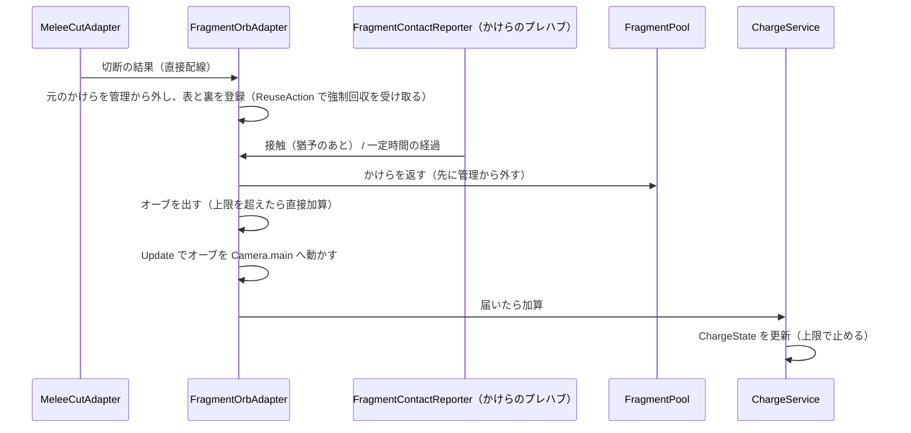

# 区間3：かけら・オーブ・チャージ

| 項目 | 内容 |
|---|---|
| 状態 | 実装中（2026-10-05 着手） |
| 目安の時期 | 2026/10/20〜10/26 |
| 前提となる区間 | 2 |
| 全体計画 | [InGameOverallPlan.md](../InGameOverallPlan.md) |

## 目的

切断で生まれたかけらをオーブに変えてプレイヤーに吸収させ、チャージを溜める。
その前に、操作シーン（StandardPlayerControl）を InGame に統合し、インゲームの機能を 1 つの DI のスコープにまとめる（決定 A）。

## 関連する仕様

- チャージ（かけら・オーブ）：https://app.notion.com/p/3e91ea2aa7fa81249000ca51326add0f
- アウトゲーム・通貨：https://app.notion.com/p/3e91ea2aa7fa81e3b271e0fc71189ea6（アウトゲームはスキルの購入と装備だけで、プレイヤーを歩かせる記述はない）

## 計画書と今のコードの食い違い（着手時に確認）

| # | 内容 | 対応 |
|---|---|---|
| 1 | 操作シーン（StandardPlayerControl）と InGame は別の Compositor のスコープで、DI は「自分のスコープ → Root」しか探さない。チャージの State と Service の置き場所が決まらない（区間2の `OnSwing` の Event、区間4の決めること #7 も同じ原因） | 操作シーンを InGame に統合する（決定 A、コミット0） |
| 2 | 3-1「かけらの管理」は Application / BlackBoard の作業になっているが、かけらは MeshCut の `CuttableObject` で、Application の asmdef は MeshCut を参照していない。区間3には、かけらの状態を読む利用者もいない（つかむのは区間7） | かけらの管理は EngineAdapter の Adapter に閉じ込め、State は作らない |
| 3 | 3-1「チャージにならないかけらの印」と 3-4「消費の操作」は、区間3に利用者がいない（投擲は区間7、消費は区間6・7） | 区間6・7へ持ち越す |
| 4 | かけらのプレハブ（`CutFragment`）は Default レイヤー。`Shard` レイヤーはあり、Player との衝突は切ってあるが、Shard 同士は衝突する | かけらを Shard にし、Shard 同士の衝突を切る（決定 5） |
| 5 | `MeshCutObjectPool.ReleaseObject` は `OnRecycle` を呼ぶので、自分でかけらを返したときも `ReuseAction` が呼ばれる。`TryReleaseObject` はフラグを下ろすだけで非アクティブにしない | 自分で返すかけらは、返す前に管理から外す |
| 6 | ステージシーンは区間4（4-0）で作るので、3-5「ステージの外周」の置き場所がない | InGame の `TestWalls` の下に仮に置き、4-0 で一緒に移す |

## 既存の資産

| 資産 | 内容 |
|---|---|
| 区間2の成果 | `MultiCutBlade.ExecuteCut` が、切断した対象ごとに `MultiCutResult`（`Original` / `Front` / `Back`）を返す。InGame の `MeleeCutAdapter.CutAsync` が受け取ってログに出している。切ったかけらは、かけら同士が重なって 2〜3m 散らばる |
| `MeshCutObjectPool` | 固定長のリングバッファ（`RecycleBuffer`）。`Get` は先頭の枠を順に使い、使用中なら `OnRecycle`（`ReuseAction` を呼び、非アクティブにする）してから渡す。生成数は 128 |
| `CuttableObject` | `Rig`（Rigidbody）、`Renderer`、実行時に作られる球コライダー（`_colliderNum` 個）。`ReuseAction` は public な `Action` のフィールド |
| `CutFragment.prefab` | Default レイヤー。Rigidbody（質量 1、補間あり、衝突判定は Discrete） |
| 物理レイヤー | `Player`（3）、`Shard`（6）、`Enemy`（7）、`Blade`（8）、`Wall`（9）。Player は Shard・Enemy と衝突しない |

## 既存コードの確認結果

| 対象 | 状態 |
|---|---|
| StandardPlayerControl シーン | `Compositor`（`StandardPlayerInputRouteInitializer` / `PlayerInitializer` / `PlayerDebugInitializer`）、`PlayerRoot`（Player レイヤー）、`CameraPivot`、`Main Camera`、Canvas `MeleeCutPreview` |
| SceneGroup | `InGameGroup` = InGame ＋ StandardPlayerControl、`OutGameGroup` = OutGame ＋ StandardPlayerControl。`GameSceneInitializer` は場面ごとにビルドモード 3 枠を持つが、すべて同じグループが入っている |
| OutGame シーン | `OutGameStart`（OnGUI のボタン）、ライト、地面（操作シーンのプレイヤーが落ちないためのもの）、`Compositor`。カメラはない |
| `PlayerInitializer` | `StandardPlayerControlCompositor.TryRegisterContent(_healthService)` で登録先の Compositor を名指ししている |
| `MeleeCutService` / `MeleeCutEvents` / `PlayerEventBoard` | `OnSwing` を StandardPlayerControl から InGame の `MeleeCutAdapter` へ渡すためだけにある（区間2の決定4） |
| `StandardPlayerCameraAdapter` | カーソルのロックを持ち、破棄されたときにロックを外す |
| `BuildModeSelector` | `GameSceneInitializer` と `StandardPlayerInputRouteInitializer`（タッチ操作の有無）が使う |

## 作業一覧

| # | 作業 | 層 | 内容 |
|---|---|---|---|
| 3-A | 操作シーンの統合 | Level / Initialization / Application | StandardPlayerControl の中身を InGame に移し、シーンを削除する。使わなくなった物（`PlayerEventBoard`、`MeleeCutEvents`、`MeleeCutInitializer`、場面ごとのビルドモードの枠、アウトゲームの地面）を捨てる |
| 3-0 | かけらの通知 | EngineAdapter / Initialization | `MeleeCutAdapter` が受け取った切断の結果を、かけらの管理へ直接渡す（決定 2） |
| 3-1 | かけらの管理 | EngineAdapter | 切断で生まれたかけらを登録し、切り直された元のかけらと、強制回収されたかけらを外す |
| 3-2 | オーブ化 | EngineAdapter | かけらが何かに触れたら（または一定時間で）オーブにする。かけらはプールに返し、代わりにオーブを出す |
| 3-3 | 吸収 | EngineAdapter | オーブをプレイヤーへ引き寄せ、届いたらチャージに加える |
| 3-4 | チャージの State | BlackBoard / Application | チャージ量の State と、加算の操作 |
| 3-5 | ステージの外周 | Level | ステージ全体を囲うコライダー。下側は地面とその下の床の二重にする（かけらはぶつかればオーブになるので、Trigger は使わない） |
| 3-6 | オーブのプールと上限 | EngineAdapter | オーブは `ObjectPool<T>` で使い回し、同時に存在する数に上限を設ける |
| 3-7 | デバッグ表示 | Debug | チャージ量、管理中のかけら数、オーブ数（`DebugGUI.ObserveVariable`） |

## 完了条件

- 常駐シーンから再生して、アウトゲーム → インゲームに入れ、区間1・2の操作（移動、視点、切断、プレビュー、HP のデバッグ操作）がそのまま動く
- ダミーの敵を切ると、かけらがオーブになってプレイヤーに吸収され、チャージが増える
- 大量に切っても、かけらとオーブの数が上限を超えず、強制回収されたかけらが管理に残らない
- かけらがステージの外へ落ちない

## 詳細仕様で決めること

### 操作シーンの統合（2026-10-05 決定）

| # | 項目 | 決定 |
|---|---|---|
| A | 操作シーンの扱い | InGame に統合する。プラットフォームごとのリグは InGame に置き、ビルドモードで使うものを選ぶ。Compositor はシーンに置いた Initializer しか初期化しないので、リグは実行時に Instantiate せず、シーンに置いて有効・無効を切り替える。今は PC・スマホ共用のリグしかないので、選ぶ仕組みは VR のリグを置くときに作る |
| B | 使わなくなった物 | 捨てる。`StandardPlayerControl` シーンと `StandardPlayerControlCompositor`、`PlayerEventBoard` と `MeleeCutEvents`（`OnSwing` は `MeleeCutService` から `MeleeCutAdapter` への直接配線にする）、`MeleeCutInitializer`（配線は `PlayerInitializer` に移す）、`GameSceneInitializer` の場面ごとのビルドモード 3 枠（場面ごとに 1 グループにする）、アウトゲームの地面 |
| C | アウトゲーム | プレイヤーを置かない。画面を描くカメラだけを置く |
| D | 統合を行う場所 | 区間3のコミット0。区間3の設計（チャージの置き場所、かけらの通知）に直接影響する為 |

### かけら・オーブ・チャージ（2026-10-05 決定）

| # | 項目 | 決定 |
|---|---|---|
| 1 | チャージの置き場所 | `ChargeState` を `PlayerBoard` の SceneState として InGame の sceneId で登録し、`ChargeService` だけが書く。インゲームに入るたびにリセットされる。区間6・7の消費する側も InGame の Initializer から DI で受け取れる |
| 2 | かけらの通知の経路 | 直接配線。`PlayerInitializer` が、`MeleeCutAdapter` に「切断の結果を渡す関数」（`FragmentOrbAdapter` のメソッド）を渡す。受け取り手が 1 つで、同じシーンにある為 |
| 3 | 1 個あたりのチャージとゲージの上限 | 仮に 1 個 = 1、上限 100。`PlayerParameterData` に置く。満タンのときも吸収は行い、値は上限で止める |
| 4 | もう一度切ったときの数え方と、加算するタイミング | オーブがプレイヤーに届いたときに加える。切られた元のかけらは管理から外すので、結果として「最終的にオーブになったかけらの数」になる |
| 5 | 「何かに触れる」の範囲 | かけらを `Shard` レイヤーにし、Shard 同士の衝突を切る（散らばる問題も解消する見込み）。生まれてから仮に 0.2 秒は接触を無視する（生まれた時点で敵の残りのパーツに触れていて、すぐにオーブになるのを防ぐ。0 で無効）。値は Adapter の Inspector |
| 6 | 何にも触れないかけら | 生まれてから仮に 3 秒でオーブにする |
| 7 | 吸収の速さと、引き寄せ始める距離 | 距離の条件は設けず、オーブになったらすぐにプレイヤーへ向かう。仮に 15 m/s、0.5m 以内で吸収。向かう先は `Camera.main` の位置。動きは `Time.deltaTime`（スロー中は一緒に遅くなる） |
| 8 | かけらのプールの生成数と、強制回収されたかけら | 生成数は 128 のまま。強制回収されたかけらは捨てる（チャージにしない）。強制回収は切断の途中（`GetObjects` の中）で起き、切られている最中の元のかけらと区別できないので、チャージにすると二重に数えるおそれがある為 |
| 9 | オーブの同時に存在する数の上限 | 仮に 64。上限に達したら、オーブを出さずにすぐチャージに加える |
| 10 | オーブの見た目 | 光る小さな球（仮）。コライダーと Rigidbody は持たせず、Adapter が位置を動かす |
| 11 | スロー中につかむかけら（区間7）との関係 | 区間3では扱わない。区間7で決める |

## 設計

### 操作シーンの統合（コミット0）

| 対象 | 変更 |
|---|---|
| シーン | StandardPlayerControl の `PlayerRoot`、`CameraPivot`、`Main Camera`、`MeleeCutPreview` を InGame へ移す。Initializer（`StandardPlayerInputRouteInitializer` / `PlayerInitializer` / `PlayerDebugInitializer`）は InGame の `Compositor` と同じ GameObject かその近くに置き直し、`InGameCompositor` を作り直す。StandardPlayerControl を削除し、Build Settings から外して `BuildScenes` を作り直す |
| SceneGroup | `InGameGroup` = InGame だけ、`OutGameGroup` = OutGame だけ |
| OutGame | 地面を削除し、カメラを置く。カメラに AudioListener は付けない（遷移の間は 2 つの場面シーンのカメラが同時にあり、AudioListener が 2 つあるという警告が出る為） |
| `GameSceneInitializer` / `GameSceneController` | 場面ごとに 1 つのシーングループを持つ。`IBuildModeState` を使わなくなる |
| `MeleeCutService` | `PlayerEventBoard` の代わりに、振ったときに呼ぶ関数（`Action<float>`）を受け取る |
| `MeleeCutAdapter` | `Initialize()` は引数なし。振りは `PlayerInitializer` から渡された関数経由で呼ばれる |
| `PlayerInitializer` | 登録先を `InGameCompositor` にする。`MeleeCutAdapter` を受け取り、`MeleeCutService` と直接配線する |
| `UsefulToolkitPersistentCompositor` | 作り直す（`PlayerEventBoard` の登録がなくなる） |
| コメント | 「操作シーン」と書いている箇所を、今の構成に合わせて直す |

### かけら・オーブ・チャージの処理の流れ（コミット1〜3）

### 新しく作る型と、区間3での利用者

| 型 | 層 | 区間3での利用者 |
|---|---|---|
| `ChargeState` / `IChargeState` | BlackBoard | `ChargeService`（書く）、`PlayerDebugInitializer`（読む） |
| `ChargeService` | Application | `PlayerInitializer`（生成）、`FragmentOrbAdapter`（加算の関数として受け取る） |
| `FragmentOrbAdapter` | EngineAdapter | `PlayerInitializer` |
| `FragmentContactReporter` | EngineAdapter | `FragmentOrbAdapter`。接触のコールバックは Rigidbody と同じ GameObject のコンポーネントにしか届かないので、かけらのプレハブに付ける |

拡張する型：`PlayerInitializer`（`ChargeService` の生成、かけらの管理とチャージの配線）、`PlayerDebugInitializer`（チャージ量、かけら数、オーブ数の表示）、`MeleeCutAdapter`（結果をログの代わりに渡す。区間2の結果のログは削除）、`PlayerParameterData`（1 個あたりのチャージ、上限）。`PlayerInitializer` が切断の結果の型（`MultiCutResult`）を扱うので、Initialization の asmdef に `UsefulToolkit.MeshCut.Runtime` の参照を足す

削除する型：`PlayerEventBoard`、`MeleeCutEvents`、`MeleeCutInitializer`、`StandardPlayerControlCompositor`

作らないもの：かけらの State、投擲の印、消費の操作、かけらの通知の Event、ビルドモードでリグを選ぶ仕組み

### コミットの分け方

| # | 内容 | 確かめ方 |
|---|---|---|
| 0 | 操作シーンの統合と、使わなくなった物の削除（3-A） | 完了条件 1。アウトゲームでカーソルが自由に動き、ボタンを押せる |
| 1 | チャージの State と Service、`FragmentOrbAdapter`（通知の受け取り、管理、強制回収で外す）、配線、デバッグ表示（3-0、3-1、3-4、3-7） | 切ると管理中のかけら数が増え、切り直すと元が外れる。大量に切っても 128 を超えず、強制回収で減る |
| 2 | Shard レイヤーと衝突の設定、`FragmentContactReporter`、オーブ化、オーブのプレハブとプール、吸収（3-2、3-3、3-6） | 完了条件 2・3 |
| 3 | ステージの外周（3-5）。`TestWalls/StageBounds` に、厚さ 5m の 4 面・天井・地面の下の床（地面との間に 1m の隙間）を置く。描画はせず、Default レイヤー | 完了条件 4 |
| 4 | 区間計画書の「実装結果」と全体計画書の更新 | ― |

## 実装中に確かめたこと

| 内容 | 結果 |
|---|---|
| 切り直しの途中のかけら（コミット2） | `ExecuteCut` は切り直す元のかけらを先に非アクティブにし、結果は数フレーム後に返ることがある。その間に寿命が来た元のかけらをオーブにすると、二重に数え、使用中のプールの枠を空けてしまうおそれがある。非アクティブなかけらはオーブにしないようにした（結果が届いたときに管理から外れる）。直したあと、かけらを切り続けるテストを 2 回行い、「管理中なのに非アクティブなかけら」と「アクティブなのに空きになっているプールの枠」がどちらも 0 だった |
| ステージの外周（コミット3） | かけらは衝突判定が Discrete なので、速いと薄いコライダーを抜ける。外周の各面は厚さ 5m にした（物理の 1 ステップ 0.02 秒で抜けるのは 250 m/s 以上）。かけらを外周の近くに置き、外向きに撃って確かめた：下向き 80 m/s は厚さ 1m の地面を抜けたが、下の床で止まった（最も低い位置 y = -2.78）。横と斜め 80 m/s は壁に 0.7m ほど入って押し戻された（最も外 50.70）。上向き 80 m/s は天井の下（24.90）で止まった。下向き 150 m/s は地面で止まった。8 個すべてが外へ出ずにオーブになった |
| かけら同士の衝突を切った効果（コミット2） | 90° で 2 つのパーツを切ったとき、かけらが散らばった範囲は最大 0.38m（区間2では 2〜3m） |

## 見つけた問題（今回は扱わない）

- 【UsefulToolkit.Debugging】`DebugGUI.ObserveVariable` には登録を外す API がない。コミット0でプレイヤーをインゲームに移したので、インゲームに入り直すたびに「Player HP」「Charge」「Fragments」の表示が重複し、前回の値が残る（破棄された State を読み続ける）。1 回のインゲームの中での確認には影響しない。直すなら、UsefulToolkit に登録を外す API（`IDisposable` を返すなど）を足す
- 【UsefulToolkit.Debugging】`DebugGUI.OnLogReceived`（`DebugGUI.cs:97`）が `EditorPrefs.GetBool` を呼んでいる。ログがメインスレッド以外から出たとき（エディタの ADB の警告「Multiple ADB server instances found」など）に、`UnityException: GetBool can only be called from the main thread` のエラーになる。区間3の変更とは関係なく、プレイモードに入る前から出ている
- `Assets/Art/` は `.gitignore` の対象で、断面のマテリアル（`CutFace.mat`）もオーブのマテリアル（`ChargeOrb.mat`）もリポジトリに入らない。別の環境で開くと、ダミーの断面とオーブのマテリアルが外れる
- 衝突の設定で Player と Enemy の衝突が切ってあり、ダミーの敵は Default レイヤーにある（区間4で敵のレイヤーを決めるときに扱う）

## 他プラットフォームへの対応

- かけらとオーブにプラットフォームによる違いはない。スマホでは、かけらとオーブの上限を別の値にする可能性がある
- VR のリグを置くときに、InGame の中でビルドモードによってリグを選ぶ仕組みを作る（決定 A）
