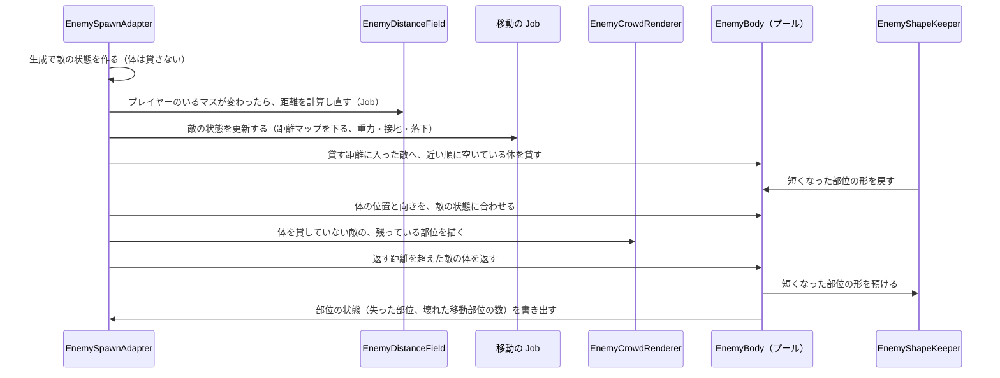

# 区間4B：群衆 AI の試作と計測

| 項目 | 内容 |
|---|---|
| 状態 | 完了（2026-10-06） |
| 目安の時期 | 2026/10/20〜11/02（最速の推定 10/10〜10/13） |
| 前提となる区間 | 4A |
| 全体計画 | [InGameOverallPlan.md](../InGameOverallPlan.md) |

## 目的

Notion の「敵の群衆 AI」「敵の大量描画と体の貸し出し」の方式を、計測用の試作で確かめて決める。
約 1000 体の敵の状態を NativeArray に持ってまとめて描画し、近くの敵にだけ 4A の体を貸して、切れるようにする。

## 関連する仕様

- 敵の群衆の動き：https://app.notion.com/p/3f01ea2aa7fa81b79394e168026e83e7（同時に約 1000 体、グループごとの隊列、地形への追従）
- 敵の群衆 AI（目的地・経路・移動）：https://app.notion.com/p/3f01ea2aa7fa81faad84f46c32a3b860（距離マップ、目的地の図、簡易物理。方式は計測用の試作で確定する）
- 敵の大量描画と体の貸し出し：https://app.notion.com/p/3f01ea2aa7fa818fb0ebc1f6ea509324（NativeArray ＋ Burst、まとめて描画、近くの敵にだけ体を貸す）
- 議論の記録：[EnemyCrowdDiscussion.md](../EnemyCrowdDiscussion.md)

## 前提

- 実装方式は、Notion の案A（Jobs ＋ 体を貸す）を試作の出発点にする。全面 ECS は、物理の世界が PhysX と分かれるので見送り寄り
- 敵の状態は、後から ECS のコンポーネントへ移せる形（構造体の NativeArray）で持つ
- 体を返すときも、部位の状態（失った部位、切られて短くなった部位）は敵の状態に持ち続ける。移動の仕組みと、区間9の固有のアクションが使う為（2026-10-05 決定）
- 体を返す距離は、貸す距離より遠くする（2026-10-05 決定）。遠くの敵をわざわざ見ることは少ないので、部位が欠けた敵の形がまとめて描画する側で表せなくても目立たない
- グループ、隊列、2 段の距離マップ、地形の変化への追従、脚の IK は 4C で作る

## 計画書と今のコードの食い違い（着手時に確認）

2026-10-06 に確認した。

| # | 内容 | 根拠 | 対応 |
|---|---|---|---|
| 1 | 4B-7 の 2 つの確認のうち、`SampleDistance` が `ApplyEdit` の直後に新しい値を返すことは、コードで確かめられる。`ApplyEdit` は CSG の Job を `Complete` してから戻る | [VoxelVolume.cs](../../../Code/Scripts/EngineAdapterLayer/Voxel/Core/VoxelVolume.cs) の `ApplyEdit` | 確認済みとする |
| 2 | ボクセルの SDF は Burst の Job から読める見込み。距離の配列 `Samples` は `internal` の NativeArray で、補間の `VoxelSampling.Trilinear` は NativeArray を受け取る static 関数。ただし `internal` なので、読めるのは EngineAdapter の asmdef の中だけ。切り分け（`ExtractComponent`）ではボリュームが作り直されるので、Job が古い配列を持ち続けないようにする必要がある | `VoxelVolume.Samples`、`VoxelSampling.Trilinear` | Burst でコンパイルできるかを、コミット 6 で小さな Job を書いて確かめる |
| 3 | 議論メモと Notion の「1 体 7 パーツ」は旧モデルの数。`AttackerEnemy` は 11 部位、三角形は合計 4310。1000 体では 11000 個のインスタンスと約 431 万の三角形を描く | 区間4A の実装結果、`AttackerEnemy.prefab` | 描画の計測はこの数で行う。Notion の表の数字を直すことを、区間の終わりに提案する |
| 4 | GPU Resident Drawer は、PC とスマホの両方の RP アセットで無効。PC のレンダラーは Forward+、スマホのレンダラーは Forward | `PC_RPAsset.asset` と `Mobile_RPAsset.asset` の `m_GPUResidentDrawerMode: 0`、`PC_Renderer.asset` の `m_RenderingMode: 2`、`Mobile_Renderer.asset` の `m_RenderingMode: 0` | 決定 3 のとおり、比べる対象から外す |
| 5 | `EnemySpawnSystem.MaxAliveCount` が、同時に存在する敵の数と、体のプールの大きさを兼ねている | `EnemySpawnAdapter.Initialize` が `MaxAliveCount` の数だけ体を作る | 同時に存在する敵の数（敵の状態の数）と、体の数を分ける（決定 9） |
| 6 | 4B-3「直進」は、距離マップ（4B-4）ができたら捨てるコードになる | ― | 距離マップを下る移動にする（決定 8） |

## 既存の資産

| 資産 | 内容 |
|---|---|
| 区間4A の成果 | 敵の体（`EnemyBody`）とプール、部位の役割、切断の受け取り、生成システム。体は `EnemySpawnAdapter` が初期化のときに上限の数だけ作り、`Spawn` のたびに全部位を `RestoreInitialShape` で戻して `MeshDataCache.Register` で登録し直す。部位の状態（失った部位、切られた形、切断回数）は `EnemyBody` の中にだけ持つので、貸し直すときに切られた形を戻すには、形を敵の状態の側にも持つ必要がある。仮の移動は `EnemyBody.MoveToward`（4B で置き換える） |
| 区間4A で拡張した MeshCut | `MeshDataCache.Register`、`CuttableObject` の切断回数（`MaxCutCount` / `CutCount`）、`AdoptCutShape`（`AdoptColliderMode.FitOwnColliders`）、`RestoreInitialShape` |
| メッシュ切断 | 計算の中心は Burst の Job とネイティブのデータ。Unity のオブジェクトに依存するのは、入口（`Physics.OverlapBox`、`CuttableObject`）と出口（かけらのコライダー、速度、MeshFilter）だけ |
| ボクセル | `VoxelShapeChange.LocalBounds`（形状が変わった範囲）、`SampleDistance`（SDF） |
| パッケージ | Burst 1.8.27、Collections 2.6.2、Mathematics 1.3.3（MeshCut の依存として入っている）。EngineAdapter の asmdef は `Unity.Burst`・`Unity.Collections`・`Unity.Mathematics` を参照済み |

## 既存コードの確認結果（2026-10-06）

| 対象 | 状態 | 対応 |
|---|---|---|
| [EnemySpawnAdapter](../../../Code/Scripts/EngineAdapterLayer/Enemy/EnemySpawnAdapter.cs) | 体のプール、生成、仮の移動（`MoveBodies`）、切断の結果の振り分け（部位から体を引く表）、見た目用の部位を持つ | 敵の状態の配列を持ち、生成は敵の状態を作るだけにする。体は近い敵に貸す。移動は Job にする |
| [EnemyBody](../../../Code/Scripts/EngineAdapterLayer/Enemy/EnemyBody.cs) | `Spawn` で全部位を戻して登録し直す。`MoveToward` で仮の移動。失った部位・壊れた部位・壊れた移動部位の数を自分で持つ | `Spawn` を「貸す（部位の状態を受け取って反映する）」と「返す（部位の状態を書き出す）」に分ける。`MoveToward` を消す |
| [EnemySpawnSystem](../../../Code/Scripts/EngineAdapterLayer/Enemy/EnemySpawnSystem.cs) | `MaxAliveCount` = 10 | 敵の状態の数の上限として使い、TestStage では 1000 にする |
| `TestStage.unity` | 地面は 100m 四方。壁 3 枚と `StageBounds`。初期生成は 2 体、生成位置は 3 か所 | 地面を 200m 四方に広げ、段差・壁・橋を置く（決定 7） |
| `MeleeCutAdapter` | 切断の範囲は、カメラから前方 3m（`_reach`）、幅 2m | 変更なし。貸す距離（決定 1）の根拠にする |
| `CuttableObject.AdoptCutShape` | 形（メッシュの持ち主、マテリアル、切断回数、切れるかどうか）を移し、移した先を `MeshDataCache.RegisterUser` に登録する。移した元は切れなくなる | 形を預かる保管用の物との受け渡しに使う（決定 2） |
| `MeshDataCache.Rebuild` | 切れる状態で生きている利用者のメッシュだけを残す | 預かっている間も、保管用の物が利用者として残るので、形のデータは消えない |
| `GraphicsSettings` | `m_BrgStripping: 0` | BRG を使うことになったら、ビルドで DOTS Instancing のバリアントが残るかを確かめる |

## 作業一覧

| # | 作業 | 内容 |
|---|---|---|
| 4B-1 | 敵の状態 | 位置、速度、向き、部位の状態などを、構造体の NativeArray に持つ。所属グループは 4C で足す |
| 4B-2 | まとめて描画 | 1000 体 × 部位を、Job で計算した行列でまとめて描画する（決定 3） |
| 4B-3 | 仮の移動 | 距離マップを下る移動と、簡易物理（重力・接地・落下）で、1000 体を動かす（決定 8） |
| 4B-4 | 距離マップの試作 | 縦の列ごとに「立てる層」の一覧を持つ格子と、プレイヤーからの距離（ダイクストラ法、Burst）。1 段だけで作る |
| 4B-5 | 体の貸し出しと返却 | 近くの敵に 4A の体を貸し、遠ざかったら返す。返す距離は貸す距離より遠い。部位の状態は敵の状態に持ち続け、もう一度貸すときに体へ反映する |
| 4B-6 | 貸した体の切断 | 4A の切断の受け取りを、貸した体でも動かす。切断の結果を敵の状態へ書き戻す。短くなった部位の形を預かり、貸し直すときに戻す |
| 4B-7 | 確認 | ボクセルの SDF を Burst の Job から読めるか（食い違い #1・#2） |
| 4B-8 | 計測 | 描画、AI、距離マップ、体の受け渡しにかかる時間を計測し、結果をこの計画書に書く |

## 完了条件

- 約 1000 体が動き、近くの敵を切れる。体を返して貸し直した敵も、失った部位が欠けたまま表示される
- 計測の結果が記録されていて、方式（描画の方法、距離マップの持ち方、体を貸す距離と数）が決まっている

## 詳細仕様

### 決定（2026-10-06）

| # | 項目 | 決定 |
|---|---|---|
| 1 | 体を貸す距離・返す距離・数の上限 | 仮に、貸す距離 12m、返す距離 18m、体の数 32。近い敵から順に、空いている体を貸す。体を返すのは返す距離を超えたときだけで、より近い敵のために貸している体を取り上げることはしない。値は計測（コミット 6）で見直す。根拠は、切断の範囲（カメラから前方 3m）と、4A の仮の移動の止まる距離（6m） |
| 2 | 短くなった部位を、貸し直すときにどう戻すか | 形を預かる保管用の `CuttableObject` のプールを、初期化のときに作る。体を返すとき、切られた部位の形を保管用の物が `AdoptCutShape` で受け取り、体の部位は `RestoreInitialShape` で戻す。貸し直すときは、体の部位が保管用の物から `AdoptCutShape(…, FitOwnColliders)` で形を戻す。今の MeshCut の API だけで足りる。保管用の物が足りないときは、その敵の体を返さない。体を返している間、まとめて描画する側では、短くなった部位も元の長さで描き、失った部位は描かない |
| 3 | まとめて描画する方法 | `Graphics.RenderMeshInstanced` から始め、計測で合格ライン（決定 6）に届かなければ BatchRendererGroup を試作して比べる。GPU Resident Drawer は比べる対象から外す（部位ごとに MeshRenderer の GameObject が要るので「中くらいの距離の敵は GameObject を持たない」方針と合わない、スマホの Forward では動かない、の 2 つの為）。遠い敵の VAT は、動き（4C の脚の IK）ができてから決めるので、4C 以降に持ち越す |
| 4 | 格子のマスの大きさ | 仮に 1m。敵の背丈は 4m、登れる高さは 1m（コミット 2 で実測。`AttackerEnemy` の描画の範囲は、高さが体の根から 1.25〜3.72m、前後が約 10.5m、幅が約 1.8m）。値は `EnemySpawnAdapter` の Inspector に持つ |
| 5 | 敵の状態とルールを置く層 | EngineAdapter（4A と同じ）。Burst と Collections を参照しているのは EngineAdapter の asmdef だけで、SDF の `Samples` も EngineAdapter の中からしか読めない為。BlackBoard の State にするのは、スキルなどプレイヤー側から敵の状態を読む必要が出たとき（4C 以降）に決める |
| 6 | 計測の合格ライン | 1000 体で、敵の処理（AI、描画の準備、体の受け渡し）のメインスレッドの時間が合計 4ms 以下で、PC で 60fps を保つこと。計測はエディタで行う（Burst の安全チェックを切る）。区間の終わりに、ユーザーが PC の Development Build で 1 回確かめる |
| 7 | 計測に使うステージ | TestStage を広げる。地面を 200m 四方にし、段差・壁・橋を少し置く。シーングループ（`InGameGroup`）は変えない |
| 8 | 仮の移動 | 敵がそれぞれ、距離マップの値が下がる方へ進む。グループと隊列は 4C で作る |
| 9 | 生成と体の数 | `EnemySpawnSystem.MaxAliveCount` は、同時に存在する敵（敵の状態）の数の上限にする。体の数は `EnemySpawnAdapter` の Inspector に別に持つ。生成は敵の状態を作るだけで、体は貸すときに `MeshDataCache` へ登録する |
| 10 | 格子の作り方（試作） | 実行の開始時に、縦の列ごとに `RaycastCommand` で下向きにレイを撃ち、「立てる層」を記録する。エディタで事前に焼く仕組みと、ボクセルが壊れた範囲を SDF で調べ直す処理は、4C-1 で作る |

### 決定（2026-10-06、コミット 6 の計測のあと）

| # | 項目 | 決定 |
|---|---|---|
| 11 | 距離マップの計算の速さ | 4B では縮めない。計算 1 回は約 5〜7ms（ワーカースレッド、Burst の安全チェックなし）で、プレイヤーのいるマスが変わったときだけ走り、メインスレッドは止めない。4C-1 で 2 段の距離マップに作り直すときに、辺の事前計算などで縮める |
| 12 | まとめて描画する方法 | `Graphics.RenderMeshInstanced` のままにし、BatchRendererGroup は試作しない。1000 体で描画の命令は約 66 回、フレームの時間は敵 0 体より約 +1ms で、重いのは体を貸している 32 体の側だった（計測の結果） |
| 13 | 体の空きがないときの貸し方（決定 1 の変更） | 体を取り上げる。プレイヤーから 9m（取り上げる距離）以内で体を持たない敵がいれば、その敵より 3m（取り上げの差）以上遠い敵のうち最も遠い敵から体を返させて貸す。9m は、切断の届く距離 3m に、体の根から脚の先までの約 5.3m を足して余裕を見た値。差を設けるのは、近い 2 体の間で体が毎フレーム行き来しない為。決定 1 の「取り上げない」は、取り上げる距離の中に体を貸した敵が 32 体いると、目の前の敵に体が回らず切れない為、やめた |
| 14 | 体を貸す距離と数 | 12m・18m・32 体のままにする。32 体に貸すとフレームの時間が約 +2〜3ms（エディタ）だが、レンダラーを切っても変わらず、中身が分からない。区間の終わりに、ユーザーが PC の Development Build で計り、Profiler で中身を見てから見直す |

### 決めること

なし（2026-10-06 にすべて決定）。

## 作業計画

### 処理の流れ

### 新しく作る型と、区間4B での利用者

| 型 | 層 | 区間4B での利用者 |
|---|---|---|
| `EnemyAgent`（構造体） | EngineAdapter | 移動の Job、`EnemySpawnAdapter`、`EnemyCrowdRenderer`。位置、速度、向き、生きているか、接地しているか、貸している体の番号、失った部位と短くなった部位（部位ごとのビット）、壊れた移動部位の数を持つ |
| `EnemyCrowdRenderer`（普通のクラス） | EngineAdapter | `EnemySpawnAdapter`。体を貸していない敵の行列を Job で作り、部位ごとにまとめて描画する |
| `EnemyDistanceField`（普通のクラス） | EngineAdapter | `EnemySpawnAdapter`（移動の Job が読む）。格子、立てる層、距離の配列を持ち、ダイクストラ法の Job を回す |
| `EnemyShapeKeeper`（普通のクラス） | EngineAdapter | `EnemySpawnAdapter`。短くなった部位の形を預かる保管用の `CuttableObject` のプール（決定 2） |
| `EnemyNavigationGrid`（構造体。コミット 3 で追加） | EngineAdapter | ダイクストラ法の Job と `EnemyMoveJob`。格子の配列と、移動の規則（隣の列で乗る層、斜めに進めるか）を持ち、2 つの Job が同じ規則で読む |
| `EnemyMoveJob`、ダイクストラ法の Job（Burst の構造体） | EngineAdapter | `EnemySpawnAdapter`、`EnemyDistanceField`。格子は Job でなく、物理のバッチのクエリ（`RaycastCommand`・`OverlapBoxCommand`）で作る |

拡張する型：`EnemySpawnAdapter`（敵の状態の配列、体の貸し出しと返却、計測の時間）、`EnemyBody`（貸す・返す、`MoveToward` を消す）、`EnemyInitializer`（計測の時間をデバッグ表示に出す）

作らないもの：敵の State・Board・Event、グループとアンカー、隊列（4C）、2 段の距離マップと、地形の変化への追従（4C）、脚の IK（4C）、BRG による描画（決定 3。計測で要るときだけ）、VAT（4C 以降）、崩落による撃破（区間5）

基準の当てはめで見直した点（2026-10-06）

- 基準1：新しいクラスの利用者はどれも `EnemySpawnAdapter` だけだが、ネイティブメモリの確保と Dispose をそれぞれの中で閉じる為と、描画方式を計測で差し替える単位にする為に分ける。描画方式は 3 つすべてを作らず、`RenderMeshInstanced` で足りなければ BRG を作る（決定 3）。VAT と 2 段の距離マップは持ち越す
- 基準2：敵の状態を BlackBoard の State にせず、EngineAdapter に置く（決定 5）。今は読む利用者が EngineAdapter の中だけで、State にすると BlackBoard に Burst と Collections の参照を足すことになる為
- 基準4：描画の負荷は、一般論ではなく、実測した三角形の数（1000 体で約 431 万）を前提に計る（食い違い #3）。計測の時間は Unity の `ProfilerMarker` と `ProfilerRecorder` で取り、DebugGUI に出す

### コミットの分け方

| # | 内容 | 確かめ方 |
|---|---|---|
| 0 | 区間計画書の更新 | ― |
| 1 | 敵の状態と、まとめて描画（4B-1、4B-2）。生成で敵の状態を作り、TestStage の上限を 1000 にする。計測の時間をデバッグ表示に出す | 1000 体が描かれ、かかる時間が表示される。コミット 1〜3 では体を貸さないので、敵を切れない |
| 2 | 格子と距離マップ（4B-4、決定 4・10）。TestStage を広げる（決定 7）。プレイヤーのいるマスが変わったら計算し直す。格子と距離をギズモで表示する | 段差と壁を避けた距離になっている。計算にかかる時間 |
| 3 | 移動（4B-3、決定 8）。距離マップを下る、重力、接地（格子の層の高さ）、落下 | 1000 体がプレイヤーへ迫り、段差を降りる。かかる時間 |
| 4 | 体の貸し出しと返却（4B-5、決定 1・9）。失った部位を、まとめて描画する側でも描かない。部位の状態を書き戻す。倒れたら敵の状態を消す（コミット 5 から移した。このコミットで敵を切れるようになり、倒れた敵に体を貸し直さない為） | 近くの敵を切れる。離れて戻ってきても、失った部位が欠けたまま表示される。核を切ると倒れる |
| 5 | 短くなった部位の保持と貸し直し（4B-6、決定 2）。移動部位が壊れて止まった敵は、移動の Job でも止まる | 短くなった部位が、貸し直したあとも短く、上限まで切れる |
| 6 | 計測と方式の決定（4B-7、4B-8）。SDF を Burst の Job で読む確認、結果の記録、体の取り上げ（決定 13）、「実装結果」と全体計画書の更新 | 計測の結果が記録され、方式が決まっている |

## 次の区間へ持ち越すこと（計画の時点）

- 4C：グループとアンカー、隊列、2 段の距離マップ、格子の事前の焼き付けと、ボクセルが壊れた範囲の調べ直し、脚の IK
- 4C 以降：遠い敵の VAT（決定 3）。敵の状態を BlackBoard の State にするか（決定 5）

## 他プラットフォームへの対応

- BRG と GPU Resident Drawer がスマホと VR で動く条件を確認する（PC のレンダラーは Forward+、スマホのレンダラーは Forward。GPU Resident Drawer は Forward+ が必要）
- `Graphics.RenderMeshInstanced` は Forward でも動き、マテリアルの GPU インスタンシングを有効にすれば使える
- スマホでは、同時に存在する敵の数と、体の数を別の値にする可能性がある（生成システムと `EnemySpawnAdapter` の Inspector の値）

## 見つけた問題（今回は扱わない）

- 【経路】降りる高さに制限がないので、橋（高さ 5.25m）の横や台地（4m）の縁から、敵が飛び降りる経路になる。Notion の「足場ごと落ちた」（落ちた高さが一定以上なら撃破）と合わせると、自分から落ちて倒れる敵が出る。降りられる高さに上限を設けるかは、4C か区間5で決める
- 【仮モデル】`AttackerEnemy` の一番低い所は、体の根より 1.25m 上にある（脚が前後へ水平に伸びている）。体の根を床の高さに置くと、脚が床に届かず浮いて見える。区間4A の生成でも同じだった。脚の IK（4C-8）を作るときに、体の根の高さか、モデルを見直す

## 実装中に確かめたこと

- （コミット 1）`Graphics.RenderMeshInstanced` で 1 回に描けるのは最大 1023 個で、URP Lit のように uniform scaling を仮定しないシェーダーでは 511 個。Unity は自動で分けないので、`EnemyCrowdRenderer` が 511 個ずつに分けて描く
- （コミット 1）`AttackerEnemy.fbx` のマテリアルは FBX に埋め込まれていて、GPU インスタンシングが無効だった。プロジェクトはインスタンシングのバリアントを使われていなければ削る設定（`GraphicsSettings` の `m_InstancingStripping: 0`）なので、実行中に有効にしてもビルドでは描けない。マテリアルを `Assets/Art/Materials/AttackerEnemy.mat` に取り出してインスタンシングを有効にし、FBX の読み込み設定でこのマテリアルを使うようにした。体（GameObject）とまとめて描画の両方がこのマテリアルを使う
- （コミット 2）頭上が空いているかを下向きのレイだけで調べると、壁の中の地面も立てると判定される（レイは始まった位置のコライダーを検出しない為）。`OverlapBoxCommand` で、床の上に背丈の分の箱を置いて重なりを調べる。坂では箱の上り側の角が床にめり込むので、床の傾きの分だけ箱を浮かせる
- （コミット 2）TestStage（200m 四方、1m のマス）の格子は、立てる層が 40180、1 つの列の層の数の上限（4）を超えた列は 0。作るのにかかった時間は 38〜47ms（エディタ、初期化のときに 1 回）
- （コミット 2）距離の計算 1 回（ワーカースレッド、プレイヤーのいるノードが変わったときだけ）は、エディタで Burst の安全チェックありが約 9〜10ms、なしが約 5〜6ms、Burst を切ると約 40ms。Notion の見積もり（約 5 万マスで 1ms 前後）の 5 倍ほどかかる。辺の事前計算や、コストが 2 種類しかないことを使った待ち行列などで縮められる見込みで、コミット 6 の計測で、縮めるかを決める
- （コミット 2）`ProfilerRecorder` は、Burst の Job の中の `ProfilerMarker` も、ワーカースレッドの分まで記録する
- （コミット 3）1000 体が距離マップを下って歩き、プレイヤーから経路の長さ 6m で止まる。TestStage で、スロープを登って橋に上がる、橋の横から飛び降りる、1m と 0.8m の段を登る、長い壁を回り込む（引っかかる敵は 0）ことを確かめた。移動にかかるメインスレッドの時間（Job の完了待ちを含む）は 0.05〜0.18ms
- （コミット 3）敵どうしを離す処理がないので、同じ所へ向かう敵は同じ経路をたどり、1 点に重なって 1 列で進む。グループと隊列（4C）で扱う
- （コミット 4）1 体だけ残した敵で確かめた。体を貸し、前の上の脚 2 本を途中で切ると、上の脚は短くなり（切断回数 1）、その先の下の脚 2 本は失った部位として敵の状態に書き戻される。プレイヤーを 40m 離すと体を返し、まとめて描画で下の脚 2 本が欠けて描かれる。戻ると体を貸し直し、下の脚 2 本は隠れたまま。短くなった上の脚は、元の長さに戻る（コミット 5 で直す）。核を切ると、敵の状態が消えて体が空く
- （コミット 4）1000 体が迫る状態で、近い 32 体に体を貸し続ける。体の貸し出し・返却と位置の同期にかかるメインスレッドの時間は 0.04〜0.12ms（エディタ、安全チェックあり）
- （コミット 5）前の上の脚 2 本を途中で切った敵から体を返すと、2 本の形を保管用の物が預かる（預かった数 2）。貸し直すと、上の脚は短いまま（長さ 1.21m、切断回数 1）戻り、もう一度切ると切断回数が上限の 2 になる。保管用の物は、`MeshFilter`・`MeshRenderer`・`CuttableObject` だけの非アクティブの GameObject で足りる（`MeshRenderer` は、切断面を含むマテリアルを一緒に移す為に要る）
- （コミット 5）移動部位を 4 つ失った敵は、歩く速さを戻しても、プレイヤーを遠ざけても、その場に止まる
- （コミット 6）ボクセルの SDF は、Burst の Job から読める。EngineAdapter の asmdef の中に、`VoxelVolume.Samples` を `VoxelSampling.Trilinear` で読む Job を一時的に書いて確かめ、確かめたあとで消した。Job は Burst で動き（`[BurstDiscard]` のメソッドが呼ばれない）、4 点とも `SampleDistance` と同じ値を返した。`ApplyEdit` で削った直後も、両方が同じ新しい値を返した。距離は ±切り詰め距離（ボクセル 4 個分）までしか持たないので、内側の深い所でも値は切り詰め距離で止まる。崩落の判定（内側か外側か）には符号だけを使うので足りる
- （コミット 6）計測はエディタで、Burst の安全チェックと Jobs Debugger を切って行った（計測のあとで元に戻した）。プレイヤーを敵の南に置き、1000 体がカメラに映る状態で計った。値は下の「計測の結果」
- （コミット 6）カメラに映らない所に集まった敵は、`RenderMeshInstanced` が全インスタンスを 1 つの範囲として視錐台の外と判断し、描画しない（三角形の数が 4445 になった）
- （コミット 6）体の取り上げ（決定 13）を、32 体を円の上に置き、33 体目を 2m に置いて確かめた。円が 11m と 7m のときは 33 体目に体が回り、4m のとき（差が 3m 未満）は回らない

## 計測の結果（2026-10-06、エディタ、Burst の安全チェックなし）

| 項目 | 値 | 備考 |
|---|---|---|
| 敵の処理（メインスレッド、Update 全体） | 平均 0.45〜0.70ms | 内訳：移動（Job の完了待ちを含む）0.06〜0.12ms、体の貸し出し・返却・位置の同期 0.04〜0.08ms、まとめて描画の準備 0.3〜0.5ms |
| 距離マップの計算 1 回（ワーカースレッド） | 約 5〜7ms | 立てる層 40180。安全チェックありで約 9〜10ms、Burst なしで約 40ms |
| 格子を作る（初期化のとき 1 回） | 38〜67ms | 200m 四方、1m のマス |
| フレームの時間（メインスレッド） | 敵 0 体：8.9ms ／ 1000 体・体を貸さない：9.8ms ／ 1000 体・32 体に貸す：15.3〜16.4ms | エディタはシーンビューの描画なども含み、ばらつきが大きい |
| 描画の命令の数 | 敵 0 体：49 ／ 1000 体・体を貸さない：115 ／ 1000 体・32 体に貸す：818 | 体の 352 個のレンダラー（11 部位 × 32 体）が、影を含めて約 700 回 |
| 三角形の数 | 1000 体：約 862 万 | 4310 × 1000 を、通常の描画と影で 2 回描く。敵の影を切ると約 431 万 |
| 32 体に貸したときの増え方 | フレームの時間 +2〜3ms 程度 | 体のレンダラーを切っても変わらない。物理（`Physics.Simulate`）の増え方は 0.08ms。残りの中身は、エディタの計測では分からなかった |
| 一度にまとめて貸す・返す | 32 体を貸す：約 3ms ／ 32 体を返す：約 1.3ms | ワープのように一度に入れ替わるフレームで起きる |

## 実装結果（2026-10-06）

### 決めたこと

- 実装方式は案A（敵の状態を構造体の NativeArray に持ち、Burst の Job で更新し、まとめて描画し、近くの敵にだけ体を貸す）で進める
- まとめて描画は `Graphics.RenderMeshInstanced`（決定 12）。マテリアルは GPU インスタンシングを有効にしたアセットにする
- 経路は、縦の列ごとに立てる層を持つ格子と、プレイヤーからの距離マップ（ダイクストラ法、Burst）。格子のマスは 1m、敵の背丈 4m、登れる高さ 1m（決定 4）
- 体を貸す距離 12m、返す距離 18m、体の数 32、取り上げる距離 9m・取り上げの差 3m（決定 1・13・14）
- 短くなった部位は、保管用の `CuttableObject` に形を預けて、貸し直すときに戻す（決定 2）
- 敵の状態とルールは EngineAdapter に置く（決定 5）
- 距離マップの計算を縮めるのは 4C（決定 11）

### 作った主なもの

| 種類 | もの |
|---|---|
| 敵の状態 | `EnemyAgent`（位置、向き、上向きの速さ、接地、貸している体、失った部位・壊れた部位のビット、壊れた移動部位の数） |
| まとめて描画 | `EnemyCrowdRenderer`（部位ごとの行列を Job で作り、511 体ずつ描く。体を貸している敵と、失った部位は描かない） |
| 経路 | `EnemyNavigationGrid`（格子と移動の規則）、`EnemyDistanceField`（物理のバッチのクエリで格子を作り、距離マップを Job で計算する。2 つの配列を入れ替えて、計算中も前の結果を読める） |
| 移動 | `EnemyMoveJob`（距離マップを下る、向きの回る速さの上限、段差、落下。壊れた移動部位が上限に達した敵は歩かない） |
| 体の貸し出し | `EnemyBody.Lend` / `WriteState` / `Return`、`EnemySpawnAdapter` の貸す・返す・取り上げる処理、`EnemyShapeKeeper` |
| デバッグ表示 | 「Enemy ms」（Update・移動・体・描画の時間）、「Bodies」（貸している数、預かっている形の数）、「Distance Field」（層の数、作る時間、計算 1 回の時間） |
| アセット | `Assets/Art/Materials/AttackerEnemy.mat`（GPU インスタンシングを有効にして FBX から取り出した）、`TestStage` の拡張（200m 四方、`CrowdTerrain`）、`EnemySpawnSystem` の格子の範囲 |

### 完了条件の確認結果

| 完了条件 | 結果 |
|---|---|
| 約 1000 体が動き、近くの敵を切れる | 確認済み（エディタ）。1000 体が距離マップを下って迫り、近い 32 体に体を貸し、切れる |
| 体を返して貸し直した敵も、失った部位が欠けたまま表示される | 確認済み（エディタ）。体を返している間は、まとめて描画でも欠ける。短くなった部位も、貸し直したあと短いまま |
| 計測の結果が記録されていて、方式（描画の方法、距離マップの持ち方、体を貸す距離と数）が決まっている | 記録した（「計測の結果」）。描画は決定 12、距離マップは決定 4・10・11、体を貸す距離と数は決定 1・13・14 |
| （決定 6）PC の Development Build で 60fps を保つ | 未確認。ユーザーがレビューのときに確かめる。32 体に貸したときに増える約 2〜3ms の中身も、そのときに Profiler で見る |

### 次の区間へ持ち越すこと

- 4C：距離マップを 2 段にし、計算を縮める（決定 11）。格子の事前の焼き付けと、ボクセルが壊れた範囲の調べ直し
- 4C：グループとアンカー、隊列。敵どうしを離す処理がないので、今は同じ所へ向かう敵が 1 点に重なる
- 4C：移動部位を失って止まった敵の、隊列での扱い。降りられる高さの上限（「見つけた問題」）
- 4C：脚の IK。体の根の高さとモデルの見直し（「見つけた問題」）
- 4C 以降：遠い敵の VAT（決定 3）、敵の状態を BlackBoard の State にするか（決定 5）
- 区間5：崩落の判定。SDF は Burst の Job から読める（コミット 6）。敵は体を貸している間だけコライダーを持つ
- レビュー：PC の Development Build での 60fps と、32 体に貸したときの重さの中身（決定 14）

### 使い方

- `TestStage` で再生すると、南の初期生成の範囲（(0, -1, -70)、半径 25m）に 1000 体が出て、プレイヤーへ迫る
- デバッグ表示の「Enemy ms」「Bodies」「Distance Field」で、時間と体の数を見る
- InGame の `Enemy` の `EnemySpawnAdapter` の「Draw Distance Field」をオンにすると、実行中にプレイヤーの周りの距離マップをギズモで描く（シーンビュー）
- 体を貸す距離・返す距離・取り上げる距離と差・体の数・形を預かれる数、歩く速さ・向きを変える速さ・止まる距離、マスの大きさ・背丈・登れる高さは、`EnemySpawnAdapter` の Inspector にある
