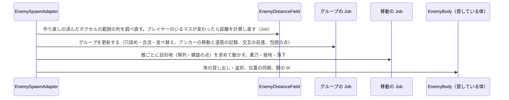

# 区間4C：群衆 AI の本実装

| 項目 | 内容 |
|---|---|
| 状態 | 着手（2026-10-07） |
| 目安の時期 | 2026/11/03〜11/16（最速の推定 10/14〜10/17） |
| 前提となる区間 | 4B |
| 全体計画 | [InGameOverallPlan.md](../InGameOverallPlan.md) |

この区間が終わるとマイルストーンA（群れで迫る敵を切って溜める）になる。

## 目的

4B で決めた方式で、Notion の「敵の群衆の動き」の見え方を作る。グループごとの隊列、交戦、地形への追従と、近くの体の脚の IK を作る。

## 関連する仕様

- 敵の群衆の動き：https://app.notion.com/p/3f01ea2aa7fa81b79394e168026e83e7
- 敵の群衆 AI（目的地・経路・移動）：https://app.notion.com/p/3f01ea2aa7fa81faad84f46c32a3b860
- 敵の出現：https://app.notion.com/p/3e91ea2aa7fa81de9e78d74221c216c8（戻ってこられなくなった敵は、一定時間後に見えない所で湧き場所へ戻る）
- 敵：https://app.notion.com/p/3e91ea2aa7fa81f3a713c0a6e64d438e（移動部位が N 個壊されたら動けなくなる）

## 計画書と今のコードの食い違い（着手時に確認）

2026-10-07 に確認した。

| # | 内容 | 根拠 | 対応 |
|---|---|---|---|
| 1 | TestStage にボクセルがなく、プレイ中にボクセルを壊す処理もない | `ApplyEdit` を呼ぶのはボクセルの層の中だけ。ボクセルを置いたシーンは `Development/Voxel/VoxelModelTest.unity` だけ | TestStage にボクセルの壁と床（橋）を置き、確認では uloop の `execute-dynamic-code` で `ApplyEdit` を呼んで壊す。プレイヤーの破壊攻撃は区間5 |
| 2 | ボクセルの形状変化の通知は、当たり判定が新しくなる前に届く | `VoxelPiece.LateUpdate` は通知（`InvokePendingShapeChanges`）のあとに作り直し（`RemeshPending`）を行い、作り直すチャンクの数にフレームごとの上限（`RemeshChunksPerFrame`）がある | 通知を受けてすぐ物理のクエリを撃つと古い形を拾う。作り直しが済むのを待ってから調べ直す（決定 1） |
| 3 | 2 段の距離マップの「遠くの区画」は、TestStage（200m 四方）では使われない。細かいマスの半径 100〜150m に全体が収まる | 4B 決定 7、Notion「敵の群衆 AI」 | 4C では作らない（決定 2） |
| 4 | 仮モデルの脚は前後へ水平に伸び、一番低い所が体の根より 1.25m 上にある | 4B の「見つけた問題」 | 脚の IK（コミット 6）の着手時に、脚の基準点と休みの姿勢を Blender か Unity で確かめる（決定 9） |

## 既存の資産

| 資産 | 内容 |
|---|---|
| 区間4A の成果 | 敵の体、部位の役割、生成システム |
| 区間4B の成果 | 敵の状態（`EnemyAgent` の NativeArray）、まとめて描画（`EnemyCrowdRenderer`）、格子と距離マップの試作（`EnemyNavigationGrid`、`EnemyDistanceField`。1 段、初期化のときに物理のクエリで作る）、移動（`EnemyMoveJob`。距離マップを下る、段差、落下、移動部位で止まる）、体の貸し出し・返却・取り上げ（`EnemySpawnAdapter`）、短くなった部位の保持（`EnemyShapeKeeper`）。計測の結果は [Section04B](Section04B_CrowdPrototype.md) の「計測の結果」 |
| ボクセル | `VoxelModelLoader` の通知（読み込み、ピースの形状変化 `LocalBounds`、切り離された塊、破棄）、`VoxelPiece.WorldBounds`・`PendingChunkCount`、`VoxelModelBaker`（エディタでのベイク） |

## 既存コードの確認結果（2026-10-07）

| 対象 | 状態 | 対応 |
|---|---|---|
| [EnemyDistanceField](../../../Code/Scripts/EngineAdapterLayer/Enemy/EnemyDistanceField.cs) | 初期化のときに格子を物理のクエリで作る。距離の Job は、ノードごとに隣の 8 列の全層について `GetLandingNode` を調べ直す、浮動小数のコストのヒープのダイクストラ法 | 辺を事前に計算し、整数のコストとバケットの待ち行列で解く（決定 2）。変わった範囲の列だけ格子と辺を作り直す（決定 1） |
| [EnemyNavigationGrid](../../../Code/Scripts/EngineAdapterLayer/Enemy/EnemyNavigationGrid.cs) | 降りる高さに制限がない | 降りられる高さの上限を足す（決定 11） |
| [EnemyMoveJob](../../../Code/Scripts/EngineAdapterLayer/Enemy/EnemyMoveJob.cs) | 敵がそれぞれ距離マップを下る。重なりを避ける処理はない | 目的地（隊列の位置、交戦中の螺旋の点）へ向かう移動にし、たどり着けないときだけ距離マップを下る |
| [EnemyAgent](../../../Code/Scripts/EngineAdapterLayer/Enemy/EnemyAgent.cs) | グループを持たない | 所属グループ、グループの中の順番、行動の状態（隊列・合流・交戦）、戻れない状態の時間を足す |
| [EnemySpawnAdapter](../../../Code/Scripts/EngineAdapterLayer/Enemy/EnemySpawnAdapter.cs) | 生成は敵の状態を 1 体ずつ作るだけ | 生成した敵をグループに入れる。グループの Job を移動の Job の前に回す |
| [VoxelPiece](../../../Code/Scripts/EngineAdapterLayer/Voxel/Piece/VoxelPiece.cs) | 作り直しを待っているチャンクの数を `PendingChunkCount` で読める（コミット 2 で確認） | 変更なし。0 になったら作り直しが済んだとみなす（決定 1） |
| `TestStage.unity` | 200m 四方、段差・壁・橋（`CrowdTerrain`）。ボクセルはない | ボクセルの壁と床を置く（食い違い #1） |

## 作業一覧

| # | 作業 | 内容 |
|---|---|---|
| 4C-1 | 距離マップ | 辺の事前計算と、整数のコストのバケットの待ち行列で、計算 1 回を縮める（4B の決定 11）。ボクセルの形状が変わった範囲の列を調べ直す。降りられる高さの上限を足す。2 段の距離マップとエディタでの事前の焼き付けは、区間14へ持ち越す（決定 2） |
| 4C-2 | グループとアンカー | グループ（12 体）の先頭（アンカー）が距離マップを下り、通った道筋を記録する |
| 4C-3 | 隊列 | 道筋に沿って先頭から s メートル後ろ、横に d メートルを目的地にする。通路では縦隊、広い場所では横に広がる。交互に進む |
| 4C-4 | 交戦と合流 | プレイヤーに近づいた敵は隊列から外れて螺旋の上の点へ向かい、離れたら隊列に戻る（入る距離と抜ける距離を変える）。近づいたアンカーには、プレイヤーを囲む円の上の点を割り当てる |
| 4C-5 | 撃破と並べ替え | 倒された敵の穴を詰め、人数が減ったグループを合流させる。目的地の割り当てを、ときどき距離マップの値の順に並べ替える |
| 4C-6 | 簡易物理 | 重力、接地、落下、着地。接地は距離マップの格子を使う（4B の `EnemyMoveJob` で作った。4C では、足場が壊れたときの落下と、着地したあとの目的地の計算し直しを足す） |
| 4C-7 | 戻れない敵 | 距離マップの値がない敵を、一定時間後に見えない所で湧き場所へ戻す |
| 4C-8 | 脚の IK | 体を貸した敵の脚を、2 本の骨の IK（自前の計算、メインスレッド）と、足を置く位置の切り替えで歩かせる。切られて短くなった脚も、体に付いていれば動かす |
| 4C-9 | 動けない敵 | 移動部位が N 個壊された敵を、グループから抜いてその場に残す |

## 完了条件

- 敵がグループごとに隊列を組み、プレイヤーを包囲するように迫る。プレイヤーを中心にした 1 つの塊や、全員が同じ向き・同じ速さでスライドしているようには見えない
- 近づいた敵は隊列から外れ、プレイヤーが離れると隊列に戻る
- 壁を壊して開いた道を通り、床が壊れた場所を避ける。足場が壊れると落ちる
- 近くの敵が、脚の IK で歩く

## 詳細仕様

### 決定（2026-10-07）

| # | 項目 | 決定 |
|---|---|---|
| 1 | ボクセルが壊れたときの格子の調べ直し | 形状変化の通知で変わった範囲（`LocalBounds` をワールドへ変換した範囲）を溜めておき、そのピースの作り直しが済んでから、範囲に重なる列だけを、初期化と同じ物理のクエリで調べ直す。ボクセルと壊れない物を区別せずに扱える。遅れは作り直しの数フレーム。Notion「敵の群衆 AI」の「SDF で調べ直す」の記述を、この方式に直すことを提案する |
| 2 | 2 段の距離マップと、エディタでの事前の焼き付け | 4C では作らず、広いマップを作る区間14へ持ち越す。TestStage では使う場面がなく、確かめられない為（食い違い #3）。4C では、辺の事前計算（ノードごとに、たどり着ける隣のノードとコスト）と、整数のコスト（縦横 10・斜め 14）のバケットの待ち行列（Dial 法）で、計算を縮める |
| 3 | 1 グループの人数 | 12 体（仮）。生成するときに、出した順に 12 体ずつグループにする |
| 4 | 隊形と切り替え | 道筋に沿って先頭から s m 後ろ、横に d m の位置を目的地にする。1 列に並べる数は、アンカーの位置で格子を道筋の左右に調べ、立てるマスが続く幅から決める（狭い所は 1 列の縦隊、広い所は最大 4 列）。間隔は横 2.5m・縦 8m（仮。体が前後に約 10.5m ある為） |
| 5 | 交互の前進 | グループごとに「進む／待つ」を数秒ずつ繰り返し、始めるタイミングをグループごとにずらす。アンカーは、前を行く別のグループに詰め寄りすぎない（グループは約 100 組なので総当たりで調べる。エージェントどうしは調べない）。コミット 3 で具体化：同じレーン（前方で、横のずれが 2 つの隊列の幅の半分の和より小さい）の前で、待つ番で止まっているグループの最後尾から 4m の所で待つ。着いて止まったグループや、詰まって止まったグループの後ろでは待たない（待ちが後ろへ連鎖して全体が止まった為） |
| 6 | 交戦と包囲 | 交戦に入る距離 12m、抜ける距離 18m（どちらも経路の長さ。Notion の例 4m／7m は、体の長さに比べて短すぎる為）。交戦中の敵は、プレイヤーを中心にしたアルキメデスの螺旋の上の点（UnlimitedKnight の方式）を目指して重なりを避ける。プレイヤーに近づいたアンカーには、プレイヤーを囲む円の上の点をグループごとに割り当て、包囲を作る。コミット 4 で具体化：グループの置き場もプレイヤーを中心にした螺旋（内側の半径 15m、1 周で 12m 広がる、置き場の間隔 18m）の上に並べ、経路の長さが 40m 以下になったアンカーに、空いていて最も近い置き場を渡す。先に来たグループが内側を取り、来た向きのまま内側から外側へ囲む。置き場はプレイヤーと一緒に動き、30m より離れたら手放す。置き場へ向かう間と着いたあとは、アンカーの向きのまっすぐ後ろに 6 列の横隊で並ぶ（着いたアンカーはプレイヤーを向く）。交戦の置き場は、内側の半径 7m、1 周で 6m 広がる、間隔 2.5m の螺旋の上で、交戦に入る距離（12m）より内側の約 20 か所。空きがなければ、交戦中の敵はその場でプレイヤーを向いて待つ |
| 7 | 螺旋の高さ（どの層を目的地にするか） | 目的地の列のうち、距離マップの値があり、基準の高さに最も近い層。基準の高さは、隊列ではアンカーの道筋の高さ、交戦中はプレイヤーの足元の高さ。コミット 4 では、目的地を水平の位置だけで持ち、乗る層は歩いて乗れる層（今の高さから続く層）で決まる形にした。基準の高さで層を選ぶ処理は作っていない（「見つけた問題」） |
| 8 | 動けない敵の、隊列での扱い | グループから抜き、交戦もやめさせて、その場に残す。穴は撃破と同じく詰める。戻れない敵として湧き場所へ戻す対象からも外し、同時に存在する数の上限を埋め続ける（仕様の戦略の為） |
| 9 | 脚の IK と歩き方 | 2 本の骨の IK を解析的に自前で解き、メインスレッドで計算する（32 体 × 4 本で、Job にするほどの量がない）。足は対角の 2 本ずつ交互に運び（トロット）、足を置く高さは格子の層の高さを使う。Animation Rigging（TwoBoneIK）は使わない。Animator と RigBuilder を体ごとに持つ必要があり、足を置く位置の決め方は結局自前で作るので、利点が小さい為。着手時に脚の基準点と休みの姿勢を確かめ、直す必要があれば相談する |
| 10 | 戻れない敵 | 距離マップの値がない状態が 10 秒続き、カメラに映っていない敵を、有効な生成位置へ移す。部位の状態は持ち続ける |
| 11 | 降りられる高さの上限 | 経路の規則に上限を足す（仮に 2m）。敵は橋（5.25m）や台地（4m）の縁から飛び降りなくなる。足場が壊れて落ちるのは、上限によらない |

### 決めること

なし（2026-10-07 にすべて決定）。

## 作業計画

### 処理の流れ（1 フレーム）

### 新しく作る型と、区間4C での利用者

| 型 | 層 | 区間4C での利用者 |
|---|---|---|
| `EnemyGroup`（構造体） | EngineAdapter | グループの Job と移動の Job。アンカーの位置と向き、進む／待つの状態と時間、人数、1 列の数、包囲の点を持つ。メンバーと道筋は別の NativeArray に、グループごとの固定長で持つ |
| `EnemyGroupJob`（Burst の構造体。IJob） | EngineAdapter | `EnemyGroups`。前を行くグループを見るので、並列にせず 1 つの Job で回す |
| `EnemyGroups`（普通のクラス。コミット 3 で追加） | EngineAdapter | `EnemySpawnAdapter`。グループ・道筋・メンバーの NativeArray の確保と Dispose、生成した敵をグループへ入れる処理 |
| `EnemyFormationSettings`（構造体。コミット 3 で追加） | EngineAdapter | `EnemySpawnAdapter` の Inspector、`EnemyGroupJob`、`EnemyMoveJob`。隊列とアンカーの設定を、値のまま Job へ渡す |
| 脚の IK（`EnemyBody` の拡張か、体のプレハブに付けるコンポーネント。コミット 6 の着手時に決める） | EngineAdapter | `EnemySpawnAdapter` |

拡張する型：`EnemyAgent`（所属グループ、グループの中の順番、行動の状態、戻れない状態の時間）、`EnemyNavigationGrid`（辺、降りられる高さの上限）、`EnemyDistanceField`（辺の事前計算、バケットの待ち行列、変わった範囲の調べ直し）、`EnemyMoveJob`（目的地へ向かう移動）、`EnemySpawnAdapter`（グループへの所属、ボクセルの形状変化の購読、戻れない敵）

作らないもの：2 段の距離マップと、エディタでの事前の焼き付け（決定 2）、プレイヤーの破壊攻撃（区間5）、崩落による撃破（区間5）、敵の攻撃（区間9）、遠い敵の VAT

基準の当てはめで見直した点（2026-10-07）

- 基準1：2 段の距離マップと事前の焼き付けは、TestStage で使う場面がないので持ち越す（決定 2）。脚の IK は量が少ないので Job にしない（決定 9）。グループの Job は、Notion の「グループ単位の Job → エージェント単位の並列 Job の 2 段」に沿い、移動の Job から分ける（書き込む先がグループとエージェントで違う為）
- 基準2：ボクセルの調べ直しは、Notion の SDF の案より、作り直しを待って物理のクエリを撃ち直す方が、壊れない物との合わせが要らず単純なので、方式を変える（決定 1）。Notion の更新を提案する
- 基準4：交戦の距離と隊列の間隔は、Notion の例の値ではなく、実測した体の大きさ（前後約 10.5m、幅約 1.8m）から決めた（決定 4・6）

### コミットの分け方

| # | 内容 | 確かめ方 |
|---|---|---|
| 0 | 区間計画書の更新 | ― |
| 1 | 距離マップを速くする（決定 2）、降りられる高さの上限（決定 11） | 計算 1 回の時間が 4B の約 5〜7ms からどれだけ縮んだか。橋と台地の縁から飛び降りなくなる。ほかの経路はギズモの表示で変わらない |
| 2 | ボクセルへの追従（決定 1）。TestStage にボクセルの壁と床を置く | 壁を壊すと開いた道を通る。床を壊すと避ける。足場が消えると落ちる |
| 3 | グループ、アンカー、道筋、隊列、交互の前進（決定 3〜5） | 縦隊と横への広がりが切り替わる。塊やスライドに見えない（スクリーンショットで確認） |
| 4 | 交戦と合流、螺旋、包囲、並べ替え（決定 6・7） | 近づくと隊列から外れて取り囲み、プレイヤーが離れると隊列に戻る |
| 5 | 撃破のあとの穴詰めとグループの合流、動けない敵、戻れない敵（決定 8・10） | 倒した穴が詰まる。人数の減ったグループが合流する。穴に落ちた敵が戻る |
| 6 | 脚の IK と歩き方（決定 9） | 近くの敵が脚で歩く。短くなった脚も動く |
| 7 | 計測、実装結果、全体計画書の更新 | 敵の処理が合計 4ms 以下（4B の決定 6） |

## 次の区間へ持ち越すこと（計画の時点）

- 区間14：2 段の距離マップ（遠くの区画）と、壊れない部分の格子のエディタでの事前の焼き付け（決定 2）
- 4C 以降：遠い敵の VAT、敵の状態を BlackBoard の State にするか（4B の決定 5）

## 他プラットフォームへの対応

- スマホでは、同時に動かす数と、体を貸す数の上限を別の値にする可能性がある

## 見つけた問題（今回は扱わない）

- 【見た目】まとめて描画している遠い敵は、脚が動かないまま移動する。VAT（4C 以降）を作るまではこのまま
- 【高さ】交戦の置き場と包囲の置き場は水平の位置だけで持つ（決定 7 の具体化）。プレイヤーが橋の上にいて、置き場が橋の下の地面の真上に来ると、地面にいる敵は橋の下の位置を目指してしまう。交戦に入るかは経路の長さで決めるので、届かない層の敵が交戦に入ることはない。高さの違う層が重なる場所で困ったら、置き場の層を選ぶ処理を足す

## 実装中に確かめたこと

- （コミット 1）距離の計算 1 回（ワーカースレッド、立てる層 40180）は、エディタで Burst の安全チェックありが 3.0〜4.3ms（4B は約 9〜10ms）、安全チェックと Jobs Debugger なしが 2.0〜3.1ms（4B は約 5〜7ms）。格子を作る時間は、辺の計算を含めて 63.7ms（4B は 38〜67ms）。斜めのコストを 1.414 から 1.4 にしたので、距離は最大で約 1% 短くなる
- （コミット 1）降りられる高さ 2m で、橋の上（高さ 4.25m）から横の地面へは進めなくなり、橋の上の距離はスロープを回る値（74.4m。横の地面は 59.8m）になった。高さ 0.8m の段から 1m 下の段へは、これまでどおり降りられる。台地（4m、スロープなし）の上はたどり着けないノードになった
- （コミット 1）1000 体が、たどり着けない敵 0 体でプレイヤーの近く（距離 8m 以内）まで来る。敵の処理（メインスレッド）は 0.9〜1.1ms（安全チェックなし。全員が近くに集まり、32 体に体を貸している状態なので、4B の計測とは状況が違う。距離の計算はワーカースレッドなので、この時間には入らない）
- （コミット 2）TestStage に、ボクセルの壁（`CrowdVoxelTerrain/VoxelWall`。(0, 1.9, -30)、長さ 30m・高さ 6.2m・厚さ 1m）と、台地へ上がるスロープ付きの橋（`CrowdVoxelTerrain/VoxelBridge`。幅 6m、高さ 4m）を置いた。元の箱を `VoxelModelBaker` でまとめてベイクし（ボクセル 0.1m）、`VoxelModelLoader` で読み込む。実行時のボクセルは 0.2m（`VoxelQuality_Terrain`）。元の箱にはコライダーを付けない（読み込む前から障害物になる為）
- （コミット 2）読み込んだボクセルは、作り直しが済んでから格子に入る（調べ直し 2.97ms、メインスレッドで 1 回）。壁の真ん中は立てる層がなくなり、壁の南北の距離は端を回る値（南 53.4m、北 28.0m）になった。台地はスロープと橋でたどり着けるようになった
- （コミット 2）壁に幅 6m の穴を開けると、0.20ms で調べ直し、壁の北の距離が 38.6m から 17.0m に縮んだ。プレイヤーを壁の反対側へ移すと、1000 体すべてが穴を通り、壁の端を回った敵は 0 体だった
- （コミット 2）橋の片側に穴を開けると、1000 体すべてが穴のない側を通って台地へ着いた（穴の側を通った敵は 0 体）。穴の下の地面は、頭上が空いたので立てる層になった
- （コミット 2）197 体が橋の上にいるときに橋を幅いっぱいに切ると、105 体が落ち、99 体が橋の下の地面に着地した。台地側の切れ端は Rigidbody で落ち、止まってから高さ 0 の足場として格子に入った。台地はたどり着けないノードになった
- （コミット 2 の確認で発見、修正）落ちた敵が着地できるのは立てる層だけなので、真下の列に立てる層がない（橋の下など、頭上が背丈より低い）と、地面を抜けて格子の下まで落ち、ステージから消えていた（橋を切ったときに 10 体）。真下の列に着地できる層がなければ、周りの列（2 列まで。コミット 3 で 4 列に広げた）のうち最も近い列の層に着地し、位置をその列の中へずらすようにした。直したあと、239 体が橋の上にいるときに橋を切ると、落ちた 97 体すべてが着地し、消えた敵は 0 体だった
- （コミット 2）動いている Rigidbody（落ちている塊）のコライダーは、床にも障害物にも数えない。そのため、頭上の判定の箱は 1 つで最大 4 つのコライダーを集める（`MAX_BOX_HITS`）
- （コミット 3）TestStage の初期生成を、南の 1 か所（1000 体、半径 25m）から、東西南北の 4 か所（中心はプレイヤーから 65m、各 250 体、半径 30m）に分けた。1 か所では 84 組の隊列が重なって生まれ、どのグループの前にも待つ番のグループがいて、ほとんど進めなかった為。包囲（コミット 4）の確認にも、いろいろな方向から迫る形が要る
- （コミット 3）初期生成は、範囲から選んだ中心の周り（半径 4m）にグループの人数ずつまとめて置く。新しいグループの道筋は、アンカーの後ろへまっすぐ伸ばした点で埋め、生まれた直後から隊列の位置が決まる
- （コミット 3）アンカーが隣のマスだけを見て進むと、隊列の向きが格子の 8 方向に限られ、まっすぐの線に並んで見えた。距離マップの値が下がる列を 6 列先までたどり、その列へ向けるようにした（その向きへ 1 マス先に乗れなければ、隣のマスへ向ける）
- （コミット 3）1000 体・84 組で、隊列は場所に合わせて 1〜4 列になる（ある時点で 1 列 1 組、2 列 7 組、3 列 5 組、4 列 71 組）。進む番のグループは約 2/3。敵の処理（メインスレッド、安全チェックあり）は 0.9〜1.2ms、移動（グループの Job を含む）は 0.35〜0.47ms
- （コミット 3）東の初期生成の範囲が、橋のスロープの下（幅 6m、頭上が背丈より低い）にかかり、そこに生まれた 6 体が着地先を見つけられずに消えた。着地先を探す範囲を、周り 2 列から 4 列に広げて直した
- （コミット 3）プレイヤーの近くでは、グループがすべて同じ所（止まる距離 12m の所）へ集まり、重なった。コミット 4 の包囲で直した
- （コミット 4）1000 体・84 組で、再生から約 90 秒で 73〜77 組が包囲の置き場を持ち、そのうち約 50 組が着いた。アンカーはプレイヤーから 14〜67m に散らばり、8 方位すべてに 7〜14 組ずついる（真上から見て、中央が空いた輪になる）。プレイヤーが動かない間に交戦するのは、内側の置き場の近くの 9〜10 体
- （コミット 4）着いて止まったグループが待つ番になると、外から来るグループが同じレーンの待ちに引っかかり、置き場を持たない 36 組の多くが止まった。包囲の置き場を持つグループは、待ちの判定から外した
- （コミット 4）プレイヤーを北の輪へ 20m 寄せると、14〜17 体が交戦に入り、全員が置き場を受け取った。そこから南へ 40m 離すと、交戦していた 17 体すべてが交戦をやめ、自分のグループのアンカーから平均 3.7m の所（隊列の中）へ戻った。プレイヤーが輪の中へ入ると、交戦に入る敵（54 体）が置き場の数（20）を超え、残りはその場で待つ
- （コミット 4）並べ替えは 1 フレームに 1 グループずつ行う。隊列の順番で隣り合うメンバーのうち、プレイヤーまでの経路が 0.5m 以上逆になっていたのは 916 組中 84 組（同じ列に並ぶメンバーどうしの小さな入れ替わり）
- （コミット 4）敵の処理（メインスレッド、安全チェックあり）は 0.8〜1.2ms、移動（グループの Job を含む）は 0.3〜0.45ms
- （コミット 5）穴詰め・合流・並べ替えは、1 フレームに 1 グループずつ順に行う（84 組で約 1.4 秒に 1 回）。倒れた敵、ほかのグループへ移った敵、動けなくなった敵を抜いて順番を詰め、残りが 4 体以下なら、40m 以内で合わせても 12 体を超えないグループのうち、アンカーが最も近いグループの隊列の最後へ移す
- （コミット 5）敵の状態を直接書き換えて確かめた。2 体を倒したグループは 10 体で順番が 0〜9 に詰まった。隣り合う 2 組を 4 体ずつにすると、生き残った 8 体が 1 つのグループにまとまった。周りがすべて 12 体のグループのときは、4 体のグループは合流しない（合わせると人数を超える為）。実行中の生成で出た 1〜3 体のグループは、近くの空きのあるグループへ合流する
- （コミット 5）移動部位を上限まで失った敵は、グループから抜けて交戦もやめ、その場に残る（動いた距離 0m）
- （コミット 5）橋を切って台地をたどり着けない場所にし、台地の上へ 3 体を移すと、約 10 秒後に 3 体とも生成位置 C (0, -1, -30) のそばへ戻り、新しいグループに入った（カメラは北を向いていて、台地は映っていない）。ボクセルの壁の上（厚さ 1m）は立てる層にならないので、そこへ移した敵は地面に着地する
- （コミット 5）敵の処理（メインスレッド、安全チェックあり）は 1.2ms 前後、移動（グループの Job と整える処理、戻れない敵の処理を含む）は 0.5ms 前後。エラーと警告のログは 0 件
