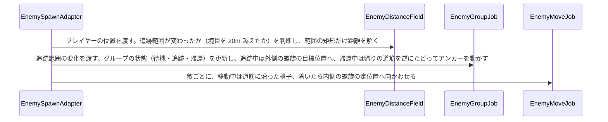

# 区間4D：群衆アルゴリズムの改変（二重螺旋と追跡範囲）

| 項目 | 内容 |
|---|---|
| 状態 | 計画済み（仕様は確定。着手時に「詳細仕様で決めること」を確かめる） |
| 目安の時期 | 2027/01/12〜01/25（最速の推定 2026/10/09〜10/12） |
| 前提となる区間 | 4C, 8R |
| 全体計画 | [InGameOverallPlan.md](../InGameOverallPlan.md) |

区間の番号は識別用。区間4D は 2026-10-09 に追加した区間で、区間8R のあと、区間9の前に行う。

## 目的

区間4C の群衆の動きを、二重のアルキメデス螺旋の形に作り直す。

- プレイヤーを中心にした外側の螺旋はグループの目標位置だけを決め、敵の並びはグループの中心を中心にした内側の螺旋が決める
- 個々の敵が隊列を外れてプレイヤーを囲む「交戦」をなくす
- 距離マップを区画に分け、プレイヤーの近く（追跡範囲）だけを計算する。持ち場が追跡範囲の外のグループは待ち、範囲に入ると追い、外れると帰る

区間9（攻撃と、ディフェンダーのバリア）は、この区間の並び方の上に作る。

## 関連する仕様

- 仕様の議論と決定の一覧：[EnemyCrowdRedesign.md](../EnemyCrowdRedesign.md)（「決めたこと」1〜22。この計画書は、そこで決めた仕様をどう作るかを書く）
- 敵の群衆の動き：https://app.notion.com/p/3f01ea2aa7fa81b79394e168026e83e7
- 敵の群衆 AI（目的地・経路・移動）：https://app.notion.com/p/3f01ea2aa7fa81faad84f46c32a3b860
- 仕様検討リストの経緯：https://app.notion.com/p/3f31ea2aa7fa81098a68cea78fa91670

## 前提

- 仕様は 2026-10-09 にユーザーと決め、Notion に反映済み。値（間隔、距離、時間）は仮で、実機で調整する
- 敵が来られる高さは今と同じ（降りられる高さは 2m まで）。建物は敵が上れない
- 広いマップ（500m 四方以上）と格子の事前の焼き付けは区間14。この区間は TestStage（200m 四方）で、区画を 50m にして確かめる
- 区間15（大きな建物のボクセル）は、傷を残す範囲に、この区間の追跡範囲を使う

## 既存の資産

| 資産 | 内容 |
|---|---|
| 区間4B・4C の成果 | 敵の状態（`EnemyAgent`）、まとめて描画、格子と距離マップ（`EnemyNavigationGrid`、`EnemyDistanceField`。Dial 法の Job、ボクセルへの追従）、グループ（`EnemyGroup`・`EnemyGroups`・`EnemyGroupJob`）、移動（`EnemyMoveJob`）、隊列の設定（`EnemyFormationSettings`）、脚の IK、戻れない敵、動けない敵、穴詰めと合流 |
| 区間5の成果 | 崩落による撃破（足場ごと落ちた敵、`EnemyCollapseDetector`）、エネルギーの演出 |
| 区間8R の成果 | 敵の仕組みの整理（`EnemyBodyLender`、`EnemyDebrisSpawner` など） |
| UsefulToolkit.Debugging | `DebugGUI.ObserveVariable`（重なる組の数の表示に使う） |

## 既存コードの確認結果（2026-10-09）

| 対象 | 状態 | 対応 |
|---|---|---|
| `EnemyDistanceField.Update`（[EnemyDistanceField.cs:219](../../../Code/Scripts/EngineAdapterLayer/Enemy/EnemyDistanceField.cs)） | プレイヤーのいるノードが変わると、格子全体を 1 つの `DistanceJob` で解く。`DistanceJob.Execute` は、最初に全ノードの距離とコストを初期化する | 解く範囲を追跡範囲の矩形に絞る（4D-1） |
| 同上 | プレイヤーの足元に立てる層がなければ（空中、壁走り、範囲の外）、前の結果を使い続ける | 敵が立てない所（屋上）にいるときは、近くの立てる列から数え始める（4D-1、決めることの 4） |
| 格子の高さ（[EnemyDistanceField.cs:136](../../../Code/Scripts/EngineAdapterLayer/Enemy/EnemyDistanceField.cs) のコンストラクタ） | `NavigationBounds`（ステージシーンの `EnemySpawnSystem`）の上面から底面まで下向きのレイを撃つ。範囲より上の物は格子に入らない | 敵が上れる高さの上限は、`NavigationBounds` の高さで足りるかを確かめる（決めることの 5） |
| `EnemyGroupJob.MoveAnchor`・`UpdateEncircleSlot`（[EnemyGroupJob.cs:100](../../../Code/Scripts/EngineAdapterLayer/Enemy/EnemyGroupJob.cs)、[189](../../../Code/Scripts/EngineAdapterLayer/Enemy/EnemyGroupJob.cs)） | 経路で 40m（`EncircleDistance`）以内のグループに、空いていて最も近い置き場を渡す。置き場から 30m（`EncircleLeaveDistance`）離れたら手放す。置き場を持たない間は距離マップを下る | 常に目標位置を持ち、来た向きで割り当てる（4D-3） |
| `EnemyGroupJob.UpdatePhase`・`IsBlockedByGroupAhead`（[85](../../../Code/Scripts/EngineAdapterLayer/Enemy/EnemyGroupJob.cs)、[281](../../../Code/Scripts/EngineAdapterLayer/Enemy/EnemyGroupJob.cs)） | 交互の前進と、同じレーンの前で待つ処理 | 設定で切れるようにする（4D-3） |
| `EnemyGroupJob.UpdateColumnCount`（[342](../../../Code/Scripts/EngineAdapterLayer/Enemy/EnemyGroupJob.cs)） | アンカーの位置の左右の床の幅で 1 列の数を決め、`ColumnChangeDelay` だけ続いたら変える | 進む先 15〜20m の最も狭い幅で決める（4D-4） |
| `EnemyGroupJob.UpdateEngageSlots`（[374](../../../Code/Scripts/EngineAdapterLayer/Enemy/EnemyGroupJob.cs)）、`EnemyGroups.EngageSlots`、`EnemyAgent.IsEngaged`、`EnemyMoveJob.UpdateEngagement`（[EnemyMoveJob.cs:157](../../../Code/Scripts/EngineAdapterLayer/Enemy/EnemyMoveJob.cs)） | 交戦（プレイヤー中心の内側の螺旋に、グループに関係なく個々の敵を並べる） | 消す（4D-4） |
| `EnemyMoveJob.TryGetSlotTarget`（[224](../../../Code/Scripts/EngineAdapterLayer/Enemy/EnemyMoveJob.cs)） | 置き場を持つ間は、アンカーのまっすぐ後ろに `EncircleColumns`（6）列の横隊。持たない間は道筋（`SamplePath`）に沿った格子 | 着いたら内側の螺旋、移動中は道筋に沿った格子（4D-4） |
| `EnemySpawnAdapter.ReturnStrandedAgents`（[EnemySpawnAdapter.cs:489](../../../Code/Scripts/EngineAdapterLayer/Enemy/EnemySpawnAdapter.cs)） | 距離の値がない状態が 10 秒続き、カメラに映っていない敵を、次の有効な生成位置へ移して新しいグループにする | 追跡範囲の中の敵だけを対象にし、自分の持ち場へ戻す（4D-1、4D-2） |
| `EnemySpawnAdapter.SpawnInitial`・`SpawnByInterval`・`TrySpawn`（[530 付近〜606](../../../Code/Scripts/EngineAdapterLayer/Enemy/EnemySpawnAdapter.cs)） | 新しいグループのアンカーを、初期生成の範囲から選んだ中心、または生成位置に置く | この位置を持ち場にする（決めることの 1） |
| `EnemyGroups.Paths`（`PATH_CAPACITY` 128 点、`PATH_SPACING` 1m） | 隊列を道筋に沿わせる為の道筋。最大 128m 分で、古い点から上書きする | 帰りの道筋は別に持つ（決めることの 2） |
| `EnemyFormationSettings`（`EnemySpawnAdapter` の Inspector の「Formation」） | 交戦の設定（`EngageEnterDistance` 12、`EngageExitDistance` 18、`Spiral*` 7 / 6 / 2.5）と包囲の設定（`Encircle*`） | 交戦の設定を消し、内側の螺旋・外側の螺旋・区画の設定にする。SerializeField の名前を変えるときは CLAUDE.md の手順（`FormerlySerializedAs`） |
| TestStage の生成 | 初期生成は東西南北の 4 か所（プレイヤーから 65m、各 250 体）。既定は `EnemySpawnSystem_Few`（10 体） | 50m の区画で、持ち場が追跡範囲の外になるグループができるかを確かめ、できなければ生成位置を足す（4D-2） |

## 作業一覧

| # | 作業 | 層 | 内容 |
|---|---|---|---|
| 4D-1 | 区画に分けた距離マップ | EngineAdapter | 区画の大きさの設定、追跡範囲（プレイヤーのいる区画とその周りの 3×3）、境目を 20m 越えてから切り替える、`DistanceJob` を範囲の矩形に絞る、範囲の外は距離なし、屋上のプレイヤーの起点、戻れない敵の判定を範囲の中に限る |
| 4D-2 | 待機・追跡・帰還 | EngineAdapter | グループの状態と持ち場、帰りの道筋の記録と逆たどり、戻れない敵を自分の持ち場へ戻す、TestStage の生成位置の確認 |
| 4D-3 | 外側の螺旋（グループの目標位置） | EngineAdapter | 追跡中は常に目標位置を持つ、来た向きで割り当てる、間隔 25m 程度、立てる層のない列はずらす、持てないグループは外で待つ、交互の前進とレーンの待ちを設定で切る、重なる組の数のデバッグ表示 |
| 4D-4 | 内側の螺旋と交戦の廃止 | EngineAdapter | 着いたら内側の螺旋（間隔 6m）でプレイヤーを向く、目標位置の移動が 10m 未満ならついていく、組み替えの先読み、交戦の処理と設定を消す |

## 完了条件

- 近くのグループは、移動中は N×M の列で道筋に沿って進み、細い所の手前で列を組み替える。目的地に着くと、グループの中心を中心にした螺旋に並び直し、プレイヤーを向く。個々の敵がグループに関係なくプレイヤーの周りに並ぶことはない（`EnemySpawnSystem_Few` と `EnemySpawnSystem_Crowd` の両方で確かめる）
- 着いたグループどうしが重ならない。重なる組の数をデバッグ表示で数え、開けた場所・壁の穴・橋で、移動中と着いたあとの値を記録する
- 持ち場が追跡範囲の外のグループは持ち場で待つ。プレイヤーが近づくと追い始め、離れると来た道を戻って持ち場で止まる
- 距離マップは追跡範囲だけを計算する。計算 1 回の時間を、区間4C（2.4〜3.0ms、安全チェックなし）と比べて記録する
- プレイヤーが敵の立てない所（台地の上や、置いた高い箱の上）にいるとき、敵は近くの立てる所へ向かう
- 区間4C・5 の挙動を壊さない：壁の穴を通る、床の穴を避ける、足場が壊れると落ちる、崩落で倒れる、近くの体が脚の IK で歩く、切断と撃破
- （4B の決定 6）敵の処理が合計 4ms 以下（1000 体、32 体に体を貸す、エディタ、安全チェックなし）

## 詳細仕様で決めること

仕様は [EnemyCrowdRedesign.md](../EnemyCrowdRedesign.md) で確定している。ここに書くのは、作り方の細部で、着手時にユーザーに確かめるもの。

| # | 項目 | 案 |
|---|---|---|
| 1 | 持ち場の位置 | グループを作ったときのアンカーの位置（`TrySpawn` の `groupCenter`。初期生成なら範囲から選んだ中心、実行中の生成なら生成位置）。`EnemyGroup` に持たせる。合流したグループは、合流先の持ち場に従う |
| 2 | 帰りの道筋の持ち方 | 隊列用の `Paths`（1m おき・128 点）とは別に、追跡を始めてからのアンカーの位置を 5m おき・64 点（320m 分）記録する。追跡範囲（50m 区画で 150m 四方、100m 区画で 300m 四方）を往復できる長さ。あふれたら古い点から捨て、たどり終えたら持ち場へまっすぐ向かう。通れなければ、カメラに映っていないときに持ち場へ移す |
| 3 | 追跡を始める・やめるきっかけ | 区画の切り替え（境目を 20m 越えたとき）だけで判断する。持ち場の区画が新しい追跡範囲から外れたグループを帰還にし、入ったグループを追跡にする。帰還の途中で持ち場が範囲に戻ったら、追跡に戻す |
| 4 | 屋上のプレイヤーの起点 | プレイヤーの列に立てる層がなければ、周りの列を近い順に調べ（半径の上限は仮に 20m）、最初に見つかった立てる層を起点にする。見つからなければ、今と同じく前の結果を使い続ける |
| 5 | 敵が上れる高さの上限 | 新しい設定は作らず、`NavigationBounds` の高さで格子に入れる高さを決める。高い建物の屋上は範囲の外になり、格子に入らない。着手時に、TestStage の今の範囲（高さ）で台地・橋・壁の結果が変わらないことを確かめる |
| 6 | 交戦の廃止で消すもの | `UpdateEngageSlots`、`EngageSlots`、`IsEngaged`、`UpdateEngagement`、`MAX_ENGAGE_SLOTS`、設定の `EngageEnterDistance`・`EngageExitDistance`・`Spiral*`（交戦用）。`EnemyMoveJob.StopDistance`（プレイヤーとの距離が近すぎると止まる）は残す |
| 7 | 内側の螺旋の並べ方 | 既存の `EnemyFormationSettings.GetSpiralOffset` を、内側の半径 0・1 周で 6m 広がる・間隔 6m で使う。0 番がグループの中心（区間9でディフェンダーを置く位置）。螺旋の向きはプレイヤーへの向きに合わせて回す |
| 8 | 区画の原点 | `NavigationBounds` の最小の角を原点にする。TestStage では、プレイヤーの開始位置が区画の境目に来ないかを確かめる |

## 作業計画

### 処理の流れ（1 フレーム）

### 新しく作る型と、区間4D での利用者

| 型 | 層 | 区間4D での利用者 |
|---|---|---|
| グループの状態の列挙（待機・追跡・帰還） | EngineAdapter | `EnemyGroup` が持ち、`EnemyGroupJob` が書き、`EnemyMoveJob` が読む |

クラスは新しく作らない。

拡張する型：`EnemyDistanceField`（区画、追跡範囲、範囲を絞った距離の Job、屋上の起点）、`EnemyGroup`（状態、持ち場、外側の目標位置の番号、帰りの道筋の位置）、`EnemyGroups`（帰りの道筋の配列、持ち場の設定、交戦の配列を消す）、`EnemyGroupJob`（状態の更新、目標位置の割り当て、帰還、組み替えの先読み、交戦を消す）、`EnemyMoveJob`（内側の螺旋、交戦を消す）、`EnemyAgent`（`IsEngaged` を消す）、`EnemyFormationSettings`（設定の入れ替え）、`EnemySpawnAdapter`（持ち場を渡す、戻れない敵を持ち場へ、重なる組の数の表示）

### コミットの分け方

| # | 内容 | 確かめること |
|---|---|---|
| 0 | 区間計画書の更新（決めることの答えを書き込む） | ― |
| 1 | 区画に分けた距離マップ、屋上の起点、戻れない敵の判定を範囲の中に限る（4D-1） | 範囲の外の距離がない。計算 1 回の時間。プレイヤーが境目を 20m 越えたときだけ範囲が変わる。台地や高い箱の上のプレイヤーへ、敵が近くの立てる所から向かう。範囲の外の敵が持ち場へ戻されない |
| 2 | 待機・追跡・帰還（4D-2） | 範囲の外のグループが待つ。近づくと追う。離れると来た道を戻り、持ち場で止まる。戻れない敵が自分の持ち場へ戻る |
| 3 | 外側の螺旋（4D-3） | 追跡中のグループが全員目標位置を持つ（持てないグループは外で待つ）。来た向きに近い目標位置を取る。重なる組の数を、交互の前進とレーンの待ちを切った状態と入れた状態で比べる |
| 4 | 内側の螺旋と交戦の廃止（4D-4） | 着いたら螺旋に並ぶ。プレイヤーが少し動いても並びが崩れない。細い所の手前で組み替える。個々の敵がプレイヤーの周りに並ばない |
| 5 | 計測、実装結果、全体計画書の更新 | 完了条件すべて。敵の処理が合計 4ms 以下 |

### 基準の当てはめで見直した点（2026-10-09）

- 基準1：新しい型は状態の列挙だけにした。区画・追跡範囲は `EnemyDistanceField`、帰りの道筋は `EnemyGroups` の配列に持ち、別のクラスにしない。区間15が追跡範囲を読む口は、区間15で要るときに足す
- 基準1：内側の螺旋の座標は、交戦用にあった `GetSpiralOffset` をそのまま使う
- 基準1：敵が上れる高さの上限は、新しい設定を作らず `NavigationBounds` の高さで足りるかを先に確かめる（決めることの 5）
- 基準4：距離マップの計算時間（6〜7ms の見込み）は、区間4C の実測（約 4 万層で 2.4〜3.0ms）を層の数に比例させた推定。確かめるのはコミット 1

## 他プラットフォームへの対応

- プラットフォームによる違いはない

## 次の区間へ持ち越すこと（計画の時点）

- 区間9：攻撃は隊列の位置から行う。ディフェンダーは内側の螺旋の 0 番に置き、円形のバリアを張るのは螺旋に並んでいる間だけ（[EnemyCrowdRedesign.md](../EnemyCrowdRedesign.md) の「区間9に関わること」）
- 区間14：広いマップの格子の事前の焼き付け。区画の大きさの調整（振り切れる距離）
- 区間15：傷を残す範囲に、追跡範囲を使う

## 見つけた問題（今回は扱わない）

- 【広いマップ】格子と距離マップの配列は、`NavigationBounds` 全体の列 × 4 層の大きさで確保している（[EnemyDistanceField.cs:136](../../../Code/Scripts/EngineAdapterLayer/Enemy/EnemyDistanceField.cs)。高さ・距離 2 枚・辺・コスト・バケットの前後で、1 ノードあたり約 28 バイト）。追跡範囲で計算を絞っても配列は全体の大きさのままなので、1m のマスで 500m 四方なら約 28MB、1000m 四方なら約 110MB になる。初期化の格子づくりも全体を調べる（200m 四方で 83.7ms）。広いマップを作る区間14で、配列を区画ごとに持つか、事前の焼き付けと合わせて扱う
