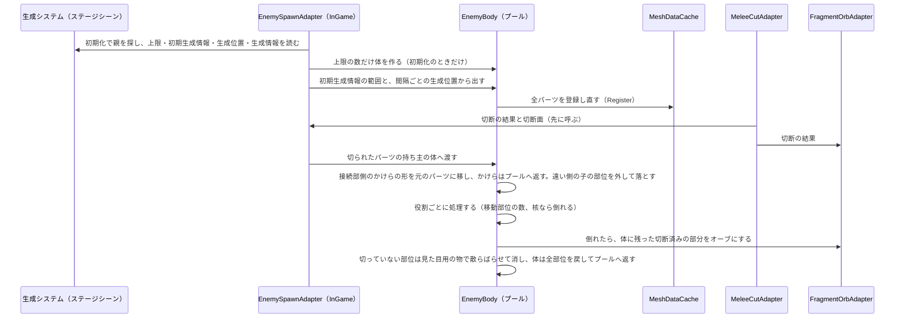

# 区間4A：敵の体と切断

| 項目 | 内容 |
|---|---|
| 状態 | 着手（2026-10-06。詳細仕様は確定済み） |
| 目安の時期 | 2026/10/06〜10/19（最速の推定 10/06〜10/09） |
| 前提となる区間 | 1, 3 |
| 全体計画 | [InGameOverallPlan.md](../InGameOverallPlan.md) |

区間4は 2026-10-05 に 3 つに分けた。4A（この区間）で敵の体と切断を作り、[4B](Section04B_CrowdPrototype.md) で群衆 AI の試作と計測、[4C](Section04C_CrowdAI.md) で群衆 AI の本実装を行う。4A の敵は、その場に立つか、プレイヤーへまっすぐ進むだけにする。

## 目的

ステージシーンの生成システムから敵を出し、切ると部位を失い、核を切ると倒れる敵の体を作る。
敵の体は最初にすべてプールに用意し、実行中は Instantiate しない。
その前に、今の InGame にあるライト・地面・テスト用の壁をステージシーンへ分ける。

## 関連する仕様

- 敵：https://app.notion.com/p/3e91ea2aa7fa81f3a713c0a6e64d438e（部位の役割、切られた部位は接続部側が残ること、核を壊すまで倒れないこと、倒れたときの扱い、部位ごとの切断回数の上限）
- 敵の出現：https://app.notion.com/p/3e91ea2aa7fa81de9e78d74221c216c8（生成システム、同時に存在する数の上限）
- チャージ：https://app.notion.com/p/3e91ea2aa7fa81249000ca51326add0f（かけらの切り直しは、部位ごとの切断回数の上限まで）
- 敵の大量描画と体の貸し出し：https://app.notion.com/p/3f01ea2aa7fa818fb0ebc1f6ea509324（4A の体は、4B で近くの敵に貸す体になる）

## 前提

- 仮モデルは AttakkerEnemy（四足歩行）。コミット 1 で Blender で直して `AttackerEnemy.fbx` として書き出し直す（決定 23）。SkinnedMeshRenderer は使わず、部位ごとに分かれたメッシュを動かす
- 敵の動きは `Time.deltaTime` を使う（スロー中は一緒に遅くなる）
- 移動の仕組み（群衆 AI）は 4B・4C で作る。固有のアクション（攻撃を含む）は区間9で作る
- 失敗（HP 0）とリトライは区間11で作る（敵の攻撃は区間9までないので、それまでは HP のデバッグ操作でしか 0 にならない為）
- UsefulToolkit.MeshCut の拡張（4-1）は、別の作業者が UsefulToolkit のリポジトリで作る。要件は [Section04_MeshCutRequirements.md](Section04_MeshCutRequirements.md)

## 仮モデルの確認結果（2026-10-05）

| 項目 | 内容 |
|---|---|
| 階層 | `Body`、脚 4 本（上の部位 `〜UpperLeg` の子に下の部位 `〜UnderLeg`）、`GunTurret`（子に `Gun`）、`Light` |
| 三角形の数 | 合計 4308（Body 164、上の部位 236 × 4、下の部位 430 × 4、GunTurret 716、Gun 764）。SkinnedMeshRenderer はない |
| Transform | `Light` 以外は回転 0、拡大率 1 |
| 部位の役割（決定） | 核 = `Body`、攻撃部位 = `GunTurret`（子の `Gun` を含む）、移動部位 = 脚の各部位（上 4・下 4） |
| 問題 | ① Blender のライト `Light`（拡大率 100）が書き出されている ② 後ろ脚の名前が `FrontLeftUpperLeg.001` などの複製名のままで、左右も逆（`FrontLeftUpperLeg.001` は右後ろ） ③ マテリアルが `Body` だけ違う ④ `Assets/Art/` は `.gitignore` の対象で、モデルがリポジトリに入らない ⑤ ファイル名の綴りが `Attakker` になっている。①〜⑤ はコミット 1 で直す（決定 22・23） |

## 計画書と今のコードの食い違い（着手時に確認）

#1〜#6 は 2026-10-05、#7〜#9 は 2026-10-06（区間3の後のリファクタリングの後）、#11 はコミット 5 の着手時に確認した。

| # | 内容 | 根拠 | 対応 |
|---|---|---|---|
| 1 | `MeshDataCache` は、`Start` の時点で**アクティブな**子孫の `CuttableObject` しか登録しない。非アクティブで待たせておくプールの敵は登録されない | `MeshDataCache.Initialize` の `GetComponentsInChildren<CuttableObject>()`（`includeInactive` なし） | 敵を出すたびに、パーツを登録し直す（決定 2） |
| 2 | 切られたパーツは、ストアの作り直し（`Rebuild`）で登録から外れ、`MeshId` が別のメッシュを指すようになる | `MeshDataCache.Rebuild` が `!user.IsCuttable` を外す | 出すたびに登録し直すので、保持していた `MeshId` には頼らない |
| 3 | 切られたパーツは `SetActive(false)` されるので、その子もまとめて消える。仮モデルは上の部位の子に下の部位がある | `MultiCutBlade.ExecuteCut` の `target.gameObject.SetActive(false)` | 接続部側を残す処理（決定 4）で、元のパーツを表示し直す。遠い側にある子の部位は、体から外して落とす |
| 4 | 4-3「敵の State（生きている敵の一覧と数）」は、区間4A に読む利用者がいない | 区間3の `FragmentOrbAdapter` は、かけら数・オーブ数を Adapter のプロパティとしてデバッグ表示に出している | 作らない。数は Adapter のプロパティにする。敵の状態は 4B で NativeArray に持つ |
| 5 | 骨子の 4-5「`NavMeshAgent` でプレイヤーに近づく」は、Notion の群衆 AI（距離マップと簡易物理。NavMesh は不採用寄り）と合わない | Notion「敵の群衆 AI（目的地・経路・移動）」 | 4A では作らない。移動は 4B・4C |
| 6 | インゲームにいるときに `GoToInGameAsync` を呼んでも、インゲームは読み直されない（リトライにならない） | `SceneLoadRequester.CollectLoadTargets` はロード済みのシーンを除く | 区間11で、UsefulToolkit にシーンを読み直す経路を足して扱う（決定 10） |
| 7 | かけらのメッシュは、かけら自身が持ち主になっている。メッシュを元のパーツに写してからかけらをプールへ返すと、そのかけらが次に使われたときに古いメッシュが Destroy され、体に残した部位が見えなくなる | `CuttableObject.SetCutMesh` は前に持っていたメッシュを Destroy する。`MultiCutBlade.ApplyResult` が毎回呼ぶ | MeshCut の拡張（4-1）に、かけらの形（メッシュの持ち主、マテリアル、当たり判定、切断回数）を別の `CuttableObject` へ移す操作と、切断前の形に戻す操作を足す（決定 15） |
| 8 | `CuttableObject` は `Awake` で球のコライダーを（無効の状態で）足す。元のパーツは自分のコライダーで当たり判定をしているので、残す側を短くしても当たり判定は元の大きさのまま | `CuttableObject.Awake`、`MeleeCutAdapter.CollectTargets` | #7 の操作で、かけらの球コライダーを写し、元のパーツのコライダーを無効にする（決定 15） |
| 9 | 残す側を決める（決定 4）には切断面が要るが、`MeleeCutAdapter` は切断の結果だけを渡している | `MeleeCutAdapter.Initialize(Action<MultiCutResult[]>)` | `MeleeCutAdapter` が切断面（`Plane`）も渡す（決定 16） |
| 10 | （コミット 4 の実装中に確認）`AdoptCutShape` で写したかけらの球コライダーは、長い部位では並びに隙間ができる。刃の範囲が隙間に入ると、体に残した部位を 2 回目に切れない。上の脚（残した長さ約 1.7m）で、約 0.7m の隙間があった | `CuttableObject.AdoptCutShape`（球コライダーを写し、元のコライダーを無効にする）、`MeleeCutAdapter.CollectTargets`（`OverlapBoxNonAlloc`） | UsefulToolkit 側で直してもらう（決定 25） |
| 11 | 4-3「部位の役割」はコミット 3 の予定だったが、作られていない。`EnemyPart` は切断対象と接続部の距離だけを持つ | `EnemyPart` | 役割を読むのはコミット 5 の処理だけなので、コミット 5 で作る |

## 既存の資産

| 資産 | 内容 |
|---|---|
| 区間2・3の成果 | `MeleeCutAdapter` が範囲内の切れる `CuttableObject` を集めて切り、結果（`MultiCutResult[]`）を `PlayerInitializer` が渡した関数へ渡す。今の渡し先は `FragmentOrbAdapter.ReceiveCutResults` だけ。かけらはオーブになり、吸収されるとチャージが増える |
| `RecycleBuffer<T>` | UsefulToolkit.framework（`UsefulToolkit` の Utility）。固定長のリングバッファで、空きがないと最も古い物を使い回す。要素は `IRecyclable` |
| `SubclassSelectorAttribute` | UsefulToolkit.framework。`[SerializeReference]` のフィールドに、Inspector でサブクラスを選ぶ表示を付ける |
| MeshCut の公開 API | `MeshDataCache.Instance`、`CompleteStoreReaders()`、`Store.Add(Mesh)`、`RegisterUser(CuttableObject)`、`CuttableObject.SetRegisteredMesh(int)`。切断の設定 `CanMultiCut` は、`ExecuteCut` の中でかけらへ引き継がれる（`InheritCutSettings`）。`MeshCutObjectPool.ReleaseObject` は `OnRecycle` を呼ぶので、かけらの `ReuseAction` が呼ばれる |
| `IGameSceneController` | 常駐シーンの `GameSceneInitializer` が Root スコープに登録している |
| `SceneGroup` | `HasMainScene` が有効なら、配列の先頭がアクティブなシーンになる。今の `InGameGroup` は `HasMainScene` 有効で `[InGame]` |
| 物理レイヤー | `Enemy`（7）がある。Player と Enemy は衝突しない。Shard と Enemy は衝突する |
| エフェクト | VFX Graph（導入済み）。`Assets/Art/Particles/EnemyDead.vfx` がある |

## MeshCut の制約（敵に関わるもの）

| 制約 | 影響 |
|---|---|
| `MeshDataCache` は `Start` の時点でアクティブな子孫の `CuttableObject` だけを登録する | 敵を出すたびに、パーツを登録し直す |
| 切られたパーツは `DisableCutting()` で切れない状態になり、非アクティブになる。子も一緒に消える | 接続部側を残すときは、かけらの形を元のパーツに移し、表示し直す（決定 4・15） |
| ストアを変えるときは、先に `CompleteStoreReaders()` で切断の Job の完了を待つ（README「ストアを読む Job との関係」） | 登録し直す処理で必ず守る（4-1 の `Register` が受け持つ） |
| 刃をローカル空間へ移すときの拡大率は `localScale` を使う（区間2で確認） | パーツの親に拡大率を持たせない。仮モデルは拡大率がすべて 1 なので問題ない |
| 近接切断の刃はカメラの位置を通る（区間2の決定） | 水平（0°）に振ると、カメラより低い部分は切れない |
| `MeleeCutAdapter` は、パーツ自身のコライダーで切る対象を探す（`Physics.OverlapBoxNonAlloc`） | 各パーツの GameObject にコライダーを付ける |
| かけらは `MeshCutObjectPool`（固定長のリングバッファ）のもので、空きがなくなると古い物から回収される。かけらのメッシュは、かけらが持ち主 | 体に残す接続部側を、かけらのまま持たない。形を元のパーツに移してから、かけらはプールへ返す（決定 4・15） |
| かけらのメッシュは元のパーツのローカル空間の座標で作られる | 形を移すときに Transform を合わせ直す必要はない。切断が数フレームにまたがって体が動いても、形は体に合う |

## 既存コードの確認結果（2026-10-06）

| 対象 | 状態 | 対応 |
|---|---|---|
| InGame シーン | `Directional Light`、`Ground`、`TestWalls`（`WallFront` / `WallLeft` / `WallRight` / `StageBounds`）、`MeshCut System`（`MeshDataCache` / `FragmentPool` / `CutBlade`）、`DummyEnemy`、`PlayerRoot`、`CameraPivot`、`Main Camera`、`MeleeCut`、`MeleeCutPreview`、`FragmentOrb`、`Compositor` | ライト・地面・`TestWalls` をステージシーンへ移す（4-0）。`DummyEnemy` は敵が出るようになったら削除する |
| [PlayerInitializer](../../../Code/Scripts/Initialization/Player/PlayerInitializer.cs) | `_meleeCutAdapter.Initialize(_fragmentOrbAdapter.ReceiveCutResults)` で、切断の結果を `FragmentOrbAdapter` だけに渡している | 敵の Adapter にも渡す（決定 9・16） |
| [MeleeCutAdapter](../../../Code/Scripts/EngineAdapterLayer/Player/MeleeCutAdapter.cs) | `Initialize(Action<MultiCutResult[]>)`。切断面（カメラの位置と、刃の法線）は `Swing` の中だけで持つ | 切断面も渡す（決定 16） |
| [FragmentOrbAdapter](../../../Code/Scripts/EngineAdapterLayer/Player/FragmentOrbAdapter.cs) | 切断の結果の `Original` が管理中のかけらでなければ何もしない。アクティブな表と裏を管理に加える。オーブは自分の子として `Instantiate` する | 位置を渡すとオーブを出す操作を足す（決定 6・決定 21） |
| `MeshCutObjectPool` | かけらを自分の子として `Instantiate` する | 変更なし |
| `PlayerInitializer` の State の登録先 | `gameObject.scene.buildIndex`（InGame）で SceneState を登録している | 変更なし。ステージシーンをアクティブにしても影響しない |
| asmdef | EngineAdapter と Initialization は `UsefulToolkit.MeshCut.Runtime` を参照済み | 変更なし |
| `Assets/Art/` | `.gitignore` の対象（約 2.5MB。マテリアル、`AttakkerEnemy.fbx`、`Enemy_Boss.fbx`、`EnemyDead.vfx`、スプライト、テクスチャ） | git の対象にする（決定 22） |

## 作業一覧

| # | 作業 | 層 | 内容 |
|---|---|---|---|
| 4-A | `Assets/Art/` の追跡と仮モデルの直し | Level / Blender | `.gitignore` から `Assets/Art/` を外す。Blender で仮モデルを直して `AttackerEnemy.fbx` として書き出し直す（決定 22・23） |
| 4-0 | ステージシーンの分離 | Level | ステージシーンを作り、今の InGame にあるライト・地面・`TestWalls`（`StageBounds` を含む）とライティングの設定を移す。`InGameGroup` を「ステージシーン（先頭、アクティブ）＋ InGame」にする。Build Settings に足し、`BuildScenes` を作り直す |
| 4-1 | UsefulToolkit.MeshCut の拡張 | UsefulToolkit | 実行中に 1 つのパーツを登録する操作、部位の系統ごとの切断回数、かけらの形を移す操作と切断前の形に戻す操作（決定 2・5・15）。別の作業者が作る。要件は [Section04_MeshCutRequirements.md](Section04_MeshCutRequirements.md) |
| 4-2 | 敵の体のプレハブ | Level | AttackerEnemy から作る。各部位にコライダーと `CuttableObject` を付け、役割を設定する |
| 4-3 | 部位の役割 | EngineAdapter | 役割をサブクラスセレクターで選ぶ（決定 7）。4A で作るのは核と移動。攻撃部位の役割は区間9で作り、4A の `GunTurret` は役割なしにする（決定 24） |
| 4-4 | 体のプール | EngineAdapter | 初期化のときに、同時に存在する数の上限の分だけ体を作る。実行中は Instantiate しない。空きがなければ出さない |
| 4-5 | 生成システム | EngineAdapter / Level | ステージシーンに置く生成システム（親）と、その子の、実行中の生成位置・初期生成情報（決定 8）。生成情報は親に一覧で持つ（決定 19） |
| 4-6 | 切断の受け取り | EngineAdapter / Initialization | 切断の結果と切断面から、どの体のどの部位が切られたかを引き、接続部側を残す処理と、子の部位を落とす処理を行う（決定 4・16） |
| 4-7 | 倒れる処理と再利用 | EngineAdapter | 核を切ったら倒れる。体に残った切断済みの部分はオーブにし、切っていない部位は見た目用の物で散らばらせてディゾルブで消す（決定 6・15）。体は全部位を戻してすぐプールへ返す |
| 4-8 | 仮の移動 | EngineAdapter | プレイヤーへまっすぐ進む（4B で置き換える）。移動部位が N 個壊されたら止まる |
| 4-9 | デバッグ表示 | Debug | 出ている敵の数、プールの空き、生成位置の有効・無効 |

## 完了条件

- ステージシーンを分けたあとも、区間3までの操作（移動、視点、切断、チャージ、かけらが外へ落ちない）が動く
- 初期生成情報の場所に敵が出ていて、実行中は生成位置から敵が出る。同時に存在する数は上限を超えない。無効にした生成位置からは出ず、動かした生成位置からは動かした先で出る
- 実行中に敵の体の Instantiate が呼ばれない
- 部位を切ると、接続部側が体に残り、遠い側がかけらになってチャージになる。接続部の近くを切ると、部位全体が落ちる。上の部位を切ると、遠い側にある子の部位も落ちて、ディゾルブで消える
- 同じ部位の系統は、上限の回数を超えて切れない。核は、ほかの部位を何度切ったあとでも切れる
- 核以外をいくら切っても倒れない。核を切ると倒れ、体に残っていた切断済みの部分はチャージになり、切っていない部位はばらばらになってディゾルブで消える
- 移動部位が N 個壊されると（切られる・落ちる）、移動しなくなる
- 倒れた敵の体はすぐプールに戻り、次に出たときに全部位がそろっていて、切断回数も 0 に戻っている

## 詳細仕様

### 決定（2026-10-05）

| # | 項目 | 決定 |
|---|---|---|
| 1 | 体のプール | 最初にすべてプールに用意し、実行中は Instantiate しない。同時に存在する数の上限（プールの大きさ）に達しているときは、新しく出さない。動けない敵がプールを埋めて、新しい敵が出なくなる、という戦略を遊びにする |
| 2 | パーツの登録 | UsefulToolkit.MeshCut に `MeshDataCache.Register(CuttableObject)`（`CompleteStoreReaders` → `Store.Add` → `SetRegisteredMesh` → `RegisterUser` をまとめたもの）を足す。敵を出すたびに、全パーツを登録し直す |
| 3 | 倒れる条件 | 切断では、核を壊すまで倒れない（崩落による撃破は区間5） |
| 4 | 切られた部位 | 接続部に近い側が体に残り、遠い側がかけらになる。接続部の近く（部位の基準点から一定の距離以内）を切ると、位置にかかわらず部位全体が落ちる。残す側は、切断面に対して基準点がある側とする。実装：残す側のかけらの形を元のパーツに移し（決定 15）、元のパーツを表示し直して登録し直す。かけらはプールへ返す（かけらのまま体に付けておくと、リングバッファの回収で消えるおそれがある為）。遠い側にある子の部位は、体から外れて落ちる。切っていない部位なので、ディゾルブで消える |
| 5 | 切断回数の上限 | 敵ごとではなく、部位の系統ごとに数える。かけらが「これまでに切られた回数」を持ち、表と裏のかけらには「元の回数 + 1」を引き継ぐ。上限に達したかけらは切れない。核の系統は別に数えるので、脚を何度切っても核は切れる（敵ごとに数えると、脚だけを切って上限に達し、核とタレットだけが残った倒せない敵ができる為）。1 回の攻撃で同じ系統のかけらを何個切っても、それぞれの回数が 1 ずつ増えるだけなので、自然に「1 回」と数えられる。UsefulToolkit.MeshCut の `CanMultiCut` を受け継ぐ仕組みを広げて、ライブラリ側に入れる。体に戻した接続部側も、かけらと同じ回数を持つ |
| 6 | 倒れたとき | 切断済みの部分（体に残っていた接続部側を含む）はチャージになる。切っていない部位はばらばらになり、ディゾルブで消える（チャージにならない）。体は全部位を有効に戻し、元のメッシュに戻し、切断回数を 0 にして、すぐプールへ返す。散らばって消える部位は、体とは別の見た目用の物で表す |
| 7 | 部位の役割の持たせ方 | 体のコンポーネントに「パーツと役割」の一覧を持たせ、役割は `[SerializeReference]` ＋ `SubclassSelector` で選ぶ（攻撃する・ガードする・吸収するなど、敵の種類で処理そのものが変わる為）。特殊部位は、区間9で役割のクラスを足して作る |
| 8 | 生成システム | ステージシーンに親となる生成システムを置き、その子に次の 2 つを置く。InGame 側は、親を `FindAnyObjectByType` で見つける（ステージシーン全体を探さない）。① 実行中の生成位置：MonoBehaviour。実行中に動くことも、無効になることもある。無効化のメソッドを公開する ② 初期生成情報：開始時に敵がいる位置と、そこを中心とした半径。複数置ける。初期化のときだけ使う。実行中に出す敵の情報（生成情報。一度に出す数の上限を持つ）は、親に一覧で持つ（決定 19） |
| 9 | 切断の結果を、かけらと敵の 2 か所へ渡す方法 | 直接配線。`PlayerInitializer` が、`FragmentOrbAdapter` と敵の Adapter の両方へ渡す関数を `MeleeCutAdapter` に渡す（区間3の決定 2 と同じ理由） |
| 10 | 失敗とリトライ | 区間11へ移す。リトライは、UsefulToolkit にシーンを読み直す経路を足して作る |
| 11 | 仮モデル | AttakkerEnemy（コミット 1 で `AttackerEnemy` に直す）。核 = `Body`、攻撃部位 = `GunTurret`（子の `Gun` を含む）、移動部位 = 脚の各部位（上 4・下 4） |
| 12 | 動けなくなる条件 | 移動部位が N 個壊されたら動けなくなる。移動部位は脚の各部位（上の部位 4 つと下の部位 4 つ）。切られたとき、または体から外れて落ちたときに「壊れた」と数える |
| 13 | 敵のレイヤーと、プレイヤーとの衝突 | Enemy レイヤーにし、今の設定（Player と Enemy は衝突しない）のままにする |
| 14 | ステージシーンの名前と、今のダミーの敵 | `Assets/Level/Scenes/Stage/TestStage/TestStage.unity`。`DummyEnemy` は、敵が出るようになったら削除する |

### 決定（2026-10-06）

| # | 項目 | 決定 |
|---|---|---|
| 15 | 体に残す形の扱い（食い違い #7・#8） | UsefulToolkit.MeshCut の `CuttableObject` に、かけらの切断後の形（メッシュの持ち主、マテリアル、球コライダー、切断回数、切れるかどうか）を自分に移す操作と、`Awake` の時点の形に戻す操作を足す。形を移したパーツは、元から持っていたコライダーを無効にする。要件は [Section04_MeshCutRequirements.md](Section04_MeshCutRequirements.md) |
| 16 | 切断面の渡し方（食い違い #9） | `MeleeCutAdapter` の `onCut` を `Action<MultiCutResult[], Plane>` にし、切断面（カメラの位置を通り、刃の法線を持つ平面）も渡す。`PlayerInitializer` が、敵の Adapter には結果と切断面を、`FragmentOrbAdapter` には結果だけを渡す（`FragmentOrbAdapter.ReceiveCutResults` は変更しない）。敵の Adapter を先に呼ぶ（体に残す側のかけらは、敵の Adapter がプールへ返して非アクティブになるので、`FragmentOrbAdapter` の管理に入らない） |
| 17 | 散らばって消える部位の見た目 | 部位の形の見た目用の物（コライダーなし）を `RecycleBuffer` のプールから出し、ディゾルブのシェーダーで消す。VFX Graph に置き換えるかは、区間5でエネルギーの演出を作るときに決める |
| 18 | 接続部の近くとみなす距離、動けなくなる数 N、切断回数の上限 | 距離は部位ごとに Inspector で持ち、仮に 0.3m。部位の基準点が接続部（脚なら付け根、下の部位なら膝）にあることは、コミット 1 の Blender での作業で確かめ、ずれていれば直す。N は体の Inspector に置き、仮に 4（8 つのうち）。切断回数の上限は `CuttableObject` の Inspector に置き、仮に 2（元の部位を切ったかけらを、もう 1 回まで切れる） |
| 19 | 生成情報と、同時に存在する数の上限 | どちらもステージシーンの生成システムに置く（仕様のとおりステージごと）。生成情報は一覧で持ち（区間9で敵の種類を足せる形）、1 件あたり「一度に出す数の上限」と「出す間隔（仮に 3 秒）」を持つ。同時に存在する数の上限は仮に 10 で、InGame の体のプールは初期化のときにその数の体を作る。出す敵の総数は Notion で検討中なので、4A では持たない（総数の制限なし） |
| 20 | 実行中の生成位置から出す順番 | 順番に回す。無効な生成位置は飛ばす。区間11でステージごとに見直す |
| 21 | 体に残った切断済みの部分をチャージにする方法 | `FragmentOrbAdapter` に「位置を渡すとオーブを出す」操作を足し、倒れたときに体がその部分ごとに呼ぶ（1 つで 1 チャージ。かけら 1 個と同じ） |
| 22 | `Assets/Art/` の扱い | `.gitignore` から外し、git の対象にする |
| 23 | 仮モデルの直し | Blender で直して書き出し直す。ライトを書き出さない、後ろ脚の名前を複製名から付け直して左右を正す、マテリアルをそろえる、ファイル名の綴りを `AttackerEnemy` に直す |
| 24 | 攻撃部位の役割 | 4A では読む処理がないので作らない。区間9で、役割のクラスを足して作る。4A の `GunTurret` は役割なし（切られても体に何も起きない部位）にする |
| 25 | 体に残した部位の当たり判定（食い違い #10） | UsefulToolkit.MeshCut 側で、`AdoptCutShape` で形を移した先の当たり判定に隙間ができないようにしてもらう（2026-10-06 ユーザーが決定）。要件は [Section04_MeshCutColliderRequirements.md](Section04_MeshCutColliderRequirements.md)。マージの後で参照を更新し、完了条件 5 を確かめる |

### 決定（2026-10-06、コミット 5 の着手時）

| # | 項目 | 決定 |
|---|---|---|
| 26 | ディゾルブのシェーダー | ローカルで Shader Graph で作る（URP の Lit に Alpha Clip、ノイズと float のプロパティ `_DissolveAmount`（0〜1）を比べて消す）。消えた割合は、コードが `MaterialPropertyBlock` で毎フレーム渡す（`Time.deltaTime` で進むので、スロー中は一緒に遅くなる） |
| 27 | 見た目用の部位の作り方 | プレハブを作らない。`EnemySpawnAdapter` が初期化のときに、`MeshFilter` と `MeshRenderer` だけの物（`EnemyDebris`）を必要な数だけ作り、`RecycleBuffer` で使い回す。出すときに部位のメッシュを写す |
| 28 | 親と一緒に落ちる子の部位が、すでに切られていたとき | 倒れたとき（決定 6）と同じ規則にする。切断済みならオーブ（チャージ）、切っていなければ見た目用の物でディゾルブ。切断の途中（非アクティブ）の部位は何も出さない（その表と裏のかけらがチャージになる為） |

### 決めること

なし（2026-10-06 にすべて決定）。

## 作業計画

### 処理の流れ

### 新しく作る型と、区間4A での利用者

| 型 | 層 | 区間4A での利用者 |
|---|---|---|
| `MeshDataCache.Register`、`CuttableObject` の切断回数と、形を移す・戻す操作（メソッドとフィールドの追加） | UsefulToolkit.MeshCut | `EnemyBody`（出すたびに登録し直す、接続部側を残す、全部位を戻す）、`MeleeCutAdapter` 経由の切断（上限に達したかけらを除く） |
| `EnemyBody` | EngineAdapter | `EnemySpawnAdapter`。敵のプレハブに付ける。パーツと役割の一覧、接続部側を残す処理、子の部位を落とす処理、倒れる処理、全部位を戻す処理、仮の移動を持つ |
| `EnemyPartRole`（抽象）と、`CorePartRole` / `MovePartRole` | EngineAdapter | `EnemyBody`。部位が壊れたときの処理を役割ごとに持つ |
| `EnemySpawnAdapter` | EngineAdapter | `EnemyInitializer`（初期化）、`PlayerInitializer`（切断の結果を渡す）。体のプール、パーツから体を引く表、生成の間隔、見た目用の部位のプール（`RecycleBuffer`）と寿命、出ている敵の数（デバッグ表示用のプロパティ）を持つ |
| `EnemySpawnSystem` / `EnemySpawnPoint` / `EnemyInitialSpawnArea` | EngineAdapter | `EnemySpawnAdapter`。ステージシーンに置く。親が上限と生成情報の一覧を持ち、子が実行中の生成位置と初期生成情報になる |
| `EnemyInitializer` | Initialization | `InGameCompositor`。敵の Adapter を初期化し、出ている敵の数を `DebugGUI` に出す |
| `EnemyDebris`（見た目用の部位 1 つ。`IRecyclable`） | EngineAdapter | `EnemySpawnAdapter` の `RecycleBuffer`（決定 27） |
| ディゾルブのシェーダーとマテリアル | Level（Shader Graph） | `EnemySpawnAdapter`（決定 26） |

拡張する型：`MeleeCutAdapter`（切断面も渡す）、`PlayerInitializer`（切断の結果を敵の Adapter にも渡す）、`FragmentOrbAdapter`（位置を渡すとオーブを出す操作 `SpawnOrb`）、`EnemyInitializer`（`SpawnOrb` を `EnemySpawnAdapter` に渡す）

作らないもの：敵の State・Board・Event、ステージシーンの Compositor と Initializer、敵の Service（Application）、攻撃部位の役割（区間9）、見た目用の部位だけを扱う Adapter（`EnemySpawnAdapter` に含める）、移動の仕組み（4B・4C）、攻撃（区間9）、失敗とリトライ（区間11）

基準の当てはめで見直した点（2026-10-06）

- 基準1：`AttackPartRole` は 4A に読む処理がないので作らない（決定 24）。`EnemyDebrisAdapter` は利用者が `EnemyBody` だけで、ディゾルブはシェーダーが時間で進めるので、`EnemySpawnAdapter` に含める
- 基準2：敵の生成・部位・倒れるルールを、Application の Service にせず EngineAdapter に置く。区間3で、オーブ化と吸収のルールを `FragmentOrbAdapter` に置いたのと同じ考え方。4B で敵の状態を NativeArray に持つときに、どの層に置くかを見直す
- 基準3：食い違い #7〜#9 は、放置すると完了条件 4（接続部側が体に残る）を満たせないので計画に入れた

### コミットの分け方

| # | 内容 | 確かめ方 |
|---|---|---|
| 0 | 区間計画書の更新と、MeshCut 拡張の要件定義（[Section04_MeshCutRequirements.md](Section04_MeshCutRequirements.md)） | ― |
| 1 | `Assets/Art/` を git の対象にし、仮モデルを Blender で直して `AttackerEnemy.fbx` として書き出し直す（4-A） | `git status` に `Assets/Art/` の中身が出る。Unity で読み込んだモデルに、ライトがなく、部位の名前と左右が正しく、マテリアルがそろっていて、各部位の基準点が接続部にある |
| 2 | ステージシーンの分離（4-0） | 常駐シーンから再生してインゲームに入り、区間3までの操作が動き、見た目（ライティング）が変わっていない。ステージシーンがアクティブになっている |
| （UsefulToolkit 側） | MeshCut の拡張（4-1。別の作業者） | 要件定義の「受け入れの確認」 |
| 3 | meshcut の参照の更新。敵の体のプレハブ、部位の役割、体のプール、生成システム、`EnemyInitializer`、デバッグ表示、仮の移動（4-2〜4-5、4-8 の前半、4-9）。`DummyEnemy` を削除 | 完了条件 2・3。敵を切るとかけらがチャージになる |
| 4 | 切断の受け取り（4-6）。切断面を渡す、接続部側を残す、接続部の近くなら全体を落とす、子の部位を落とす | 完了条件 4・5。完了条件 5 のうち「上限まで切れる」は、当たり判定の修正（決定 25）の後に確かめる |
| （UsefulToolkit 側） | 当たり判定の修正（決定 25。別の作業者） | [Section04_MeshCutColliderRequirements.md](Section04_MeshCutColliderRequirements.md) の「受け入れの確認」 |
| 5a | 部位の役割（4-3。食い違い #11）、倒れる処理と再利用、移動部位で止まる処理（4-7、4-8 の後半）、見た目用の部位（決定 27・28）。クラウドで作る | ローカルで 5b と一緒に確かめる |
| 5b | ディゾルブの Shader Graph とマテリアル（決定 26）、`AttackerEnemy` の部位の役割（`Body` = 核、脚 8 つ = 移動）と `EnemySpawnAdapter` のマテリアルの設定。ローカルで作る | 完了条件 6・7・8 |
| 6 | 区間計画書の「実装結果」と全体計画書の更新 | ― |

コミット 0〜2 は MeshCut の拡張を待たずに進められる。コミット 3 は、UsefulToolkit 側のマージの後に始める。

## 次の区間へ持ち越すこと（計画の時点）

- 4B：敵の状態を NativeArray に持ち、体を近くの敵にだけ貸す。体を返すときも、部位の状態（失った部位、切られて短くなった部位）は敵の状態に持ち続ける
- 4B：見た目用の部位の扱いが、寿命で消す以上に大きくなったら（物理や VFX を持つなど）、`EnemySpawnAdapter` から分ける
- 区間5：崩落による撃破。エネルギーの演出を VFX Graph で作るときに、散らばる部位の見た目（決定 17）を一緒に置き換えるかを決める
- 区間9：攻撃部位の役割（決定 24）、特殊部位と固有のアクション（攻撃を含む）。攻撃部位を失った敵は攻撃しない
- 区間11：失敗とリトライ。スコアに使う「倒した敵の数」。出す敵の総数の持たせ方（Notion「敵の出現」の検討中）

## 他プラットフォームへの対応

- 敵の処理にプラットフォームによる違いはない。スマホでは、同時に存在する数の上限を別の値にする可能性がある（生成システムの Inspector の値）

## 見つけた問題（今回は扱わない）

- 【UsefulToolkit.MeshCut】README の「重要な制約」に「切断対象は必ず `MeshDataCache` の子に配置」とあるが、`Start` の時点で非アクティブな子は登録されないことが書かれていない（`MeshDataCache.Initialize`）。要件定義の D1 として、MeshCut の拡張と一緒に書き足してもらう
- 【UsefulToolkit.MeshCut】Read/Write が無効なメッシュを `Register` すると、原因の分かりにくい `ArgumentException` になる（コミット 3 で発生。FBX の Read/Write を有効にして解消）。当たり判定の要件定義に、任意の要件 F5 として入れた
- 【区間3からの挙動】かけらそのものの球コライダーにも、長い形では隙間があり、隙間を通る刃では切り直せない。当たり判定の要件定義に、任意の要件 F4 として入れた
