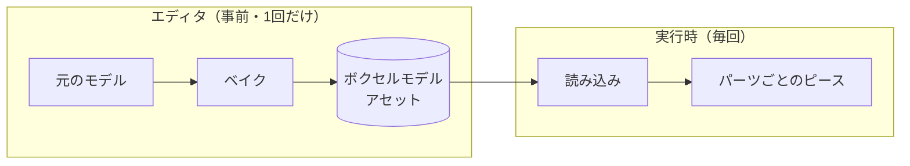
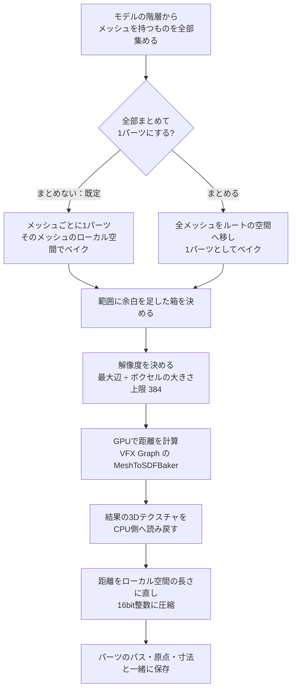
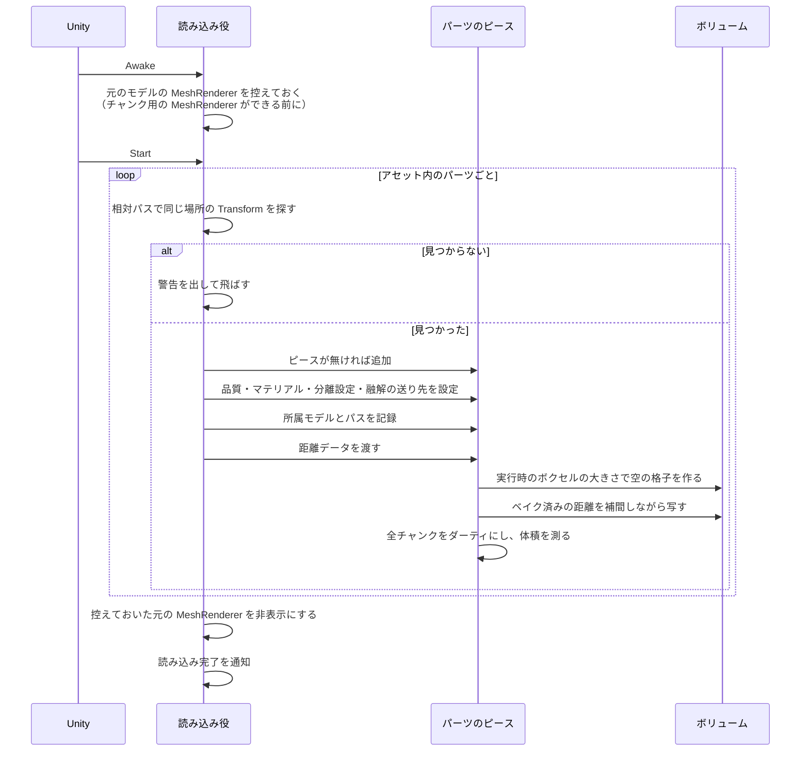
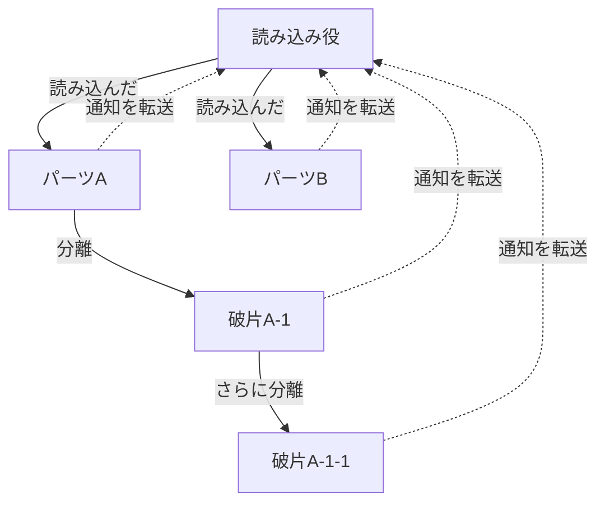

# Bake：既存メッシュのベイクと実行時の読み込み

[← 全体像へ](../VoxelOverview.md)

## 1. なぜ2段階なのか

メッシュから「表面までの距離の格子」を正確に計算するのは重いので、**エディタ上で事前に計算して保存**（ベイク）しておき、
実行時はそれを読み込むだけにしている。

## 2. ベイク（エディタ）

### 使い方

メニュー `Kizami/Voxel/Bake Model` でウィンドウを開き、モデルと設定を選んで「ベイク」を押す。
出力先は既定で `Assets/Data/Voxel/Baked/モデル名_Voxel.asset`。同じパスのアセットがあれば中身だけ差し替える（参照は切れない）。

> ウィンドウは [`VoxelBakeWindow`](../../../Code/Scripts/EngineAdapterLayer/Voxel/Editor/Bake/VoxelBakeWindow.cs)[L12](https://github.com/TaguchiRei/Kizami/blob/main/Assets/Code/Scripts/EngineAdapterLayer/Voxel/Editor/Bake/VoxelBakeWindow.cs#L12)、処理本体は [`VoxelModelBaker`](../../../Code/Scripts/EngineAdapterLayer/Voxel/Editor/Bake/VoxelModelBaker.cs)[L14](https://github.com/TaguchiRei/Kizami/blob/main/Assets/Code/Scripts/EngineAdapterLayer/Voxel/Editor/Bake/VoxelModelBaker.cs#L14) で行っている。

### 処理の流れ

ポイント：

- 距離の計算は Unity の VFX Graph に含まれる [GPU ベイカーをそのまま使っている](../../../Code/Scripts/EngineAdapterLayer/Voxel/Editor/Bake/VoxelModelBaker.cs)[L120](https://github.com/TaguchiRei/Kizami/blob/main/Assets/Code/Scripts/EngineAdapterLayer/Voxel/Editor/Bake/VoxelModelBaker.cs#L120)（自前実装ではない）
- **パーツごとにベイクした場合**、各パーツは「元のモデル階層の中のどの Transform か」を相対パスで覚えておく。読み込み時はこのパスで同じ場所の Transform を探す
- 距離は ±最大距離（既定 0.3）を [16bit 整数の全範囲に割り当てて圧縮する](../../../Code/Scripts/EngineAdapterLayer/Voxel/Model/VoxelSdfEncoding.cs)[L13](https://github.com/TaguchiRei/Kizami/blob/main/Assets/Code/Scripts/EngineAdapterLayer/Voxel/Model/VoxelSdfEncoding.cs#L13)。これより遠い値は丸められる
- 解像度には上限（384）がある。GPU ベイカーは総ボクセル数が一定を超えると例外を投げるため

- ボクセルより細い・薄い部分は格子で表現しきれず、先が丸くなったり途切れたりする。元メッシュが閉じていない・面が裏返っている場合は内外判定を誤ることがある

> 圧縮と復元は [`VoxelSdfEncoding`](../../../Code/Scripts/EngineAdapterLayer/Voxel/Model/VoxelSdfEncoding.cs)[L8](https://github.com/TaguchiRei/Kizami/blob/main/Assets/Code/Scripts/EngineAdapterLayer/Voxel/Model/VoxelSdfEncoding.cs#L8)、1パーツ分のデータは [`VoxelSdfData`](../../../Code/Scripts/EngineAdapterLayer/Voxel/Model/VoxelSdfData.cs)[L12](https://github.com/TaguchiRei/Kizami/blob/main/Assets/Code/Scripts/EngineAdapterLayer/Voxel/Model/VoxelSdfData.cs#L12)、保存先のアセットは [`VoxelModelAsset`](../../../Code/Scripts/EngineAdapterLayer/Voxel/Model/VoxelModelAsset.cs)[L14](https://github.com/TaguchiRei/Kizami/blob/main/Assets/Code/Scripts/EngineAdapterLayer/Voxel/Model/VoxelModelAsset.cs#L14) で扱っている。

### ベイク設定

| 項目 | 既定値 | 意味 |
|---|---|---|
| ボクセルの大きさ | 0.02 | ベイクの細かさ。**実行時の品質設定より細かく** する |
| 余白（ボクセル数） | 2 | メッシュの外側に取る余白 |
| 最大距離 | 0.3 | 保持する距離の上限。**実行時のボクセルの大きさの 2 倍以上** にする（短いと法線が荒れる。読み込み時に警告が出る） |
| 階層をまとめる | オフ | オンで全メッシュを1パーツに |
| 内外判定の補正回数 / 閾値 | 1 / 0.5 | GPU ベイカーの内外判定の調整値（そのまま渡している） |

> 設定は [`VoxelBakeSettings`](../../../Code/Scripts/EngineAdapterLayer/Voxel/Editor/Bake/VoxelBakeSettings.cs)[L10](https://github.com/TaguchiRei/Kizami/blob/main/Assets/Code/Scripts/EngineAdapterLayer/Voxel/Editor/Bake/VoxelBakeSettings.cs#L10) 構造体で定義している。

## 3. 実行時の読み込み

### 使い方

モデルのルートにモデル読み込み役のコンポーネントを付け、ベイク済みアセットと品質設定を指定する。
既定では Start で自動的に読み込む。

> この役割は [`VoxelModelLoader`](../../../Code/Scripts/EngineAdapterLayer/Voxel/Model/VoxelModelLoader.cs)[L16](https://github.com/TaguchiRei/Kizami/blob/main/Assets/Code/Scripts/EngineAdapterLayer/Voxel/Model/VoxelModelLoader.cs#L16) クラスが担っている。

### 処理の流れ

- ベイク時の細かさと実行時の細かさは別でよい。実行時の品質設定（PC / モバイル）に合わせて、読み込み時に補間して変換する
- マテリアルは「上書き指定 → パーツの元の MeshRenderer → 階層内で最初の元の MeshRenderer」の順に探す
- [元の見た目は非表示にするだけで、削除はしない](../../../Code/Scripts/EngineAdapterLayer/Voxel/Model/VoxelModelLoader.cs)[L217](https://github.com/TaguchiRei/Kizami/blob/main/Assets/Code/Scripts/EngineAdapterLayer/Voxel/Model/VoxelModelLoader.cs#L217)
- 全チャンクをダーティにするので、表示は数フレームかけて出そろう（1フレームの作り直し上限に従う）

> 読み込みは [`VoxelModelLoader.Load`](../../../Code/Scripts/EngineAdapterLayer/Voxel/Model/VoxelModelLoader.cs)[L179](https://github.com/TaguchiRei/Kizami/blob/main/Assets/Code/Scripts/EngineAdapterLayer/Voxel/Model/VoxelModelLoader.cs#L179)、パーツ側の受け取りは [`VoxelPiece.LoadSdf`](../../../Code/Scripts/EngineAdapterLayer/Voxel/Piece/VoxelPiece.cs)[L235](https://github.com/TaguchiRei/Kizami/blob/main/Assets/Code/Scripts/EngineAdapterLayer/Voxel/Piece/VoxelPiece.cs#L235) メソッドで行っている。

## 4. モデル単位でのまとめ役

読み込み役は、読み込んだ後も「このモデルに属するピース全部」を追跡する。

- **パーツ**：読み込み時からあるピース（分離前の本体）
- **ピース全体**：パーツ ＋ そこから切り離された全ての破片（破棄されたものは除く）
- 切り離された破片にも「所属モデル」が引き継がれるので、何世代分離しても通知は読み込み役に集まる
- 体積（今 / 最初 / 割合）はパーツの合計で計算する（切り離された破片は含まない）。「モデル本体がどれだけ削られたか」の指標になる

| 通知 | 内容 |
|---|---|
| 読み込み完了 | 読み込み・読み込み直しが終わった |
| いずれかのピースの形状変化 | 各ピースの形状変化通知をまとめたもの |
| いずれかのピースの分離 | 各ピースの分離通知をまとめたもの（新しい破片は追跡対象に加わる） |
| いずれかのピースの破棄 | 各ピースの破棄通知をまとめたもの（追跡対象から外れる） |

読み込み直した場合、既に切り離された破片はそのまま残る。

> これらは [`VoxelModelLoader`](../../../Code/Scripts/EngineAdapterLayer/Voxel/Model/VoxelModelLoader.cs)[L16](https://github.com/TaguchiRei/Kizami/blob/main/Assets/Code/Scripts/EngineAdapterLayer/Voxel/Model/VoxelModelLoader.cs#L16) の [`RegisterOnLoaded`](../../../Code/Scripts/EngineAdapterLayer/Voxel/Model/VoxelModelLoader.cs)[L142](https://github.com/TaguchiRei/Kizami/blob/main/Assets/Code/Scripts/EngineAdapterLayer/Voxel/Model/VoxelModelLoader.cs#L142) / [`RegisterOnPieceShapeChanged`](../../../Code/Scripts/EngineAdapterLayer/Voxel/Model/VoxelModelLoader.cs)[L151](https://github.com/TaguchiRei/Kizami/blob/main/Assets/Code/Scripts/EngineAdapterLayer/Voxel/Model/VoxelModelLoader.cs#L151) / [`RegisterOnPieceSplit`](../../../Code/Scripts/EngineAdapterLayer/Voxel/Model/VoxelModelLoader.cs)[L161](https://github.com/TaguchiRei/Kizami/blob/main/Assets/Code/Scripts/EngineAdapterLayer/Voxel/Model/VoxelModelLoader.cs#L161) / [`RegisterOnPieceDestroyed`](../../../Code/Scripts/EngineAdapterLayer/Voxel/Model/VoxelModelLoader.cs)[L170](https://github.com/TaguchiRei/Kizami/blob/main/Assets/Code/Scripts/EngineAdapterLayer/Voxel/Model/VoxelModelLoader.cs#L170) メソッドで登録する。
