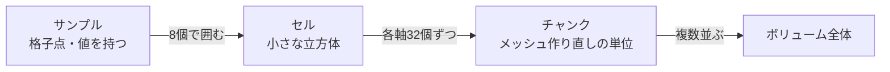
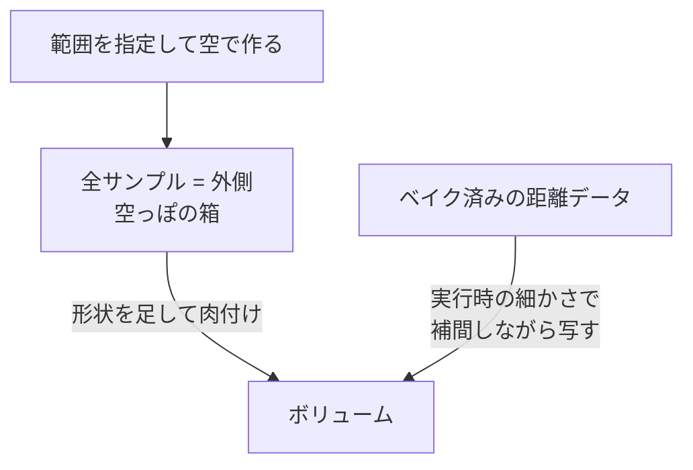
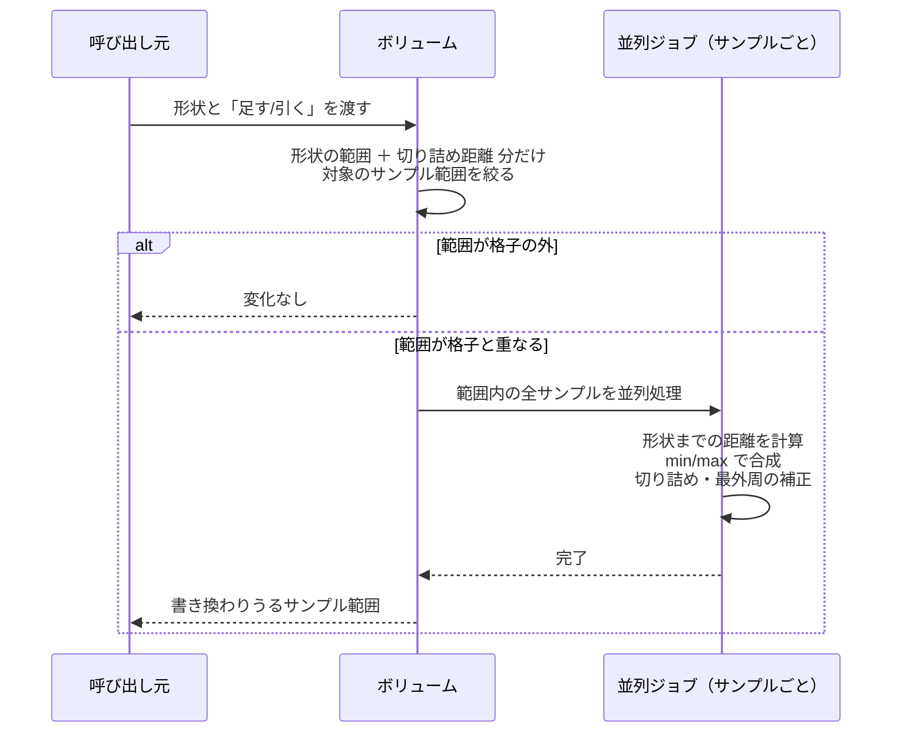
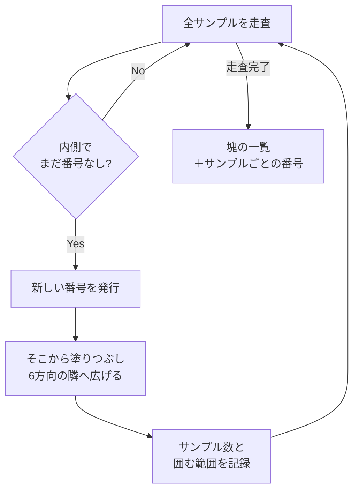

# Core：ボクセルデータの持ち方と編集

[← 全体像へ](../VoxelOverview.md)

## 1. データの形

1つの物体のボクセルデータは、**3次元の格子に並んだ数値の配列** である。

- 各サンプルは「表面までの距離」を1つ持つ（負が内側）
- 加熱されたことがあれば、同じ並びで「温度」も持つ（最初に加熱されたときに初めて確保される）
- 距離は「ボクセル 4 つ分」を上限・下限に切り詰めて保存する

格子そのものの寸法（原点の位置、ボクセルの大きさ、各軸のサンプル数、チャンクの区切り方）は別の小さなデータとして持ち、
「格子点の番号 ⇔ 3次元の座標 ⇔ 配列の何番目か」の変換はすべてこれが受け持つ。

> データ本体は [`VoxelVolume`](../../../Code/Scripts/EngineAdapterLayer/Voxel/Core/VoxelVolume.cs)[L17](https://github.com/TaguchiRei/Kizami/blob/main/Assets/Code/Scripts/EngineAdapterLayer/Voxel/Core/VoxelVolume.cs#L17) クラス、格子の寸法と座標変換は [`VoxelGridLayout`](../../../Code/Scripts/EngineAdapterLayer/Voxel/Core/VoxelGridLayout.cs)[L13](https://github.com/TaguchiRei/Kizami/blob/main/Assets/Code/Scripts/EngineAdapterLayer/Voxel/Core/VoxelGridLayout.cs#L13) 構造体で行っている。

### 格子・セル・チャンクの関係

サンプルは各軸「セル数 + 1」個並ぶ（柵と柵の間の関係と同じ）。

### 守られている約束：一番外側は必ず「外」

格子の最外周のサンプルは、どんな書き込みをしても[必ず正（外側）に保たれる](../../../Code/Scripts/EngineAdapterLayer/Voxel/Core/VoxelGridLayout.cs)[L93](https://github.com/TaguchiRei/Kizami/blob/main/Assets/Code/Scripts/EngineAdapterLayer/Voxel/Core/VoxelGridLayout.cs#L93)。
これにより、物体が格子の端まで達していても表面が必ず閉じ、メッシュに穴が空かない。

ボリュームへ距離を書き込む処理はすべてこの補正を通っている。**新しい書き込み処理を追加するときも必ず通す必要がある**（通さないと格子の端でメッシュが開く）。

> この補正は [`VoxelGridLayout.EnforceBoundary`](../../../Code/Scripts/EngineAdapterLayer/Voxel/Core/VoxelGridLayout.cs)[L93](https://github.com/TaguchiRei/Kizami/blob/main/Assets/Code/Scripts/EngineAdapterLayer/Voxel/Core/VoxelGridLayout.cs#L93) メソッドで行っている。

## 2. 生成のされ方（2通り）

- **空で作る**：全サンプルを「外側」で埋めた状態から始め、形状を足して形を作る（デバッグ用の箱や球など）
- **ベイク済みデータから作る**：事前ベイクした距離の格子（ベイク時とは細かさが違ってよい）を、[各サンプル位置で周囲 8 点から補間（トリリニア補間）して写す](../../../Code/Scripts/EngineAdapterLayer/Voxel/Core/VoxelResampleJob.cs)[L13](https://github.com/TaguchiRei/Kizami/blob/main/Assets/Code/Scripts/EngineAdapterLayer/Voxel/Core/VoxelResampleJob.cs#L13)。ベイク範囲の外は外側として扱う

> 補間しながら写す処理は [`VoxelResampleJob`](../../../Code/Scripts/EngineAdapterLayer/Voxel/Core/VoxelResampleJob.cs)[L13](https://github.com/TaguchiRei/Kizami/blob/main/Assets/Code/Scripts/EngineAdapterLayer/Voxel/Core/VoxelResampleJob.cs#L13) で行っている。

## 3. 編集：形状を足す／引く（CSG）

削る・盛るは、形状（球・箱・カプセル）と現在の距離を比べて値を書き換えるだけで行う。

| 操作 | 各サンプルの新しい値 | 直感的な意味 |
|---|---|---|
| 足す（和集合） | 「今の距離」と「形状までの距離」の **小さい方** | どちらかの内側なら内側 |
| 引く（差集合） | 「今の距離」と「形状までの距離の符号反転」の **大きい方** | 形状の内側は強制的に外側 |

ポイント：

- [形状から「切り詰め距離」より遠いサンプルは、合成しても値が変わらないので最初から処理しない](../../../Code/Scripts/EngineAdapterLayer/Voxel/Core/VoxelVolume.cs)[L65](https://github.com/TaguchiRei/Kizami/blob/main/Assets/Code/Scripts/EngineAdapterLayer/Voxel/Core/VoxelVolume.cs#L65)。これで編集コストは **形状の大きさにだけ比例** し、物体全体の大きさには依存しない
- 戻り値の「書き換わりうる範囲」は、後段で「どのチャンクを作り直すか」を決めるのに使われる

- 削ると、削り口の近くにある **残る側（内側）のサンプルの距離も** 新しい削り口までの距離に書き換わる。これにより断面も滑らかに表示される
- ここは近似で、符号（内か外か）と表面の位置は正確だが、削り口と元の表面が交わる角の近くでは距離の大きさが本来の最短距離から少しずれる。見た目への影響はほぼ無い

> 合成の本体は [`VoxelCsgJob`](../../../Code/Scripts/EngineAdapterLayer/Voxel/Core/VoxelCsgJob.cs)[L27](https://github.com/TaguchiRei/Kizami/blob/main/Assets/Code/Scripts/EngineAdapterLayer/Voxel/Core/VoxelCsgJob.cs#L27)、範囲の絞り込みと呼び出しは [`VoxelVolume.ApplyEdit`](../../../Code/Scripts/EngineAdapterLayer/Voxel/Core/VoxelVolume.cs)[L65](https://github.com/TaguchiRei/Kizami/blob/main/Assets/Code/Scripts/EngineAdapterLayer/Voxel/Core/VoxelVolume.cs#L65) メソッドで行っている。

### 形状について

形状は「ある点から自分の表面までの符号付き距離を返す」「自分を包む箱の範囲を返す」の2つだけを持つ。
ワールド空間で指定された形状は、物体のローカル空間へ移してから使う（拡大率は均一である前提）。

| 形状 | 距離の求め方（概略） |
|---|---|
| 球 | 中心からの距離 − 半径 |
| 箱（回転可） | 点を箱の向きに戻してから、各軸のはみ出し量で計算 |
| カプセル | 線分上の最も近い点からの距離 − 半径 |

新しい形状を追加するときは、ジョブの型登録（`RegisterGenericJobType`）をしないと Burst でコンパイルされない点に注意。

> 形状は [`IVoxelShape`](../../../Code/Scripts/EngineAdapterLayer/Voxel/Shapes/IVoxelShape.cs)[L10](https://github.com/TaguchiRei/Kizami/blob/main/Assets/Code/Scripts/EngineAdapterLayer/Voxel/Shapes/IVoxelShape.cs#L10) / [`ITransformableVoxelShape`](../../../Code/Scripts/EngineAdapterLayer/Voxel/Shapes/IVoxelShape.cs)[L25](https://github.com/TaguchiRei/Kizami/blob/main/Assets/Code/Scripts/EngineAdapterLayer/Voxel/Shapes/IVoxelShape.cs#L25) を実装した [`SphereShape`](../../../Code/Scripts/EngineAdapterLayer/Voxel/Shapes/SphereShape.cs)[L14](https://github.com/TaguchiRei/Kizami/blob/main/Assets/Code/Scripts/EngineAdapterLayer/Voxel/Shapes/SphereShape.cs#L14) / [`BoxShape`](../../../Code/Scripts/EngineAdapterLayer/Voxel/Shapes/BoxShape.cs)[L14](https://github.com/TaguchiRei/Kizami/blob/main/Assets/Code/Scripts/EngineAdapterLayer/Voxel/Shapes/BoxShape.cs#L14) / [`CapsuleShape`](../../../Code/Scripts/EngineAdapterLayer/Voxel/Shapes/CapsuleShape.cs)[L14](https://github.com/TaguchiRei/Kizami/blob/main/Assets/Code/Scripts/EngineAdapterLayer/Voxel/Shapes/CapsuleShape.cs#L14) 構造体で定義している。

## 4. 塊の判定と切り出し

削った結果、内側の部分が2つ以上に分かれていないかを調べる仕組み。

### 塊に番号を振る

内側（距離が負）のサンプルを、上下左右前後の 6 方向でつながっているもの同士でグループ分けし、[サンプルごとに「何番の塊か」を書き込む](../../../Code/Scripts/EngineAdapterLayer/Voxel/Core/VoxelComponentLabelJob.cs)[L38](https://github.com/TaguchiRei/Kizami/blob/main/Assets/Code/Scripts/EngineAdapterLayer/Voxel/Core/VoxelComponentLabelJob.cs#L38)。
塊ごとに「サンプル数（＝体積の目安）」と「その塊を囲む範囲」も記録する。

> この処理は [`VoxelComponentLabelJob`](../../../Code/Scripts/EngineAdapterLayer/Voxel/Core/VoxelComponentLabelJob.cs)[L38](https://github.com/TaguchiRei/Kizami/blob/main/Assets/Code/Scripts/EngineAdapterLayer/Voxel/Core/VoxelComponentLabelJob.cs#L38) で行っている。

### 塊に対してできる操作

| 操作 | 内容 |
|---|---|
| 切り出し | 1つの塊だけを囲む範囲（＋1サンプルの余白）で新しいボリュームを作る。範囲内にある **他の塊** の内側は符号を反転して外側扱いにする。温度があれば同じ範囲を写す |
| 消去 | 1つの塊に属するサンプルを全部外側にする |
| 収集 | 1つの塊に属するサンプルの番号を集める（融解で粒にするときに使う） |

切り出した新しいボリュームは、ボクセルの大きさ・チャンクの大きさ・ローカル空間が元と同じなので、元の物体と同じ位置・向きにそのまま置けば見た目がずれない。

> これらは [`VoxelVolume.ExtractComponent`](../../../Code/Scripts/EngineAdapterLayer/Voxel/Core/VoxelVolume.cs)[L251](https://github.com/TaguchiRei/Kizami/blob/main/Assets/Code/Scripts/EngineAdapterLayer/Voxel/Core/VoxelVolume.cs#L251) / [`EraseComponent`](../../../Code/Scripts/EngineAdapterLayer/Voxel/Core/VoxelVolume.cs)[L296](https://github.com/TaguchiRei/Kizami/blob/main/Assets/Code/Scripts/EngineAdapterLayer/Voxel/Core/VoxelVolume.cs#L296) / [`CollectComponentSamples`](../../../Code/Scripts/EngineAdapterLayer/Voxel/Core/VoxelVolume.cs)[L318](https://github.com/TaguchiRei/Kizami/blob/main/Assets/Code/Scripts/EngineAdapterLayer/Voxel/Core/VoxelVolume.cs#L318) メソッド（中身は [`VoxelComponentJobs.cs`](../../../Code/Scripts/EngineAdapterLayer/Voxel/Core/VoxelComponentJobs.cs)[L1](https://github.com/TaguchiRei/Kizami/blob/main/Assets/Code/Scripts/EngineAdapterLayer/Voxel/Core/VoxelComponentJobs.cs#L1) の各ジョブ）で行っている。

## 5. 値の読み取り

任意の位置の距離や温度は、周囲 8 サンプルからの補間で求める。格子の外は「外側（距離）」「0（温度）」として返す。
粒との当たり判定や「この点は物体の内側か」の判定に使われる。

> この処理は [`VoxelSampling`](../../../Code/Scripts/EngineAdapterLayer/Voxel/Core/VoxelSampling.cs)[L9](https://github.com/TaguchiRei/Kizami/blob/main/Assets/Code/Scripts/EngineAdapterLayer/Voxel/Core/VoxelSampling.cs#L9) クラス（[`VoxelVolume.SampleDistance`](../../../Code/Scripts/EngineAdapterLayer/Voxel/Core/VoxelVolume.cs)[L186](https://github.com/TaguchiRei/Kizami/blob/main/Assets/Code/Scripts/EngineAdapterLayer/Voxel/Core/VoxelVolume.cs#L186) / [`SampleTemperature`](../../../Code/Scripts/EngineAdapterLayer/Voxel/Core/VoxelVolume.cs)[L196](https://github.com/TaguchiRei/Kizami/blob/main/Assets/Code/Scripts/EngineAdapterLayer/Voxel/Core/VoxelVolume.cs#L196) 経由）で行っている。

## よくある疑問

**Q. 使っているのは SDF の符号だけ？**
A. 符号だけではなく、距離の大きさも使う。大きさがあるので、頂点の位置と法線が滑らかに決まる。

**Q. 削ったときの距離は、何との距離？**
A. モデルの中心ではなく「削る形状の表面」までの距離を各サンプルで計算し、今の値と比べて **大きい方**（内側が負なので、より外寄り）を残す。今の値の方が大きければ変えない。

**Q. 複雑な形のモデルだと距離がずれて見た目が崩れる？**
A. 削る処理の近似で崩れることはほぼ無い。細い・薄い部分の先が丸くなるのは、ベイク時の格子の細かさが原因（[Bake.md](Bake.md) 参照）。
