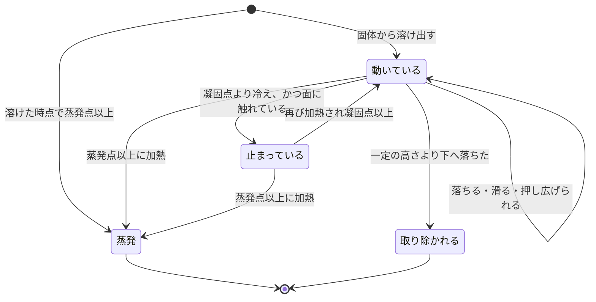
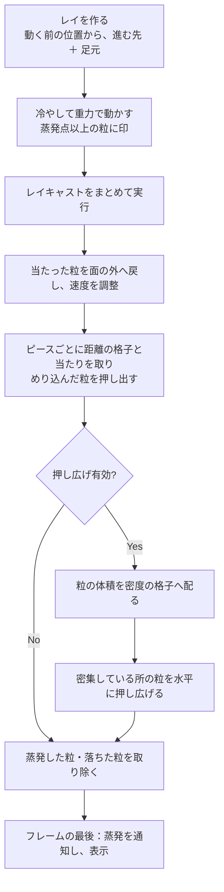
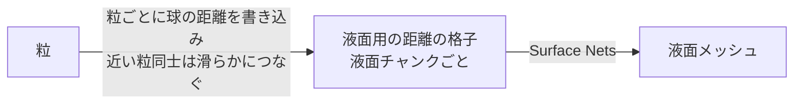

# Melt：溶けた粒の動きと表示

[← 全体像へ](../VoxelOverview.md)

## 1. 何をしているか

固体から溶け出した分を「粒」の集まりとして扱い、落として流し、冷えたら止め、液体らしく見せる。
本物の流体シミュレーションではなく、**粒を重力で動かし、面を滑らせ、密集したら押し広げる** という簡易的な疑似流体である。

- 粒同士はぶつからない
- 粒と固体（ピース）は、コライダーではなく距離の格子を直接読んで当たりを取る
- 粒とそれ以外の物（床・壁など）は、レイキャストで当たりを取る
- 温度が高いほどよく滑り、冷えると面に貼り付いて止まり、蒸発点以上で消える

融解システムはシーンに 1 つ置き、融解する全てのピースがそれを共有する。

> この役割は [`VoxelMeltSystem`](../../../Code/Scripts/EngineAdapterLayer/Voxel/Melt/VoxelMeltSystem.cs)[L24](https://github.com/TaguchiRei/Kizami/blob/main/Assets/Code/Scripts/EngineAdapterLayer/Voxel/Melt/VoxelMeltSystem.cs#L24) クラスが担っている。

## 2. 粒の一生

- 冷えても **空中では止まらない**。[面に触れた次のフレームで止まる](../../../Code/Scripts/EngineAdapterLayer/Voxel/Melt/VoxelParticleJobs.cs)[L46](https://github.com/TaguchiRei/Kizami/blob/main/Assets/Code/Scripts/EngineAdapterLayer/Voxel/Melt/VoxelParticleJobs.cs#L46)。空中で止めると宙に浮いたまま固まるため
- 粒の数には上限がある（既定 20,000）。超えた分の融解は粒にせず捨てる（一度だけ警告が出る）
- 蒸発は、そのフレームの分をまとめて通知する。一定の高さより下へ落ちた粒は、蒸発としては通知しない

## 3. 1フレームの処理の流れ

これらはすべて順番につないだジョブとして並列に処理する。

> この流れは [`VoxelMeltSystem`](../../../Code/Scripts/EngineAdapterLayer/Voxel/Melt/VoxelMeltSystem.cs)[L24](https://github.com/TaguchiRei/Kizami/blob/main/Assets/Code/Scripts/EngineAdapterLayer/Voxel/Melt/VoxelMeltSystem.cs#L24) の Update（シミュレーション）と LateUpdate（通知・表示）で行っている。

### 順番に関わる注意

- **レイは動く前の位置から作る**。動いた後から作ると、すでに面を抜けた位置から飛ばすことになる
- **レイは進む向きに加えて、[常に重力の向きへ粒の半径分を足す](../../../Code/Scripts/EngineAdapterLayer/Voxel/Melt/VoxelParticleJobs.cs)[L102](https://github.com/TaguchiRei/Kizami/blob/main/Assets/Code/Scripts/EngineAdapterLayer/Voxel/Melt/VoxelParticleJobs.cs#L102)**。進む向きだけだと、床を水平に滑る粒が足元の面を見失い、少しずつ沈んですり抜ける
- **粒の速さには上限がある**（既定 3 m/s）。1 フレームの移動が大きすぎると面をすり抜けるため
- **ピースごとの当たり判定は並列にせず順に実行する**。同じ粒の配列を書き換えるため

### 面に触れたときの速度

面へ向かう速度は消し、面に沿う速度は温度に応じて減らす。

- 熱い（蒸発点に近い）ほど減りにくく、よく流れる
- 冷たい（凝固点に近い）ほど減りやすく、面に貼り付く

> この計算は [`VoxelParticleContact`](../../../Code/Scripts/EngineAdapterLayer/Voxel/Melt/VoxelParticleJobs.cs)[L12](https://github.com/TaguchiRei/Kizami/blob/main/Assets/Code/Scripts/EngineAdapterLayer/Voxel/Melt/VoxelParticleJobs.cs#L12) で行っている。

### ピースとの当たりを距離の格子で取る理由

溶けた直後はコライダーの作り直しが追いついていない（作り直しは数フレームに分散されるため）。
距離の格子は溶けた瞬間に更新されているので、これを直接読めば、溶けてできたくぼみにも正しく流れ込む。

> この処理は [`VoxelParticleCollideJob`](../../../Code/Scripts/EngineAdapterLayer/Voxel/Melt/VoxelParticleJobs.cs)[L160](https://github.com/TaguchiRei/Kizami/blob/main/Assets/Code/Scripts/EngineAdapterLayer/Voxel/Melt/VoxelParticleJobs.cs#L160) で行っている。

### 押し広げ

粒同士はぶつからないので、そのままだと同じ場所に重なって山になる。これを防ぐため、次のようにする。

1. 粒の大きさ程度の間隔の格子に、各粒の体積を周囲 8 点へ配る（どこにどれだけ粒が詰まっているかが分かる）
2. 詰まり具合が基準を超えている粒に、[詰まり具合が下がる向きの速度を足す](../../../Code/Scripts/EngineAdapterLayer/Voxel/Melt/VoxelParticleSpreadJobs.cs)[L89](https://github.com/TaguchiRei/Kizami/blob/main/Assets/Code/Scripts/EngineAdapterLayer/Voxel/Melt/VoxelParticleSpreadJobs.cs#L89)

押すのは **面に触れている粒だけ**、向きは **水平だけ** に限る。空中の粒を押すと落ちている列が飛び散り、上向きに押すと打ち上がって空中で冷えるため。
位置は直接動かさず、速度だけを変える（位置を動かすと面をすり抜けうるため）。

> この処理は [`VoxelParticleDensityJob`](../../../Code/Scripts/EngineAdapterLayer/Voxel/Melt/VoxelParticleSpreadJobs.cs)[L51](https://github.com/TaguchiRei/Kizami/blob/main/Assets/Code/Scripts/EngineAdapterLayer/Voxel/Melt/VoxelParticleSpreadJobs.cs#L51) と [`VoxelParticleSpreadJob`](../../../Code/Scripts/EngineAdapterLayer/Voxel/Melt/VoxelParticleSpreadJobs.cs)[L89](https://github.com/TaguchiRei/Kizami/blob/main/Assets/Code/Scripts/EngineAdapterLayer/Voxel/Melt/VoxelParticleSpreadJobs.cs#L89) で行っている。

## 4. 表示

表示方法は 2 通りから選ぶ。

| 方式 | 見た目 | 負荷 |
|---|---|---|
| 液面（既定） | 粒を滑らかにつないだ 1 枚の表面 | 高め |
| 球 | 粒ごとに、体積の等しい球 | 低い（GPU インスタンシングでまとめて描く） |

> 方式は [`VoxelMeltRenderMode`](../../../Code/Scripts/EngineAdapterLayer/Voxel/Melt/VoxelMeltRenderMode.cs)[L6](https://github.com/TaguchiRei/Kizami/blob/main/Assets/Code/Scripts/EngineAdapterLayer/Voxel/Melt/VoxelMeltRenderMode.cs#L6) で指定する。

### 液面の作り方

固体と同じ「距離の格子 → Surface Nets」の仕組みを、粒に対してもう一度使っている。

- 固体とは別の、ワールド空間に固定した格子を使う。一辺 16 セルの液面チャンクに区切る
- 粒ごとに「球までの距離」を書き込み、近い球同士は [smooth-min](../../../Code/Scripts/EngineAdapterLayer/Voxel/Melt/VoxelMeltSplatJob.cs)[L81](https://github.com/TaguchiRei/Kizami/blob/main/Assets/Code/Scripts/EngineAdapterLayer/Voxel/Melt/VoxelMeltSplatJob.cs#L81)（最小値を取りつつ境目を丸める）でつないで、液だまりのように見せる
- 見た目の球は、粒の体積から求めた半径に倍率（既定 1.5）を掛けて大きめにしている。粒同士がつながりやすくなる反面、見た目の体積は実際より増える

作り直すのは、次のいずれかに当たる液面チャンクだけ。[止まった粒しか無いチャンクはメッシュを使い回す](../../../Code/Scripts/EngineAdapterLayer/Voxel/Melt/VoxelMeltSurface.cs)[L107](https://github.com/TaguchiRei/Kizami/blob/main/Assets/Code/Scripts/EngineAdapterLayer/Voxel/Melt/VoxelMeltSurface.cs#L107)ので、全部固まれば液面の負荷はほぼ無くなる。

- 動いている粒が届くチャンク
- 前のフレームに動いていた粒が届いていたチャンク（離れた跡を消すため）
- 粒が消えたチャンク
- 設定が変わったときは全チャンク

液面チャンクの格子の余白と、Surface Nets が読む範囲は対になっている。**片方だけ変えるとチャンクの境目で面が開く**（固体の場合と同じ。[Meshing.md](Meshing.md) 参照）。

> 液面の管理は [`VoxelMeltSurface`](../../../Code/Scripts/EngineAdapterLayer/Voxel/Melt/VoxelMeltSurface.cs)[L21](https://github.com/TaguchiRei/Kizami/blob/main/Assets/Code/Scripts/EngineAdapterLayer/Voxel/Melt/VoxelMeltSurface.cs#L21)、距離の書き込みは [`VoxelMeltSplatJob`](../../../Code/Scripts/EngineAdapterLayer/Voxel/Melt/VoxelMeltSplatJob.cs)[L16](https://github.com/TaguchiRei/Kizami/blob/main/Assets/Code/Scripts/EngineAdapterLayer/Voxel/Melt/VoxelMeltSplatJob.cs#L16)、作り直すチャンクの判定は [`VoxelMeltChunkKeysJob`](../../../Code/Scripts/EngineAdapterLayer/Voxel/Melt/VoxelMeltSplatJob.cs)[L95](https://github.com/TaguchiRei/Kizami/blob/main/Assets/Code/Scripts/EngineAdapterLayer/Voxel/Melt/VoxelMeltSplatJob.cs#L95) で行っている。

## 5. 設定

| 項目 | 既定値 | 影響 |
|---|---|---|
| 重力の倍率 | 1 | |
| 速さの上限 | 3 m/s | 大きいと面をすり抜ける |
| 滑りやすさ（熱いとき / 冷たいとき） | 1 / 12 | 面に沿う速度の 1 秒あたりの減り方。小さいほどよく流れる |
| 押し広げの速さ | 0.5 m/s | 0 で押し広げない |
| 押し広げを始める詰まり具合 | 0.6 | |

以上は `VoxelThermalSettings`、次は融解システムのコンポーネント側で設定する。

| 項目 | 既定値 | 影響 |
|---|---|---|
| 粒の上限数 | 20,000 | |
| 当たるレイヤー | 全て | ボクセル以外で粒が当たる物 |
| 液面の格子の大きさ | 0.02 m | 小さいほど細かいが重い |
| 液面の半径の倍率 / つなぐ幅 | 1.5 / 0.03 m | |

## よくある疑問

**Q. 流体シミュレーションをしている？**
A. していない。粒を重力で動かして面を滑らせ、密集したら水平に押し広げるだけの疑似的な表現。粒同士の衝突や圧力は計算していない。

**Q. 液面の見た目の量と、溶けた量は一致する？**
A. 一致しない。液面は粒を大きめの球として描いてつないでいるので、見た目は実際の体積より多く見える。体積の値（粒の体積の合計）は正確に保たれている。
