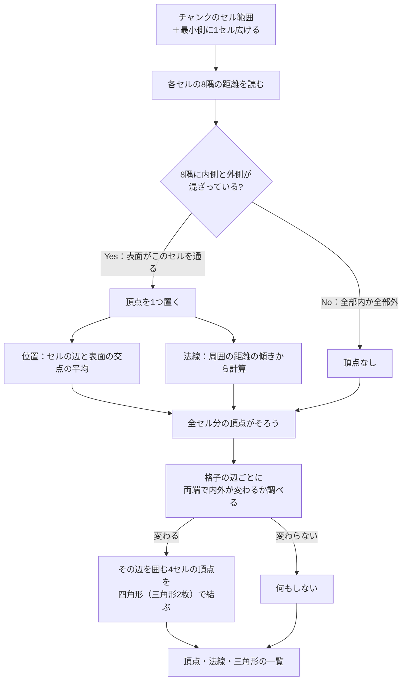
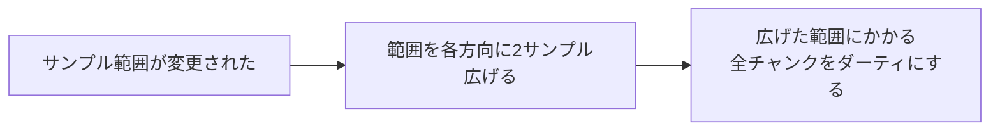
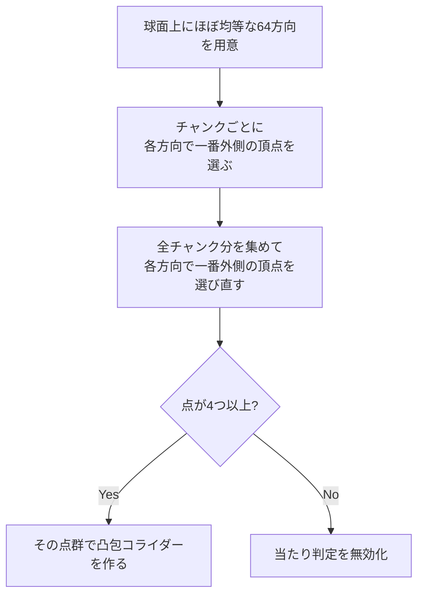
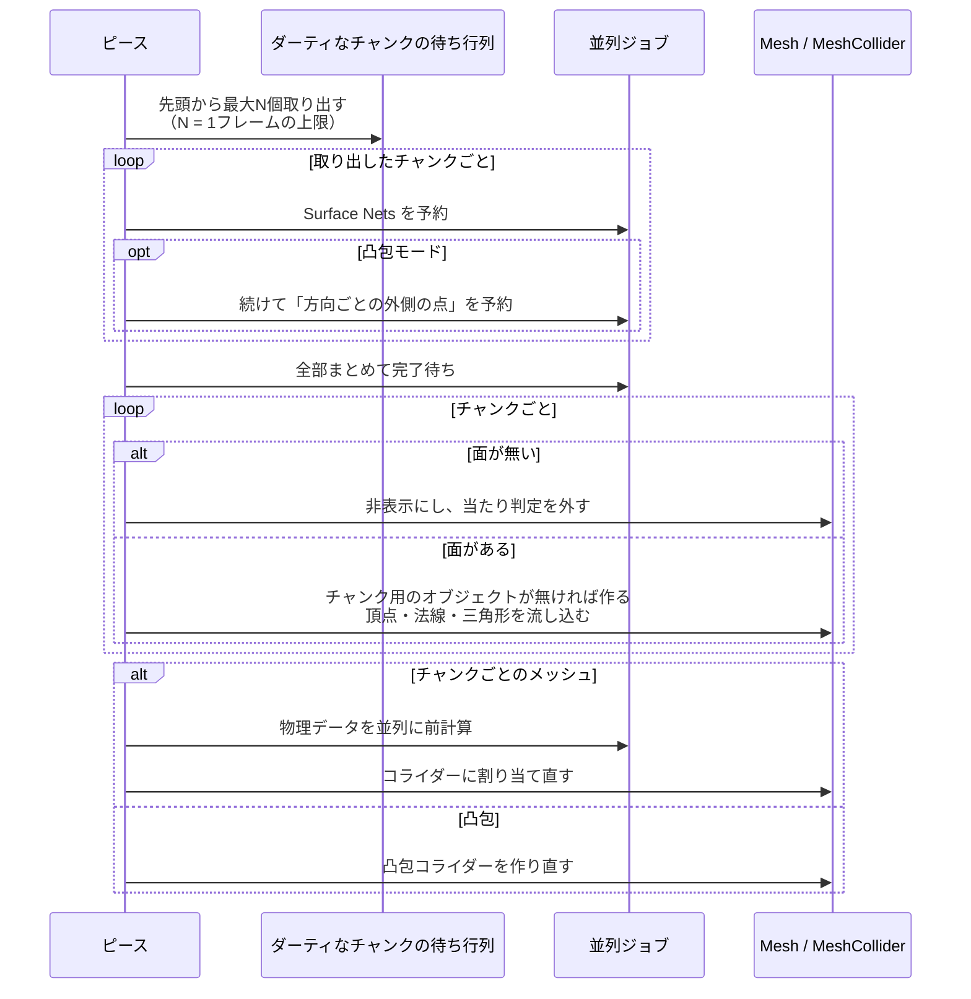

# Meshing：距離の格子から見た目と当たり判定を作る

[← 全体像へ](../VoxelOverview.md)

## 1. 何をしているか

距離の格子そのものは目に見えないので、「距離が 0 になる面」を探して三角形メッシュに変換する。
このとき **Surface Nets** という方式を使っている。

- 物体全体を一度に作るのではなく、**チャンク単位** で作る
- 編集で値が変わったチャンクだけを作り直す（ダーティなチャンクだけ）
- 複数チャンクを並列に処理する

## 2. Surface Nets の流れ（1チャンク分）

### 直感的なイメージ

1. [表面が通過している小さな立方体（セル）の中に、点を1つずつ打つ](../../../Code/Scripts/EngineAdapterLayer/Voxel/Meshing/SurfaceNetsJob.cs)[L51](https://github.com/TaguchiRei/Kizami/blob/main/Assets/Code/Scripts/EngineAdapterLayer/Voxel/Meshing/SurfaceNetsJob.cs#L51)
2. [隣り合う点同士を網（ネット）のように結ぶと、それが表面になる](../../../Code/Scripts/EngineAdapterLayer/Voxel/Meshing/SurfaceNetsJob.cs)[L80](https://github.com/TaguchiRei/Kizami/blob/main/Assets/Code/Scripts/EngineAdapterLayer/Voxel/Meshing/SurfaceNetsJob.cs#L80)

点の位置を「セルの辺と表面が交わる点の平均」にしているので、格子の段差ではなく滑らかな面になる。
面の向き（表裏）は、内側から外側へ向かう側が表になるように揃えている。

> この処理は [`SurfaceNetsJob`](../../../Code/Scripts/EngineAdapterLayer/Voxel/Meshing/SurfaceNetsJob.cs)[L19](https://github.com/TaguchiRei/Kizami/blob/main/Assets/Code/Scripts/EngineAdapterLayer/Voxel/Meshing/SurfaceNetsJob.cs#L19) で行っている。

## 3. チャンク境界の継ぎ目対策

四角形は「隣り合う4セルの頂点」を結ぶため、チャンクの端の四角形は隣のチャンクのセルの頂点も必要になる。
そのため頂点は、面を作るセル範囲より最小側へ 1 セル広く作っている。

また法線計算のため、実際にはチャンクの範囲より **2 サンプル外側** まで距離を読んでいる。
これの裏返しとして、あるサンプルが書き換わったときは、**[その周囲 2 サンプル以内にかかる隣のチャンクも作り直す](../../../Code/Scripts/EngineAdapterLayer/Voxel/Core/VoxelGridLayout.cs)[L159](https://github.com/TaguchiRei/Kizami/blob/main/Assets/Code/Scripts/EngineAdapterLayer/Voxel/Core/VoxelGridLayout.cs#L159)** 必要がある。

この「2」はメッシュ生成が読む範囲と対応しており、**片方だけ変えると、編集後に継ぎ目が開くチャンクが出る**。

> この「2」は [`VoxelGridLayout.MeshingReadMargin`](../../../Code/Scripts/EngineAdapterLayer/Voxel/Core/VoxelGridLayout.cs)[L21](https://github.com/TaguchiRei/Kizami/blob/main/Assets/Code/Scripts/EngineAdapterLayer/Voxel/Core/VoxelGridLayout.cs#L21) 定数、影響チャンクの計算は [`VoxelGridLayout.GetChunksAffectedBySamples`](../../../Code/Scripts/EngineAdapterLayer/Voxel/Core/VoxelGridLayout.cs)[L159](https://github.com/TaguchiRei/Kizami/blob/main/Assets/Code/Scripts/EngineAdapterLayer/Voxel/Core/VoxelGridLayout.cs#L159) メソッドで行っている。

## 4. 当たり判定の3つのモード

| モード | 作り方 | 向いている用途 |
|---|---|---|
| なし | 作らない | 見た目だけのもの |
| チャンクごとのメッシュ | 各チャンクのメッシュをそのままコライダーにする。形に忠実 | 動かない物（地形・壁・置物）。動く Rigidbody には使えない |
| 凸包 | 表面全体を包む凸形状を1つ作る。へこみは埋まる | 動く物（切り離された破片） |

> モードは [`VoxelColliderMode`](../../../Code/Scripts/EngineAdapterLayer/Voxel/Piece/VoxelColliderMode.cs)[L6](https://github.com/TaguchiRei/Kizami/blob/main/Assets/Code/Scripts/EngineAdapterLayer/Voxel/Piece/VoxelColliderMode.cs#L6) 列挙型で指定する。

### チャンクごとのメッシュの場合

コライダー用の物理データ化（クッキング）は重いので、[ワーカースレッドで並列に先に済ませてから割り当てる](../../../Code/Scripts/EngineAdapterLayer/Voxel/Meshing/BakeColliderJob.cs)[L12](https://github.com/TaguchiRei/Kizami/blob/main/Assets/Code/Scripts/EngineAdapterLayer/Voxel/Meshing/BakeColliderJob.cs#L12)。
先に済ませた設定と、割り当て先のコライダーの設定が一致しないと、割り当て時にメインスレッドでやり直しになる点に注意。

> この処理は [`BakeColliderJob`](../../../Code/Scripts/EngineAdapterLayer/Voxel/Meshing/BakeColliderJob.cs)[L12](https://github.com/TaguchiRei/Kizami/blob/main/Assets/Code/Scripts/EngineAdapterLayer/Voxel/Meshing/BakeColliderJob.cs#L12) で行っている。

### 凸包の場合

全頂点から凸包を作ると重いので、次のように点を絞る。

64 方向に絞っているのは、凸包の面数が物理エンジン（PhysX）の上限 255 を超えないようにするため。

> 方向ごとの最も外側の点を選ぶ処理は [`ExtremePointsJob`](../../../Code/Scripts/EngineAdapterLayer/Voxel/Meshing/ExtremePointsJob.cs)[L34](https://github.com/TaguchiRei/Kizami/blob/main/Assets/Code/Scripts/EngineAdapterLayer/Voxel/Meshing/ExtremePointsJob.cs#L34)（方向の定義は [`VoxelHullDirections`](../../../Code/Scripts/EngineAdapterLayer/Voxel/Meshing/ExtremePointsJob.cs)[L11](https://github.com/TaguchiRei/Kizami/blob/main/Assets/Code/Scripts/EngineAdapterLayer/Voxel/Meshing/ExtremePointsJob.cs#L11)）、凸包の組み立ては [`VoxelPiece`](../../../Code/Scripts/EngineAdapterLayer/Voxel/Piece/VoxelPiece.cs)[L25](https://github.com/TaguchiRei/Kizami/blob/main/Assets/Code/Scripts/EngineAdapterLayer/Voxel/Piece/VoxelPiece.cs#L25) 内の凸包再構築処理で行っている。

## 5. 1回の作り直し処理の流れ

- 1フレームに作り直すチャンク数には上限がある（既定 8）。大きく削っても 1 フレームに負荷が集中せず、数フレームかけて反映される
- すぐに全部反映したいときは上限を無視して一括で作り直すこともできる（分離直後などで使用）

> この一連の処理は [`VoxelPiece`](../../../Code/Scripts/EngineAdapterLayer/Voxel/Piece/VoxelPiece.cs)[L25](https://github.com/TaguchiRei/Kizami/blob/main/Assets/Code/Scripts/EngineAdapterLayer/Voxel/Piece/VoxelPiece.cs#L25) の再メッシュ化処理（[`RemeshPending`](../../../Code/Scripts/EngineAdapterLayer/Voxel/Piece/VoxelPiece.cs)[L810](https://github.com/TaguchiRei/Kizami/blob/main/Assets/Code/Scripts/EngineAdapterLayer/Voxel/Piece/VoxelPiece.cs#L810) / [`FlushRemesh`](../../../Code/Scripts/EngineAdapterLayer/Voxel/Piece/VoxelPiece.cs)[L367](https://github.com/TaguchiRei/Kizami/blob/main/Assets/Code/Scripts/EngineAdapterLayer/Voxel/Piece/VoxelPiece.cs#L367) メソッド）で行っている。上限は [`VoxelQualitySettings`](../../../Code/Scripts/EngineAdapterLayer/Voxel/Piece/VoxelQualitySettings.cs)[L10](https://github.com/TaguchiRei/Kizami/blob/main/Assets/Code/Scripts/EngineAdapterLayer/Voxel/Piece/VoxelQualitySettings.cs#L10) で設定する。
