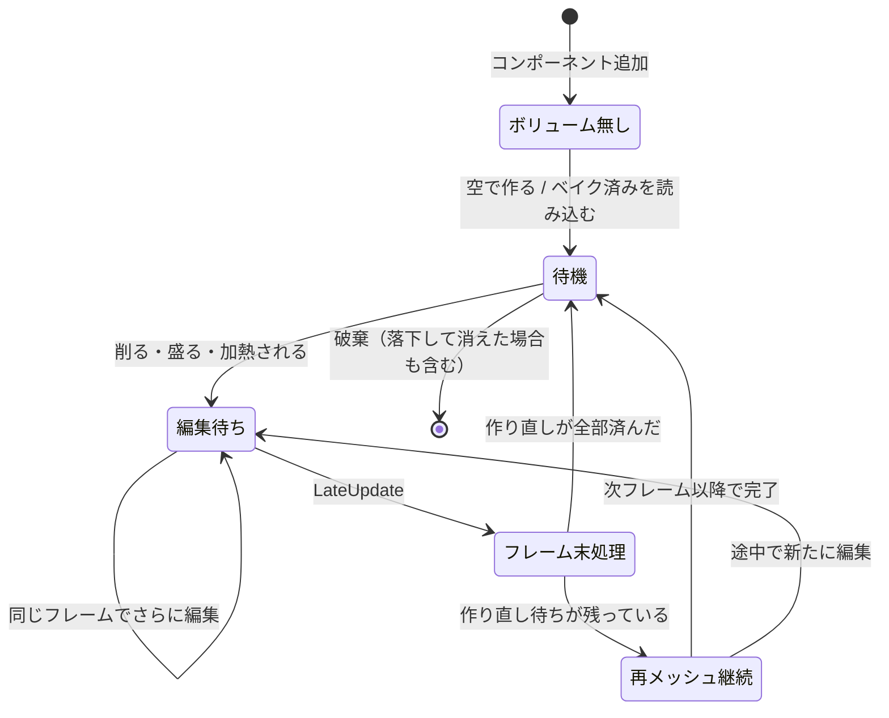
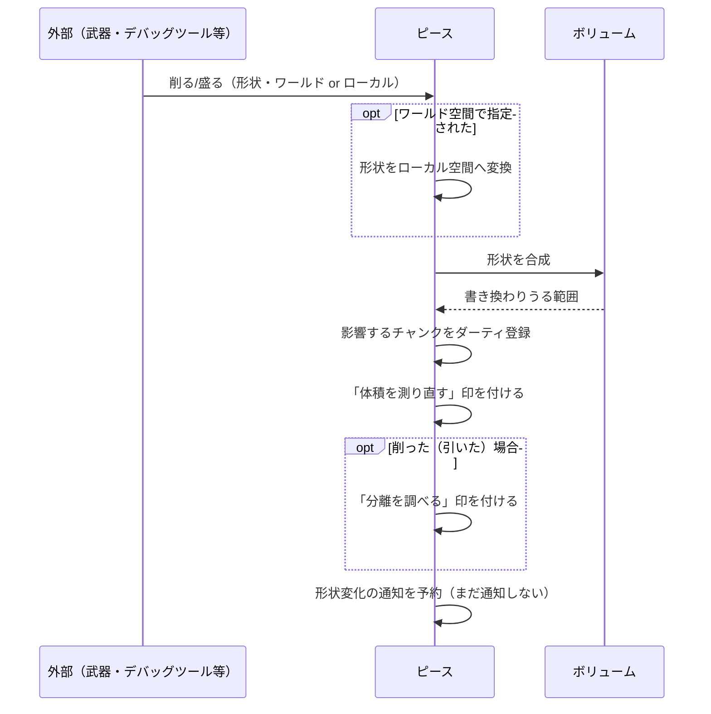
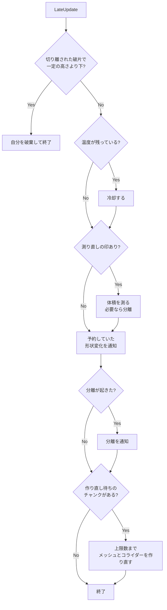
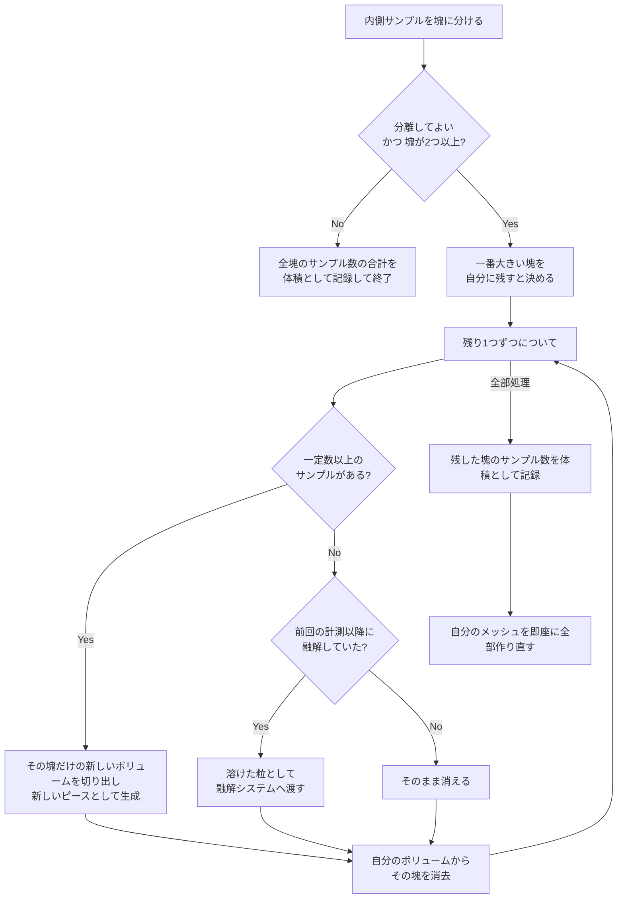
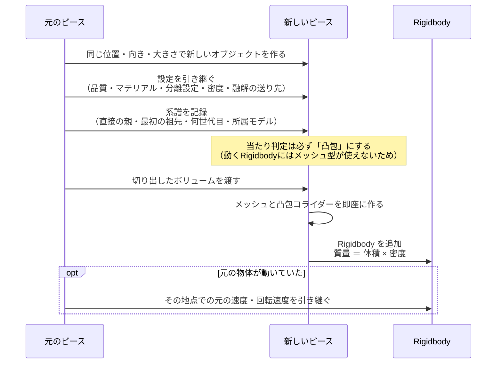

# Piece：1つの物体のライフサイクル

[← 全体像へ](../VoxelOverview.md)

## 1. 役割

「ピース」は、シーン上に置かれた **削れる物体 1 つ分** を表すコンポーネントで、これまでの部品をまとめて動かす司令塔にあたる。

- ボリューム（距離の格子）を1つ持つ
- 外部から「削る/盛る」「加熱する」の指示を受け付ける
- 変わったチャンクを覚えておき、メッシュとコライダーを作り直す
- 削られて塊が分かれたら、小さい方を **新しいピースとして切り離す**
- 形状が変わった・分離した・破棄された、を外部へ通知する

ボクセル空間はこの物体のローカル空間と同じで、物体の拡大率は均一である前提。

> この役割は [`VoxelPiece`](../../../Code/Scripts/EngineAdapterLayer/Voxel/Piece/VoxelPiece.cs)[L25](https://github.com/TaguchiRei/Kizami/blob/main/Assets/Code/Scripts/EngineAdapterLayer/Voxel/Piece/VoxelPiece.cs#L25) クラスが担っている。

## 2. 状態の移り変わり

ポイントは、**編集の指示を受けた時点では距離の書き換えだけを行い、[重い後処理はフレームの最後（LateUpdate）にまとめて1回だけ行う](../../../Code/Scripts/EngineAdapterLayer/Voxel/Piece/VoxelPiece.cs)[L496](https://github.com/TaguchiRei/Kizami/blob/main/Assets/Code/Scripts/EngineAdapterLayer/Voxel/Piece/VoxelPiece.cs#L496)** こと。
1フレームで何回削られても、体積の計測や分離判定は1回で済む。

## 3. 編集を受けたときの流れ

盛る（足す）だけでは物体が分かれることはないので、分離の判定は削ったときにだけ行う。

> この処理は [`VoxelPiece.ApplyEdit`](../../../Code/Scripts/EngineAdapterLayer/Voxel/Piece/VoxelPiece.cs)[L258](https://github.com/TaguchiRei/Kizami/blob/main/Assets/Code/Scripts/EngineAdapterLayer/Voxel/Piece/VoxelPiece.cs#L258) メソッドで行っている。

## 4. フレームの最後にまとめて行うこと

この順番には意味がある。

- 形状変化の通知は **体積を測った後** に出すので、通知を受け取った側は編集後の体積を読める
- 分離の通知は、新しいピースのメッシュとコライダーが **できあがった後** に出る

> この処理は [`VoxelPiece.LateUpdate`](../../../Code/Scripts/EngineAdapterLayer/Voxel/Piece/VoxelPiece.cs)[L496](https://github.com/TaguchiRei/Kizami/blob/main/Assets/Code/Scripts/EngineAdapterLayer/Voxel/Piece/VoxelPiece.cs#L496) で行っている。

## 5. 体積の計測と分離

[内側のサンプルを塊に分け、そのサンプル数から体積を求める](../../../Code/Scripts/EngineAdapterLayer/Voxel/Piece/VoxelPiece.cs)[L565](https://github.com/TaguchiRei/Kizami/blob/main/Assets/Code/Scripts/EngineAdapterLayer/Voxel/Piece/VoxelPiece.cs#L565)（体積 ＝ 内側サンプル数 × ボクセル1つの体積）。

- 小さすぎる塊（既定 8 サンプル未満）は、別の物体にせず消す。細かいゴミが大量に物体化するのを防ぐ
- 「最初の体積」は最初の計測時に一度だけ記録され、以降は「今の体積 / 最初の体積」で残り具合が分かる

> この処理は [`VoxelPiece.Measure`](../../../Code/Scripts/EngineAdapterLayer/Voxel/Piece/VoxelPiece.cs)[L565](https://github.com/TaguchiRei/Kizami/blob/main/Assets/Code/Scripts/EngineAdapterLayer/Voxel/Piece/VoxelPiece.cs#L565) メソッドで行っている。

### 新しいピースの生成

Rigidbody より **先に** [凸包コライダーを作るのは](../../../Code/Scripts/EngineAdapterLayer/Voxel/Piece/VoxelPiece.cs)[L628](https://github.com/TaguchiRei/Kizami/blob/main/Assets/Code/Scripts/EngineAdapterLayer/Voxel/Piece/VoxelPiece.cs#L628)、Rigidbody が追加された時点の形状から重心と慣性を計算させるため（順番を逆にすると重心がずれる）。

切り離されたピースも同じ仕組みで動くので、さらに削れば孫ピースが生まれる。
切り離されたピースは一定の高さ（既定 Y = -20）より下に落ちると自動的に破棄される。

> この処理は [`VoxelPiece.SpawnPiece`](../../../Code/Scripts/EngineAdapterLayer/Voxel/Piece/VoxelPiece.cs)[L628](https://github.com/TaguchiRei/Kizami/blob/main/Assets/Code/Scripts/EngineAdapterLayer/Voxel/Piece/VoxelPiece.cs#L628) メソッドで行っている。

## 6. 外部への通知

| 通知 | いつ | 受け取れる情報 |
|---|---|---|
| 形状が変わった | 編集・融解があったフレームの最後。編集1回につき1回 | どのピースか、足した/引いたか、原因（編集/融解）、変わりうる範囲 |
| 分離した | 塊が切り離されたとき | 0番目が元のピース、1番目以降が新しいピース |
| 破棄された | ピースが破棄されるとき（落下で消えたときも含む） | 破棄されるピース |

モデルから読み込んだピースの場合、これらの通知はモデル読み込み役にも転送され、モデル単位でまとめて受け取れる（[Bake.md](Bake.md) を参照）。

> 通知は [`VoxelPiece.RegisterOnShapeChanged`](../../../Code/Scripts/EngineAdapterLayer/Voxel/Piece/VoxelPiece.cs)[L436](https://github.com/TaguchiRei/Kizami/blob/main/Assets/Code/Scripts/EngineAdapterLayer/Voxel/Piece/VoxelPiece.cs#L436) / [`RegisterOnSplit`](../../../Code/Scripts/EngineAdapterLayer/Voxel/Piece/VoxelPiece.cs)[L447](https://github.com/TaguchiRei/Kizami/blob/main/Assets/Code/Scripts/EngineAdapterLayer/Voxel/Piece/VoxelPiece.cs#L447) / [`RegisterOnDestroyed`](../../../Code/Scripts/EngineAdapterLayer/Voxel/Piece/VoxelPiece.cs)[L456](https://github.com/TaguchiRei/Kizami/blob/main/Assets/Code/Scripts/EngineAdapterLayer/Voxel/Piece/VoxelPiece.cs#L456) メソッドで登録する。通知内容は [`VoxelShapeChange`](../../../Code/Scripts/EngineAdapterLayer/Voxel/Piece/VoxelShapeChange.cs)[L20](https://github.com/TaguchiRei/Kizami/blob/main/Assets/Code/Scripts/EngineAdapterLayer/Voxel/Piece/VoxelShapeChange.cs#L20) 構造体に入っている。

## 7. 品質設定

| 項目 | 既定値 | 影響 |
|---|---|---|
| ボクセルの大きさ（ワールド, m） | 0.03 | 小さいほど細かく削れるが、メモリと処理が増える |
| チャンクの大きさ（セル数） | 32 | 作り直しの単位。小さいと1回の作り直しは軽いが、オブジェクト数が増える |
| 1フレームの作り直し上限（チャンク数） | 8 | 大きいと反映が速いが、1フレームの負荷が増える |

PC 用とモバイル用の設定アセットが用意されている（`Assets/Data/Voxel/VoxelQuality_PC.asset` / `VoxelQuality_Mobile.asset`）。

> これらは [`VoxelQualitySettings`](../../../Code/Scripts/EngineAdapterLayer/Voxel/Piece/VoxelQualitySettings.cs)[L10](https://github.com/TaguchiRei/Kizami/blob/main/Assets/Code/Scripts/EngineAdapterLayer/Voxel/Piece/VoxelQualitySettings.cs#L10) で設定する。
