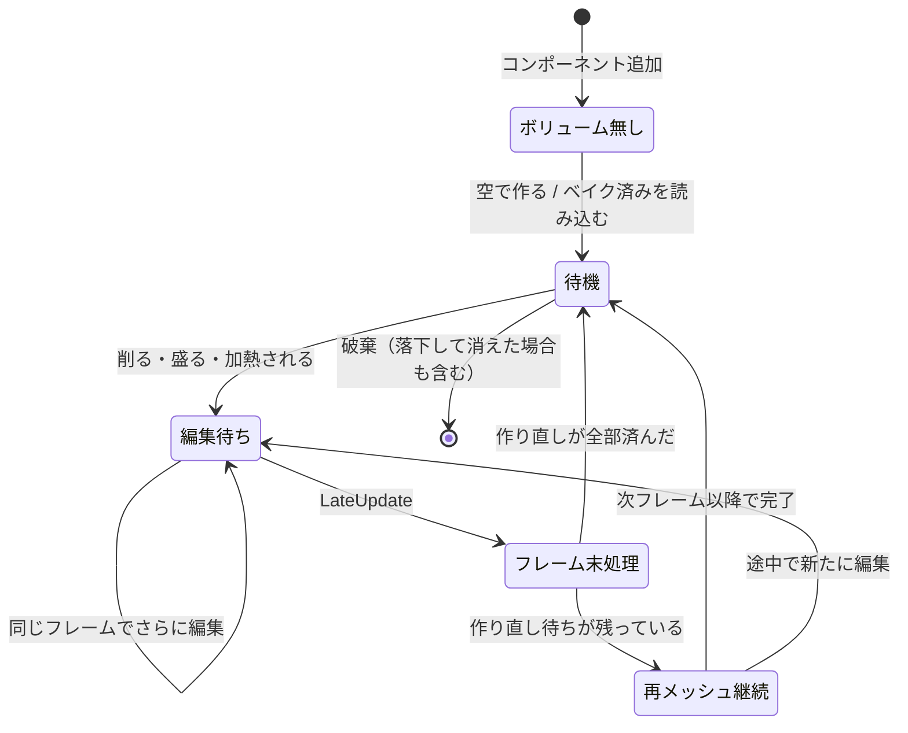
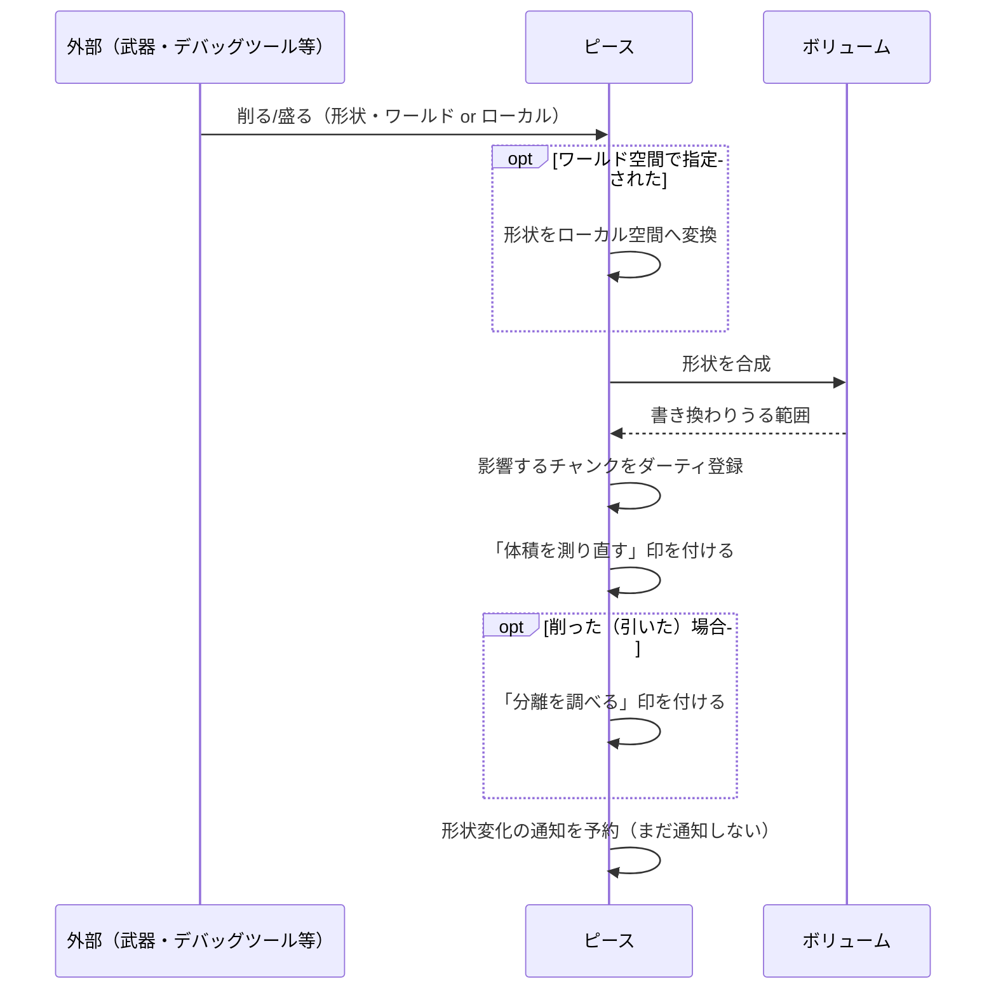
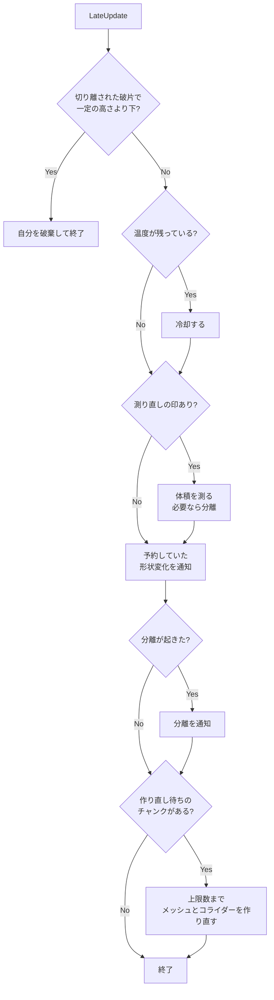
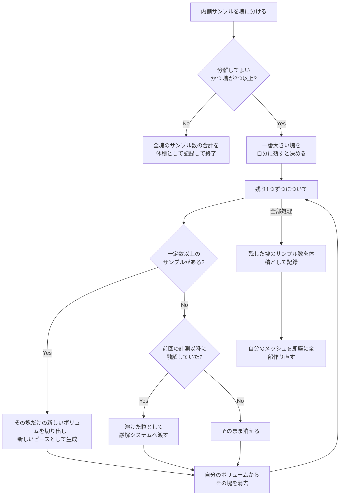
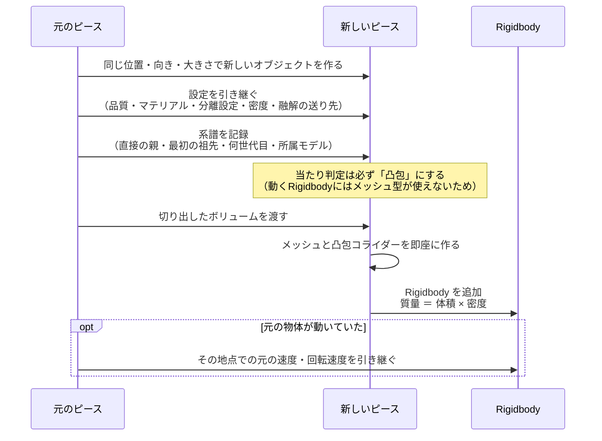
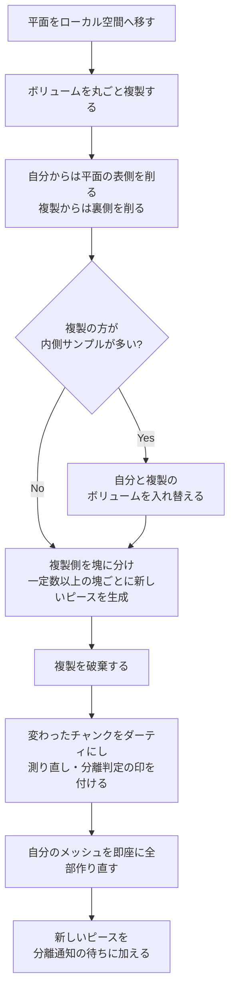

# Piece：1つの物体のライフサイクル

[← 全体像へ](../VoxelOverview.md)

## 1. 役割

「ピース」は、シーン上に置かれた **削れる物体 1 つ分** を表すコンポーネントで、これまでの部品をまとめて動かす司令塔にあたる。

- ボリューム（距離の格子）を1つ持つ
- 外部から「削る/盛る」「加熱する」「平面で切り分ける」の指示を受け付ける
- 変わったチャンクを覚えておき、メッシュとコライダーを作り直す
- 削られて塊が分かれたら、小さい方を **新しいピースとして切り離す**
- 形状が変わった・分離した・破棄された、を外部へ通知する

ボクセル空間はこの物体のローカル空間と同じで、物体の拡大率は均一である前提。

> この役割は [`VoxelPiece`](../../../Code/Scripts/EngineAdapterLayer/Voxel/Piece/VoxelPiece.cs)[L26](https://github.com/TaguchiRei/Kizami/blob/main/Assets/Code/Scripts/EngineAdapterLayer/Voxel/Piece/VoxelPiece.cs#L26) クラスが担っている。

## 2. 状態の移り変わり

```mermaid
stateDiagram-v2
    [*] --> ボリューム無し: コンポーネント追加
    ボリューム無し --> 待機: 空で作る / ベイク済みを読み込む
    待機 --> 編集待ち: 削る・盛る・加熱される
    編集待ち --> 編集待ち: 同じフレームでさらに編集
    編集待ち --> フレーム末処理: LateUpdate
    フレーム末処理 --> 待機: 作り直しが全部済んだ
    フレーム末処理 --> 再メッシュ継続: 作り直し待ちが残っている
    再メッシュ継続 --> 待機: 次フレーム以降で完了
    再メッシュ継続 --> 編集待ち: 途中で新たに編集
    待機 --> [*]: 破棄（落下して消えた場合も含む）
```

ポイントは、**編集の指示を受けた時点では距離の書き換えだけを行い、[重い後処理はフレームの最後（LateUpdate）にまとめて1回だけ行う](../../../Code/Scripts/EngineAdapterLayer/Voxel/Piece/VoxelPiece.cs)[L561](https://github.com/TaguchiRei/Kizami/blob/main/Assets/Code/Scripts/EngineAdapterLayer/Voxel/Piece/VoxelPiece.cs#L561)** こと。
1フレームで何回削られても、体積の計測や分離判定は1回で済む。

## 3. 編集を受けたときの流れ

```mermaid
sequenceDiagram
    participant 外部 as 外部（武器・デバッグツール等）
    participant ピース
    participant ボリューム

    外部->>ピース: 削る/盛る（形状・ワールド or ローカル）
    opt ワールド空間で指定された
        ピース->>ピース: 形状をローカル空間へ変換
    end
    ピース->>ボリューム: 形状を合成
    ボリューム-->>ピース: 書き換わりうる範囲
    ピース->>ピース: 影響するチャンクをダーティ登録
    ピース->>ピース: 「体積を測り直す」印を付ける
    opt 削った（引いた）場合
        ピース->>ピース: 「分離を調べる」印を付ける
    end
    ピース->>ピース: 形状変化の通知を予約（まだ通知しない）
```

盛る（足す）だけでは物体が分かれることはないので、分離の判定は削ったときにだけ行う。

> この処理は [`VoxelPiece.ApplyEdit`](../../../Code/Scripts/EngineAdapterLayer/Voxel/Piece/VoxelPiece.cs)[L260](https://github.com/TaguchiRei/Kizami/blob/main/Assets/Code/Scripts/EngineAdapterLayer/Voxel/Piece/VoxelPiece.cs#L260) メソッドで行っている。

## 4. フレームの最後にまとめて行うこと

```mermaid
flowchart TD
    Start[LateUpdate] --> A{切り離された破片で<br/>一定の高さより下?}
    A -->|Yes| Destroy[自分を破棄して終了]
    A -->|No| B{温度が残っている?}
    B -->|Yes| Cool[冷却する]
    B -->|No| C
    Cool --> C{測り直しの印あり?}
    C -->|Yes| Measure[体積を測る<br/>必要なら分離]
    C -->|No| D
    Measure --> D[予約していた<br/>形状変化を通知]
    D --> E{分離が起きた?}
    E -->|Yes| Notify[分離を通知]
    E -->|No| F
    Notify --> F{作り直し待ちの<br/>チャンクがある?}
    F -->|Yes| Remesh[上限数まで<br/>メッシュとコライダーを作り直す]
    F -->|No| End[終了]
    Remesh --> End
```

この順番には意味がある。

- 形状変化の通知は **体積を測った後** に出すので、通知を受け取った側は編集後の体積を読める
- 分離の通知は、新しいピースのメッシュとコライダーが **できあがった後** に出る
- 平面での切り分け（6 節）で切り離したピースも、同じ分離の通知にまとめて出る

> この処理は [`VoxelPiece.LateUpdate`](../../../Code/Scripts/EngineAdapterLayer/Voxel/Piece/VoxelPiece.cs)[L561](https://github.com/TaguchiRei/Kizami/blob/main/Assets/Code/Scripts/EngineAdapterLayer/Voxel/Piece/VoxelPiece.cs#L561) で行っている。

## 5. 体積の計測と分離

[内側のサンプルを塊に分け、そのサンプル数から体積を求める](../../../Code/Scripts/EngineAdapterLayer/Voxel/Piece/VoxelPiece.cs)[L632](https://github.com/TaguchiRei/Kizami/blob/main/Assets/Code/Scripts/EngineAdapterLayer/Voxel/Piece/VoxelPiece.cs#L632)（体積 ＝ 内側サンプル数 × ボクセル1つの体積）。

```mermaid
flowchart TD
    A[内側サンプルを塊に分ける] --> B{分離してよい<br/>かつ 塊が2つ以上?}
    B -->|No| C[全塊のサンプル数の合計を<br/>体積として記録して終了]
    B -->|Yes| D[一番大きい塊を<br/>自分に残すと決める]
    D --> E[残り1つずつについて]
    E --> F{一定数以上の<br/>サンプルがある?}
    F -->|Yes| G[その塊だけの新しいボリュームを切り出し<br/>新しいピースとして生成]
    F -->|No| H{前回の計測以降に<br/>融解していた?}
    H -->|Yes| I[溶けた粒として<br/>融解システムへ渡す]
    H -->|No| J[そのまま消える]
    G --> K[自分のボリュームから<br/>その塊を消去]
    I --> K
    J --> K
    K --> E
    E -->|全部処理| L[残した塊のサンプル数を体積として記録]
    L --> M[自分のメッシュを即座に全部作り直す]
```

- 小さすぎる塊（既定 8 サンプル未満）は、別の物体にせず消す。細かいゴミが大量に物体化するのを防ぐ
- 「最初の体積」は最初の計測時に一度だけ記録され、以降は「今の体積 / 最初の体積」で残り具合が分かる

> この処理は [`VoxelPiece.Measure`](../../../Code/Scripts/EngineAdapterLayer/Voxel/Piece/VoxelPiece.cs)[L632](https://github.com/TaguchiRei/Kizami/blob/main/Assets/Code/Scripts/EngineAdapterLayer/Voxel/Piece/VoxelPiece.cs#L632) メソッドで行っている。

### 新しいピースの生成

```mermaid
sequenceDiagram
    participant 元 as 元のピース
    participant 新 as 新しいピース
    participant 物理 as Rigidbody

    元->>新: 同じ位置・向き・大きさで新しいオブジェクトを作る
    元->>新: 設定を引き継ぐ<br/>（品質・マテリアル・分離設定・密度・融解の送り先）
    元->>新: 系譜を記録<br/>（直接の親・最初の祖先・何世代目・所属モデル）
    Note over 新: 当たり判定は必ず「凸包」にする<br/>（動くRigidbodyにはメッシュ型が使えないため）
    元->>新: 切り出したボリュームを渡す
    新->>新: メッシュと凸包コライダーを即座に作る
    新->>物理: Rigidbody を追加<br/>質量 ＝ 体積 × 密度
    opt 元の物体が動いていた
        元->>物理: その地点での元の速度・回転速度を引き継ぐ
    end
```

Rigidbody より **先に** [凸包コライダーを作るのは](../../../Code/Scripts/EngineAdapterLayer/Voxel/Piece/VoxelPiece.cs)[L752](https://github.com/TaguchiRei/Kizami/blob/main/Assets/Code/Scripts/EngineAdapterLayer/Voxel/Piece/VoxelPiece.cs#L752)、Rigidbody が追加された時点の形状から重心と慣性を計算させるため（順番を逆にすると重心がずれる）。

切り離されたピースも同じ仕組みで動くので、さらに削れば孫ピースが生まれる。
切り離されたピースは一定の高さ（既定 Y = -20）より下に落ちると自動的に破棄される。

> この処理は [`VoxelPiece.SpawnPiece`](../../../Code/Scripts/EngineAdapterLayer/Voxel/Piece/VoxelPiece.cs)[L752](https://github.com/TaguchiRei/Kizami/blob/main/Assets/Code/Scripts/EngineAdapterLayer/Voxel/Piece/VoxelPiece.cs#L752) メソッドで行っている。

## 6. 平面での切り分け（スライス）

平面を 1 枚指定して、ピースを 2 つに切り分ける。削る編集とは違い、**切り口の分だけ体積が減ることは無い**。
平面は無限に広いものとして扱い、ピースの端から端まで切れる。

```mermaid
flowchart TD
    A[平面をローカル空間へ移す] --> B[ボリュームを丸ごと複製する]
    B --> C[自分からは平面の表側を削る<br/>複製からは裏側を削る]
    C --> D{複製の方が<br/>内側サンプルが多い?}
    D -->|Yes| E[自分と複製の<br/>ボリュームを入れ替える]
    D -->|No| F
    E --> F[複製側を塊に分け<br/>一定数以上の塊ごとに新しいピースを生成]
    F --> G[複製を破棄する]
    G --> H[変わったチャンクをダーティにし<br/>測り直し・分離判定の印を付ける]
    H --> I[自分のメッシュを即座に全部作り直す]
    I --> J[新しいピースを<br/>分離通知の待ちに加える]
```

- 片側を削る処理は、ふつうの「引く」編集と同じもの。平面の片側は、[片面を平面に重ねた大きな箱](../../../Code/Scripts/EngineAdapterLayer/Voxel/Shapes/BoxShape.cs)[L38](https://github.com/TaguchiRei/Kizami/blob/main/Assets/Code/Scripts/EngineAdapterLayer/Voxel/Shapes/BoxShape.cs#L38)で表している（[Core.md](Core.md) の「形状について」を参照）
- 内側サンプルが多い側が自分に残る（削ったときの分離と同じ規則）。固定の壁を切ると、小さい側が Rigidbody 付きで落ちる
- 自分と複製を入れ替えられるのは、**複製が元と同じ格子を持つ** から。チャンクのオブジェクトをそのまま使い回している為、複製の範囲を元と違うものにすると入れ替えた後のメッシュが壊れる
- 自分の側がさらにいくつかの塊に分かれた場合（例：U 字形を横に切った）は、次の LateUpdate の分離判定で切り離される。複製の側は、切り分けたその場で塊ごとに分けている
- 形状変化（原因は「切り分け」）と分離の通知は、ほかの編集と同じく LateUpdate で出る
- 分離しない設定のピースでは何もしない

ここは近似で、**切り口の面そのものは平面上に正確に乗る** が、切り口と元の表面が交わる縁は、表面メッシュの作り方（[Meshing.md](Meshing.md)）の都合でボクセル 1 つ分ほど丸くなる。

ボリューム全体を複製して全体を削り、両方のメッシュをすぐに作り直すので、大きいピースほど重い（胴体のパーツ 1 つで約 40ms）。

> この処理は [`VoxelPiece.Slice`](../../../Code/Scripts/EngineAdapterLayer/Voxel/Piece/VoxelPiece.cs)[L303](https://github.com/TaguchiRei/Kizami/blob/main/Assets/Code/Scripts/EngineAdapterLayer/Voxel/Piece/VoxelPiece.cs#L303) メソッドで行っている。複製側を塊ごとにピースにするのは [`SpawnComponents`](../../../Code/Scripts/EngineAdapterLayer/Voxel/Piece/VoxelPiece.cs)[L695](https://github.com/TaguchiRei/Kizami/blob/main/Assets/Code/Scripts/EngineAdapterLayer/Voxel/Piece/VoxelPiece.cs#L695)、分離通知への合流は [`MergeSlicePieces`](../../../Code/Scripts/EngineAdapterLayer/Voxel/Piece/VoxelPiece.cs)[L728](https://github.com/TaguchiRei/Kizami/blob/main/Assets/Code/Scripts/EngineAdapterLayer/Voxel/Piece/VoxelPiece.cs#L728) メソッド。

## 7. 外部への通知

| 通知 | いつ | 受け取れる情報 |
|---|---|---|
| 形状が変わった | 編集・融解・切り分けがあったフレームの最後。編集1回につき1回 | どのピースか、足した/引いたか、原因（編集/融解/切り分け）、変わりうる範囲 |
| 分離した | 塊が切り離されたとき、平面で切り分けたとき | 0番目が元のピース、1番目以降が新しいピース |
| 破棄された | ピースが破棄されるとき（落下で消えたときも含む） | 破棄されるピース |

モデルから読み込んだピースの場合、これらの通知はモデル読み込み役にも転送され、モデル単位でまとめて受け取れる（[Bake.md](Bake.md) を参照）。

> 通知は [`VoxelPiece.RegisterOnShapeChanged`](../../../Code/Scripts/EngineAdapterLayer/Voxel/Piece/VoxelPiece.cs)[L501](https://github.com/TaguchiRei/Kizami/blob/main/Assets/Code/Scripts/EngineAdapterLayer/Voxel/Piece/VoxelPiece.cs#L501) / [`RegisterOnSplit`](../../../Code/Scripts/EngineAdapterLayer/Voxel/Piece/VoxelPiece.cs)[L512](https://github.com/TaguchiRei/Kizami/blob/main/Assets/Code/Scripts/EngineAdapterLayer/Voxel/Piece/VoxelPiece.cs#L512) / [`RegisterOnDestroyed`](../../../Code/Scripts/EngineAdapterLayer/Voxel/Piece/VoxelPiece.cs)[L521](https://github.com/TaguchiRei/Kizami/blob/main/Assets/Code/Scripts/EngineAdapterLayer/Voxel/Piece/VoxelPiece.cs#L521) メソッドで登録する。通知内容は [`VoxelShapeChange`](../../../Code/Scripts/EngineAdapterLayer/Voxel/Piece/VoxelShapeChange.cs)[L23](https://github.com/TaguchiRei/Kizami/blob/main/Assets/Code/Scripts/EngineAdapterLayer/Voxel/Piece/VoxelShapeChange.cs#L23) 構造体に入っている。

## 8. 品質設定

| 項目 | 既定値 | 影響 |
|---|---|---|
| ボクセルの大きさ（ワールド, m） | 0.03 | 小さいほど細かく削れるが、メモリと処理が増える |
| チャンクの大きさ（セル数） | 32 | 作り直しの単位。小さいと1回の作り直しは軽いが、オブジェクト数が増える |
| 1フレームの作り直し上限（チャンク数） | 8 | 大きいと反映が速いが、1フレームの負荷が増える |

PC 用とモバイル用の設定アセットが用意されている（`Assets/Data/Voxel/VoxelQuality_PC.asset` / `VoxelQuality_Mobile.asset`）。

> これらは [`VoxelQualitySettings`](../../../Code/Scripts/EngineAdapterLayer/Voxel/Piece/VoxelQualitySettings.cs)[L10](https://github.com/TaguchiRei/Kizami/blob/main/Assets/Code/Scripts/EngineAdapterLayer/Voxel/Piece/VoxelQualitySettings.cs#L10) で設定する。

## よくある疑問

**Q. 削る道具の「刃」で切るのと、平面での切り分けは何が違う？**
A. 刃は薄い箱で削る編集なので、刃の厚み（ボクセル 3 つ分）が消え、溝の両側がつながりを失って初めて分離する。平面での切り分けは複製を使って両側を別々に残すので、厚みはゼロで、切った後の体積の合計は切る前と一致する。

**Q. 刃が途中までしか入らない切り方（切れ込み）はできる？**
A. できない。距離の格子は、隣り合うサンプルの間に「外側」のサンプルが挟まらないと面を作れないので、厚みゼロの切れ込みは 1 つのボリュームでは表せない。平面での切り分けは、ピースの端から端まで切る。
