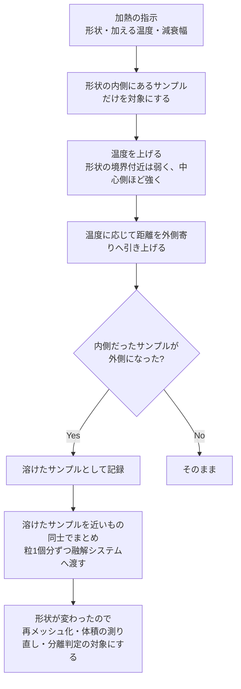
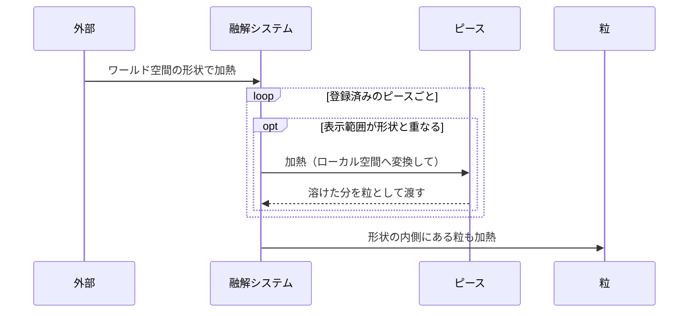

# Thermal：加熱・冷却・融解

[← 全体像へ](../VoxelOverview.md)

## 1. 何をしているか

固体（ピース）の一部を加熱し、融点に達した部分を固体から取り除いて「溶けた粒」として融解システムへ渡す。

温度は **常温を 0、融点を 1** とした値で扱う（単位は無い）。蒸発点は設定で決め、既定は 2。

| 温度 | 状態 |
|---|---|
| 0 | 常温。これより下がらない |
| 0〜1 | 温まっているが固体のまま |
| 1 以上 | 溶ける（固体から取り除かれる） |
| 蒸発点（既定 2）以上 | 溶けた瞬間に、粒にならず蒸発する |

## 2. データの持ち方

温度は、距離と同じ格子の上にサンプルごとに持つ。
一度も加熱されていないピースは温度の配列そのものを持たず、最初に加熱されたときに確保する。

> 温度の配列は [`VoxelVolume`](../../../Code/Scripts/EngineAdapterLayer/Voxel/Core/VoxelVolume.cs)[L17](https://github.com/TaguchiRei/Kizami/blob/main/Assets/Code/Scripts/EngineAdapterLayer/Voxel/Core/VoxelVolume.cs#L17) が持っている。

## 3. 加熱の流れ

### 温度で距離を引き上げる

融解は「温度が 1 を超えたら、いきなり外側にする」のではなく、[温度に応じて距離を少しずつ外側寄りに引き上げる形で進む](../../../Code/Scripts/EngineAdapterLayer/Voxel/Thermal/VoxelHeatJob.cs)[L41](https://github.com/TaguchiRei/Kizami/blob/main/Assets/Code/Scripts/EngineAdapterLayer/Voxel/Thermal/VoxelHeatJob.cs#L41)。

- 温度 0：引き上げ先は「最も内側」なので、何も変わらない
- 温度が 1 に近づく：表面近くのサンプルから順に外側寄りになり、表面が少しずつ後退する
- 温度 1 以上：外側になる（溶けた）

これにより、溶けていく境目が格子の段差にならず、滑らかに後退していく。

> 加熱の本体は [`VoxelHeatJob`](../../../Code/Scripts/EngineAdapterLayer/Voxel/Thermal/VoxelHeatJob.cs)[L18](https://github.com/TaguchiRei/Kizami/blob/main/Assets/Code/Scripts/EngineAdapterLayer/Voxel/Thermal/VoxelHeatJob.cs#L18)、呼び出しは [`VoxelVolume.ApplyHeat`](../../../Code/Scripts/EngineAdapterLayer/Voxel/Core/VoxelVolume.cs)[L100](https://github.com/TaguchiRei/Kizami/blob/main/Assets/Code/Scripts/EngineAdapterLayer/Voxel/Core/VoxelVolume.cs#L100) → [`VoxelPiece.ApplyHeat`](../../../Code/Scripts/EngineAdapterLayer/Voxel/Piece/VoxelPiece.cs)[L301](https://github.com/TaguchiRei/Kizami/blob/main/Assets/Code/Scripts/EngineAdapterLayer/Voxel/Piece/VoxelPiece.cs#L301) で行っている。

### 粒へのまとめ方

溶けたサンプルを 1 つずつ粒にすると数が多すぎるので、格子を数サンプル四方の区画に区切り、[区画ごとに 1 粒にまとめる](../../../Code/Scripts/EngineAdapterLayer/Voxel/Thermal/VoxelMeltGroupJob.cs)[L27](https://github.com/TaguchiRei/Kizami/blob/main/Assets/Code/Scripts/EngineAdapterLayer/Voxel/Thermal/VoxelMeltGroupJob.cs#L27)。
粒の位置と温度は区画内の平均、体積はサンプル数 × ボクセル 1 つの体積。区画の大きさは設定で変えられる（既定は 1 で、まとめない）。

> この処理は [`VoxelMeltGroupJob`](../../../Code/Scripts/EngineAdapterLayer/Voxel/Thermal/VoxelMeltGroupJob.cs)[L27](https://github.com/TaguchiRei/Kizami/blob/main/Assets/Code/Scripts/EngineAdapterLayer/Voxel/Thermal/VoxelMeltGroupJob.cs#L27)（[`VoxelVolume.GroupSamples`](../../../Code/Scripts/EngineAdapterLayer/Voxel/Core/VoxelVolume.cs)[L339](https://github.com/TaguchiRei/Kizami/blob/main/Assets/Code/Scripts/EngineAdapterLayer/Voxel/Core/VoxelVolume.cs#L339) 経由）で行っている。

### 融解で塊が分かれた場合

溶けて固体が分かれた場合も、削ったときと同じく切り離し判定をする（[Piece.md](Piece.md) 参照）。
違いは、**切り離すには小さすぎる塊を、[消さずに溶けた粒として渡す](../../../Code/Scripts/EngineAdapterLayer/Voxel/Piece/VoxelPiece.cs)[L711](https://github.com/TaguchiRei/Kizami/blob/main/Assets/Code/Scripts/EngineAdapterLayer/Voxel/Piece/VoxelPiece.cs#L711)** こと。溶け残りの小片が突然消えて見えないようにするため。

## 4. 冷却

固体の温度は、毎フレーム一定量ずつ下がる（既定は 1 秒に 0.1）。

全サンプルを毎フレーム見ると重いので、「温度が 0 より高いサンプルを含むかもしれないチャンク」だけを覚えておき、[そこだけを冷やす](../../../Code/Scripts/EngineAdapterLayer/Voxel/Core/VoxelVolume.cs)[L144](https://github.com/TaguchiRei/Kizami/blob/main/Assets/Code/Scripts/EngineAdapterLayer/Voxel/Core/VoxelVolume.cs#L144)。
冷えきって全サンプルが 0 になったチャンクは対象から外す。

冷えても形は戻らない。溶けて取り除かれた部分はそのまま。

> 冷却は [`VoxelCoolJob`](../../../Code/Scripts/EngineAdapterLayer/Voxel/Thermal/VoxelCoolJob.cs)[L12](https://github.com/TaguchiRei/Kizami/blob/main/Assets/Code/Scripts/EngineAdapterLayer/Voxel/Thermal/VoxelCoolJob.cs#L12)（[`VoxelVolume.Cool`](../../../Code/Scripts/EngineAdapterLayer/Voxel/Core/VoxelVolume.cs)[L144](https://github.com/TaguchiRei/Kizami/blob/main/Assets/Code/Scripts/EngineAdapterLayer/Voxel/Core/VoxelVolume.cs#L144) 経由）で行い、ピースのフレーム末処理の最初に実行される。

## 5. 加熱の入口

ピースを直接加熱することもできるが、その場合もピースに融解システムが設定されていないと何も起きない（一度だけ警告が出る）。

> シーン全体の加熱は [`VoxelMeltSystem.ApplyHeat`](../../../Code/Scripts/EngineAdapterLayer/Voxel/Melt/VoxelMeltSystem.cs)[L125](https://github.com/TaguchiRei/Kizami/blob/main/Assets/Code/Scripts/EngineAdapterLayer/Voxel/Melt/VoxelMeltSystem.cs#L125)、個別の加熱は [`VoxelPiece.ApplyHeat`](../../../Code/Scripts/EngineAdapterLayer/Voxel/Piece/VoxelPiece.cs)[L301](https://github.com/TaguchiRei/Kizami/blob/main/Assets/Code/Scripts/EngineAdapterLayer/Voxel/Piece/VoxelPiece.cs#L301) で行う。

## 6. 設定

| 項目 | 既定値 | 影響 |
|---|---|---|
| 蒸発点 | 2 | これ以上で蒸発する |
| 凝固点（粒） | 0.8 | 粒がこれより冷えると止まる。融点（1）より低くしないと、溶けた直後に固まる |
| 固体の冷却速度 | 0.1 / 秒 | |
| 粒の冷却速度 | 0.1 / 秒 | |
| 粒のまとめ具合 | 1 | 大きいほど粒が少なく大きくなる |

粒の動きの設定も同じアセットにある（[Melt.md](Melt.md) 参照）。

> これらは [`VoxelThermalSettings`](../../../Code/Scripts/EngineAdapterLayer/Voxel/Thermal/VoxelThermalSettings.cs)[L11](https://github.com/TaguchiRei/Kizami/blob/main/Assets/Code/Scripts/EngineAdapterLayer/Voxel/Thermal/VoxelThermalSettings.cs#L11) で設定する。
