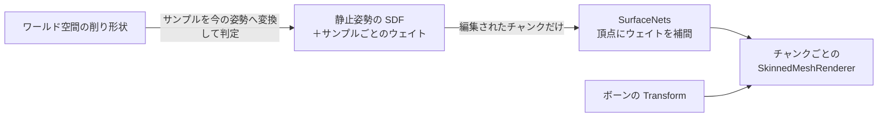

# ボクセルのスキニング対応 実装計画（案A）

## 目的

SDF で管理しているボクセルモデルを、ボーンアニメーションで動かせるようにする。
削る・割れる・溶けるといった既存の機能は維持する。

## 方針

SDF は **静止姿勢（バインドポーズ）のまま** 保持・編集する。
メッシュ化した後の頂点にボーンウェイトを持たせ、変形は Unity 標準の `SkinnedMeshRenderer`（GPU スキニング）に任せる。



- 再メッシュ化が必要になるのは、今と同じく SDF を編集したときだけ（アニメーションでは再メッシュ化しない）
- 再メッシュ化すると頂点が変わるので、ウェイトは **頂点ではなくサンプル（格子点）側に持つ**

## 現状との対応

| 既存 | 変更の要否 |
|---|---|
| `VoxelModelBaker`（MeshFilter → SDF） | SkinnedMeshRenderer の `sharedMesh`（静止姿勢）もベイク対象にし、ウェイトも一緒にベイクする |
| `VoxelSdfData` | サンプルごとのウェイト配列を追加する（任意項目） |
| `VoxelVolume` | ウェイト配列を持つ。`Resample` / `ExtractComponent` でウェイトも写す |
| `SurfaceNetsJob` | 頂点ごとに、周りの 8 サンプルのウェイトを補間して出力する |
| `VoxelPiece.ChunkSlot` | `MeshRenderer` の代わりに `SkinnedMeshRenderer` を使えるようにする |
| `VoxelPiece.ApplyEdit(…, Space.World)` | スキニングしたピースでは、サンプルを今の姿勢へ変換してから形状と判定する `VoxelSkinnedCsgJob` を使う |
| コライダー（ChunkMesh / ConvexHull） | ボーンごとのコライダーを追加する（後述） |
| 分離 | 切り離した塊は、スキニングしない通常の `VoxelPiece` にする |
| 融解（`VoxelMeltSystem`） | 粒の出現位置と、粒と SDF の当たり判定で座標変換が必要 |

## データ設計

### サンプルごとのウェイト

- 1 サンプルあたり、ボーンの番号 4 つ（byte × 4）とウェイト 4 つ（byte × 4、合計 255 に正規化）の計 8 byte
- `NativeArray<SkinWeight4>` として `VoxelVolume` に持たせる。スキニングしないボリュームでは確保しない（温度の配列と同じ扱い）
- ウェイトに意味があるのは表面の近くだけ。ただし削ると内部が表面に出てくるので、**内部のサンプルにもウェイトを入れておく**必要がある

### ボーンの一覧

- `VoxelModelAsset` に、ボーンのパス（ルートからの相対パス）の配列と `bindposes` を保存する
- ボーンごとの静止姿勢の AABB（ウェイトを持つサンプルの範囲）も保存する
- 実行時は、`VoxelModelLoader` がパスから Transform を解決し、全チャンクで `bones` 配列と `bindposes` を共有する

## ウェイトの作り方（ベイク時）

**第1候補：元の SkinnedMeshRenderer のウェイトを転写する**

1. 表面付近のサンプルには、元のメッシュ上で最も近い点（三角形の上の点）のウェイトを重心座標で補間して入れる
2. 内部のサンプルには、表面から内側へ幅優先探索で塗り広げる（隣接するサンプルのウェイトの平均）
   - 格子の内側だけを伝って広げるので、腕と脇腹のように空間的に近い部位でもウェイトが混ざりにくい

アーティストが付けたウェイトをそのまま活かせるので、見た目が元のモデルとほぼ一致する。
ウェイトの付いていないモデル（MeshFilter のみ）は、Blender などで先にスキニングしておく運用とする。
ボーンからウェイトを自動生成する機能は、今回は作らない。

## メッシュ化

- `SurfaceNetsJob` に `[ReadOnly] NativeArray<SkinWeight4> Weights` と、出力先の `NativeList<BoneWeight>`（または `BoneWeight1` と、頂点ごとの本数）を追加する
- 頂点のウェイトは、セルの 8 サンプルのウェイトを、頂点のセル内の位置によるトリリニアの重みで合算し、上位 4 本を残して正規化する
- `ChunkSlot.SetMesh` では `Mesh.SetBoneWeights` と `Mesh.bindposes` を設定する
- チャンクの GameObject は `SkinnedMeshRenderer` にし、`rootBone` と `bones` を割り当てる
  - `localBounds` は全チャンク共通の大きめの範囲を設定し、アニメーション中にカリングで消えないようにする

## 削るときの処理

削る形状は **ワールド空間のまま** 扱い、サンプルのほうを今の姿勢の位置へスキニングしてから判定する。
表示中の頂点と同じウェイトで変換するので、見た目どおりの位置が削れる。

```
候補範囲のサンプルごとに：
  M = Σ wᵢ × (boneᵢ.localToWorld × bindposeᵢ)   // サンプル自身のウェイトでブレンドした行列
  worldPos = M × restPos                           // 今の姿勢での位置
  d = shape.Distance(worldPos)                     // ワールド空間の形状との距離
  samples[i] = CSG(samples[i], d)                  // 既存の VoxelCsgJob と同じ合成
```

- `VoxelCsgJob` と同じ構造の `VoxelSkinnedCsgJob<TShape>` を追加する。ボーンの行列（`boneᵢ.localToWorld × bindposeᵢ` をピースのローカル空間から見たもの）は、削る直前に配列にまとめてジョブへ渡す
- 形状は既存の `IVoxelShape` をワールド空間（またはピースのルート空間）で表したものをそのまま使う

### 候補範囲の求め方

全サンプルを判定しないよう、静止姿勢で調べる範囲を絞る。

1. ベイク時（と読み込み時のリサンプル後）に、ボーンごとに「そのボーンのウェイトが 0 より大きいサンプルの静止姿勢の範囲（AABB）」を記録する
2. 削るとき、形状のワールド空間の AABB（切り詰め距離の分だけ広げたもの）を、各ボーンの逆行列で静止姿勢へ戻す
3. 戻した AABB とそのボーンの AABB が重なる部分を、全ボーンについて合計した範囲を候補範囲とする
4. 候補範囲のサンプルだけをジョブで処理し、その範囲を `VoxelEditResult` としてダーティの印付けに使う

### 距離の値の精度

書き込む距離はワールド空間で測った値なので、関節で伸び縮みしている部分では静止姿勢の距離と少し食い違う。
符号（内側か外側か）は正しいので、削れる境界の位置は合う。影響は法線がわずかに荒れる程度にとどまる。

## コライダー

`MeshCollider` はスキニングに追従しない。そのため次のようにする。

- **ボーンごとのコライダー**：三角形を主ボーン（ウェイトが最大のボーン）ごとに分け、それぞれを該当ボーンの子の `MeshCollider`（静止姿勢からボーンのローカル空間へ変換したもの）にする
  - 再メッシュ化のタイミングで、編集されたチャンクに関係するボーンのものだけ作り直す
  - 関節部分では多少ずれるが、削りのヒット判定の用途なら十分な精度
- キャラクターの移動用の当たり判定は、従来どおり CharacterController やカプセルで別に持つ（ボクセル側では扱わない）

## 分離

- 塊を取り出したら、その塊のウェイトを合計して主ボーンを決める
- 新しいピースは **スキニングしない** 通常の `VoxelPiece` にする。Transform は `bone.localToWorld × bindpose`（その瞬間のボーンの姿勢）とする
- 本体側で「最も大きい塊を残す」ルールは、キャラクターの場合は「ルートボーン（胴体）の塊を残す」に変えられるようにする（例：腕が切れて落ちる）

## 融解

- 粒の出現位置：サンプル位置（静止姿勢）を、そのサンプルのウェイトでスキニングしてワールド空間へ変換する
- 粒と SDF の当たり判定（`VoxelMeltSystem` 398 行目付近で `VolumeData` を直接読んでいる箇所）：粒ごとの逆変換は重いので、**初期実装ではスキニングしたピースを粒の当たり判定の対象から外す**。必要になったら、ボーンのコライダーで代用する

## 作業の段階

| 段階 | 内容 | 確認方法 |
|---|---|---|
| 1 | `SkinWeight4` 型、`VoxelVolume` のウェイト配列、`Resample` / `ExtractComponent` の対応 | EditMode テストでウェイトが写ることを確認 |
| 2 | ベイク：SkinnedMeshRenderer の読み込み、ウェイトの転写と内部への塗り広げ、アセットへの保存 | ベイクしたウェイトをデバッグ表示（主ボーンごとに色分け） |
| 3 | メッシュ化：`SurfaceNetsJob` のウェイト出力、`ChunkSlot` の SkinnedMeshRenderer 化 | アニメーションを再生して、見た目が追従することを確認 |
| 4 | 削る処理（`VoxelSkinnedCsgJob`、ボーンごとの AABB による候補範囲）と、ボーンごとのコライダー | ポーズを取った状態で `VoxelDebugCarveTool` で削り、狙った位置が削れることを確認 |
| 5 | 分離の対応 | 腕を切断して、その瞬間の姿勢のまま落ちることを確認 |
| 6 | 融解の対応（出現位置のみ） | 加熱して、粒が正しい位置から出ることを確認 |

段階 3 までで「動くボクセルモデル」として一度確認できる。

## リスクと未決事項

- **関節の破綻**：線形ブレンドスキニングの既知の問題（関節を大きく曲げると痩せる）はそのまま出る。問題になれば Dual Quaternion を検討する
- **削れた断面のウェイト**：内部へ塗り広げたウェイトの品質次第で、断面が引っ張られて見えることがある
- **メモリ**：1 サンプルあたり 8 byte 増える（距離の float 4 byte に対して 3 倍になる）。内部の奥深くのサンプルは近傍からの推定で足りるなら、表面付近のチャンクだけ確保する最適化も可能
- **スケール**：`VoxelPiece` の「Transform のスケールは均一」という前提を、ボーンのスケールにも課す
- **決めておくこと**：対象にするモデルは、すでに SkinnedMeshRenderer でスキニング済みのものに限ってよいか
