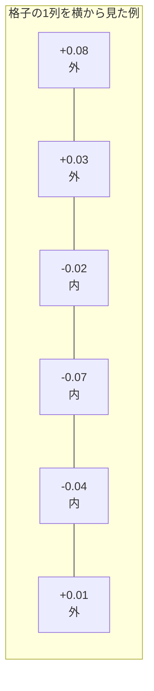
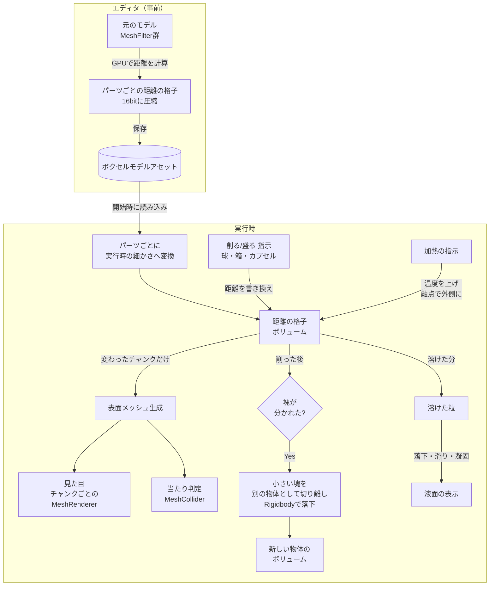
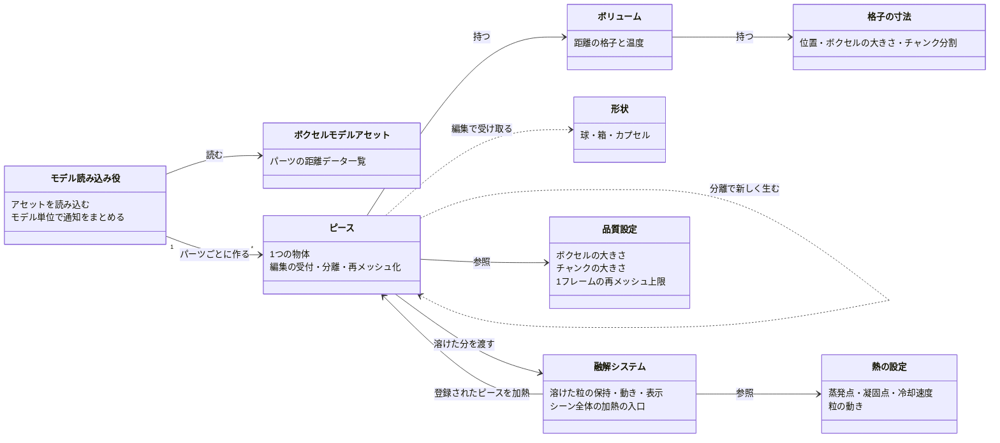

# ボクセル表現 全体像

## 何ができる仕組みか

普通のメッシュで作られたモデルを「削れる・割れる・溶ける」物体として扱う仕組み。
見た目はカクカクした箱の集まりではなく、滑らかな表面のまま削れる。

大まかには次の仕事に分かれる。

| 段階 | いつ | 何をする | 詳細 |
|---|---|---|---|
| ベイク | エディタ上（事前） | 既存メッシュを「表面までの距離の格子」に変換して保存する | [Bake.md](Detailed/Bake.md) |
| 読み込み | 実行時の開始時 | 保存した距離の格子を、実行時の細かさに合わせて取り込む | [Bake.md](Detailed/Bake.md) |
| データの保持と編集 | 実行中ずっと | 距離の格子を持ち、形状を足したり引いたりする | [Core.md](Detailed/Core.md) |
| 表示と当たり判定 | 編集されるたび | 距離の格子から表面メッシュとコライダーを作り直す | [Meshing.md](Detailed/Meshing.md) |
| 分離 | 削られた後 | 離れ離れになった塊を別の物体として切り離し、落とす | [Piece.md](Detailed/Piece.md) |
| 加熱・融解 | 加熱されたとき | 融点に達した部分を固体から取り除き、溶けた粒にする | [Thermal.md](Detailed/Thermal.md) |
| 溶けた粒 | 実行中ずっと | 粒を落として流し、冷えたら止め、液面として表示する | [Melt.md](Detailed/Melt.md) |

温度は常温を 0、融点を 1 とした単位の無い値で扱う。

## 基本となる考え方：SDF（符号付き距離場）

このシステムは物体を「ポリゴン」ではなく「空間の各点から表面までの距離」で持っている。

- 空間を等間隔の格子に区切り、各格子点（サンプル）に「一番近い表面までの距離」を記録する
- 物体の **内側なら負**、**外側なら正**、ちょうど表面上なら 0
- 表示するときは「距離が 0 になる面」を探してポリゴンを張る

B と C の間、E と F の間で符号が変わる ＝ そこに表面がある。

使うのは符号（内か外か）だけではなく、**距離の大きさも使う**。
大きさは、表面の頂点をどこに置くか・どの向きにするか（法線）を決めるのに使われ、これにより格子の段差ではなく滑らかな面になる。

この持ち方の利点は、**削る操作が「距離の値の書き換え」だけで済む** こと。
球で削りたければ、球の内側に入る格子点の値を「外側」に書き換えるだけで、ポリゴンの切り貼りは不要になる。

## 全体のデータの流れ

## 登場するおもなクラスの関係

| 図中の呼び名 | 実際のクラス |
|---|---|
| ボクセルモデルアセット | [`VoxelModelAsset`](../../Code/Scripts/EngineAdapterLayer/Voxel/Model/VoxelModelAsset.cs)[L14](https://github.com/TaguchiRei/Kizami/blob/main/Assets/Code/Scripts/EngineAdapterLayer/Voxel/Model/VoxelModelAsset.cs#L14)（中身は [`VoxelSdfData`](../../Code/Scripts/EngineAdapterLayer/Voxel/Model/VoxelSdfData.cs)[L12](https://github.com/TaguchiRei/Kizami/blob/main/Assets/Code/Scripts/EngineAdapterLayer/Voxel/Model/VoxelSdfData.cs#L12) の配列） |
| モデル読み込み役 | [`VoxelModelLoader`](../../Code/Scripts/EngineAdapterLayer/Voxel/Model/VoxelModelLoader.cs)[L16](https://github.com/TaguchiRei/Kizami/blob/main/Assets/Code/Scripts/EngineAdapterLayer/Voxel/Model/VoxelModelLoader.cs#L16) |
| ピース | [`VoxelPiece`](../../Code/Scripts/EngineAdapterLayer/Voxel/Piece/VoxelPiece.cs)[L25](https://github.com/TaguchiRei/Kizami/blob/main/Assets/Code/Scripts/EngineAdapterLayer/Voxel/Piece/VoxelPiece.cs#L25) |
| ボリューム | [`VoxelVolume`](../../Code/Scripts/EngineAdapterLayer/Voxel/Core/VoxelVolume.cs)[L17](https://github.com/TaguchiRei/Kizami/blob/main/Assets/Code/Scripts/EngineAdapterLayer/Voxel/Core/VoxelVolume.cs#L17) |
| 格子の寸法 | [`VoxelGridLayout`](../../Code/Scripts/EngineAdapterLayer/Voxel/Core/VoxelGridLayout.cs)[L13](https://github.com/TaguchiRei/Kizami/blob/main/Assets/Code/Scripts/EngineAdapterLayer/Voxel/Core/VoxelGridLayout.cs#L13) |
| 形状 | [`IVoxelShape`](../../Code/Scripts/EngineAdapterLayer/Voxel/Shapes/IVoxelShape.cs)[L10](https://github.com/TaguchiRei/Kizami/blob/main/Assets/Code/Scripts/EngineAdapterLayer/Voxel/Shapes/IVoxelShape.cs#L10) を実装した [`SphereShape`](../../Code/Scripts/EngineAdapterLayer/Voxel/Shapes/SphereShape.cs)[L14](https://github.com/TaguchiRei/Kizami/blob/main/Assets/Code/Scripts/EngineAdapterLayer/Voxel/Shapes/SphereShape.cs#L14) / [`BoxShape`](../../Code/Scripts/EngineAdapterLayer/Voxel/Shapes/BoxShape.cs)[L14](https://github.com/TaguchiRei/Kizami/blob/main/Assets/Code/Scripts/EngineAdapterLayer/Voxel/Shapes/BoxShape.cs#L14) / [`CapsuleShape`](../../Code/Scripts/EngineAdapterLayer/Voxel/Shapes/CapsuleShape.cs)[L14](https://github.com/TaguchiRei/Kizami/blob/main/Assets/Code/Scripts/EngineAdapterLayer/Voxel/Shapes/CapsuleShape.cs#L14) |
| 品質設定 | [`VoxelQualitySettings`](../../Code/Scripts/EngineAdapterLayer/Voxel/Piece/VoxelQualitySettings.cs)[L10](https://github.com/TaguchiRei/Kizami/blob/main/Assets/Code/Scripts/EngineAdapterLayer/Voxel/Piece/VoxelQualitySettings.cs#L10) |
| 融解システム | [`VoxelMeltSystem`](../../Code/Scripts/EngineAdapterLayer/Voxel/Melt/VoxelMeltSystem.cs)[L24](https://github.com/TaguchiRei/Kizami/blob/main/Assets/Code/Scripts/EngineAdapterLayer/Voxel/Melt/VoxelMeltSystem.cs#L24)（液面の表示は [`VoxelMeltSurface`](../../Code/Scripts/EngineAdapterLayer/Voxel/Melt/VoxelMeltSurface.cs)[L21](https://github.com/TaguchiRei/Kizami/blob/main/Assets/Code/Scripts/EngineAdapterLayer/Voxel/Melt/VoxelMeltSurface.cs#L21)） |
| 熱の設定 | [`VoxelThermalSettings`](../../Code/Scripts/EngineAdapterLayer/Voxel/Thermal/VoxelThermalSettings.cs)[L11](https://github.com/TaguchiRei/Kizami/blob/main/Assets/Code/Scripts/EngineAdapterLayer/Voxel/Thermal/VoxelThermalSettings.cs#L11) |

## 用語

| 用語 | 意味 |
|---|---|
| サンプル | 格子点。距離（と温度）の値を持つ |
| セル | 隣り合う 8 つのサンプルに囲まれた小さな立方体 |
| チャンク | セルを各軸 N 個（既定 32）ずつ区切ったまとまり。メッシュとコライダーはこの単位で作り直す |
| 切り詰め距離 | 保持する距離の上限（ボクセル 4 つ分）。表面から遠い場所の正確な距離は不要なので、この値で頭打ちにする |
| 塊（連結成分） | 内側のサンプルが上下左右前後でつながった集まり。2つ以上あれば「分かれた」ことになる |
| ダーティ | 値が変わったので作り直しが必要、という印 |
